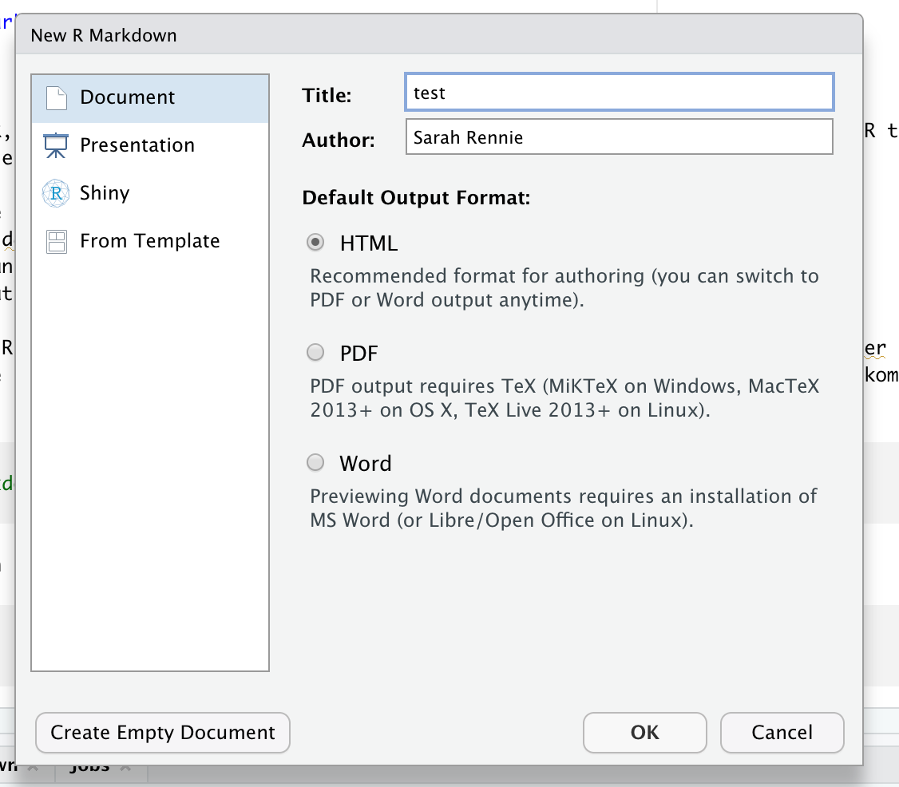
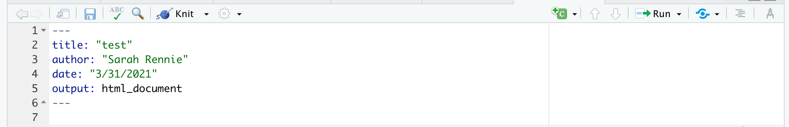
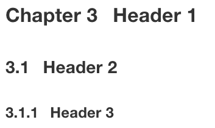

# Introduktion til R Markdown {#rmarkdown}

```{r, echo=FALSE,fig.width = 1,fig.height=1,out.height="20%",out.width="20%"}
# Bigger fig.width
library(png)
library(knitr)
include_graphics("plots/hex-rmarkdown.png")
```

“Du kan aldrig krydse havet, før du har modet til at miste synet af kysten.” – Christopher Columbus

## Inledning til kapitlet

I dag starter vi med `R Markdown`. Emnet er kort og er designet til at hjælpe dig med at komme i gang med R Markdown i praksis. Notaterne inkluderer også nogle ekstra muligheder, så du kan indrette dit dokument efter eget ønske. Der er to videoer tilgængelige - den ene er en "quick-start guide" til at komme i gang, og den anden viser en simpel lineær regression i R Markdown. Hvis du ikke har brug for en genopfriskning, kan du stadig udforske mere af funktionaliteten i R Markdown.

Efter quizzerne og problemstillingerne er der en worksheet, hvor du kan øve dig yderligere med de typer opgaver vi vil se i workshopperne. Fra næste gang skifter vi emnet til visualiseringer i ggplot2, men vi fortsætter med at anvender R Markdown igennem hele kurset.

:::tjekliste

Tjekliste til Chapter 2: R Markdown

* Se videoerne
* Lav quiz (på Absalon)
* Lav problemstillinger
* Lav mini-workshop opgaven (på Absalon)
:::

## Hvad er R Markdown?

R Markdown er en nem og fleksibel måde at arbejde med R under projekter for at dokumentere udviklingen af analysen. Her kan man kombinere R-kode, output og tekst i samme dokument og bygge et pænt HTML-dokument, som potentielt kan deles med andre. Vi anbefaler, at du bruger R Markdown til alle opgaver i kurset. 

:::pin

**OBS! Ved eksamen forventer vi, at du afleverer et HTML-dokument med din "knittede" kode fra din analyse.**
:::

## Installere R Markdown

R Markdown er, ligesom R, gratis og ‘open source’. Den fungerer indenfor RStudio and kan installeres ved at bruge den følgende kommando:

```{r,eval=FALSE}
install.packages("rmarkdown")
```

## Videodemonstrationer

To videoer er tilgænglig som dækker emnet:

### Video 1

Denne video viser dig, hvordan du:

  * Opretter et nyt dokument i R Markdown.
  * Skriver tekst i dokumentet.
  * Bruger "knit" til at lave et HTML-dokument.
  * Opretter og kører kodechunks.

```{r,echo=FALSE,warning=FALSE,comment=FALSE,message=FALSE}
#Link her hvis det ikke virker nedenunder: https://vimeo.com/702416505

library("vembedr")

embed_url("https://vimeo.com/702416505")
```

### Video 2

Denne video viser dig en kort lineær regressionsanalyse samt:

  * Hvordan man indlæser et datasæt og laver et plot af datasættet.
  * En lynhurtig gennemgang af formlen for en ret linje.
  * Hvordan man anvender funktionen `lm()` til at fitte en lineær model.
  * Fortolkning af resultaterne af modellen og deres statistiske betydning.

```{r,echo=FALSE,warning=FALSE,comment=FALSE,message=FALSE}
#Link her hvis det ikke virker nedenunder: https://vimeo.com/701240044

embed_url("https://vimeo.com/701240044")
```

## Opret et nyt dokument i R Markdown

Man åbner et nyt R Markdown dokument i RStudio ved at klikke "File" > "New File" > "R Markdown...". Alternativt kan man klikke på den grønne "+" knap i det øverste venstre hjørne af RStudio vinduet og vælge "R Markdown".


Derefter angiver man en titel (som kan ændres senere hvis nødvendigt) og specificerer, at outputtet skal være i HTML-format. I dette kursus arbejder vi kun med HTML-dokumenter, men der er også andre muligheder, som du er velkommen til at prøve (PDF/Word/Shiny osv.).



<!-- YAML Header: Controls certain output settings that apply to the entire document. -->

### YAML

Den første sektion af dokument skrives i hvad der kaldes for 'YAML'. (Dette står for 'YAML Ain’t Markup Language'). YAML-sektionen bruges til at definere en række indstillinger og metadata for dokumentet, f.eks. titel, forfatter, dato og outputformat. Denne sektion indrammes typisk af tre bindestreger (---) øverst og nederst:



I dette eksempel angiver vi titlen på rapporten som "test", forfatterens navn, datoen og outputformatet (HTML-dokument). Du kan tilføje andre indstillinger og tilpasse outputformatet ved at ændre eller udvide YAML-headeren. I de fleste tilfælde nøjes vi dog med at bruge standard indstillinger. Hvis man gerne vil lære mere om de forskellige YAML muligheder, kan man finde mere information her:

https://bookdown.org/yihui/rmarkdown/html-document.html

Man kan også se en liste af muligheder her på dette såkaldt cheatsheet:

https://www.rstudio.com/wp-content/uploads/2016/03/rmarkdown-cheatsheet-2.0.pdf

### Globale muligheder

Derefter kan vi se følgende tekst:


Ved at bruge funktionen `opts_chunk$set()` kan du angive globale indstillinger, der styrer udseendet af det endelige dokument. I dette tilfælde er de fleste parametre sat til deres 'default' eller standardværdier (da de ikke er eksplicit angivet), og echo er den eneste parameter, der har en defineret værdi. Når echo er sat til `TRUE`, betyder det, at når du "knitter" din kode (processen der omdanner R Markdown-filen til et HTML-dokument, som beskrevet nedenfor), vil både den udførte kode og dens output blive vist i det endelige HTML-dokument.

Funktionen `opts_chunk$set()` giver dig mulighed for at kontrollere adskillige aspekter af dit dokument på en global måde, såsom visning af advarsler og beskeder, cacheindstillinger og grafikindstillinger. For eksempel, advarsler og beskeder undertrykkes ved at sætte `warning = FALSE` og `message = FALSE` (Prøv venligst selv). Bemærk, at disse globale indstillinger kan overskrives for individuelle kodeblokke, hvis det er nødvendigt.

## Skriv og formatere tekst

Her er nogle muligheder for at formatere tekst i projekter, opgaverne eller rapporter:

```{r,eval=FALSE}
*italic*   **bold**

_italic_   __bold__
```

*italic*   **bold**

_italic_   __bold__

### Headers

Man kan også tilføje sektioner:

```{r,eval=FALSE}
# Header 1

## Header 2

### Header 3
```




### Tilføje en liste

```{r,eval=FALSE}
* Item 1
* Item 2
    + Item 2a
    + Item 2b
```

* Item 1
* Item 2
    + Item 2a
    + Item 2b

## Knitte kode

Man anvender *Knit* til at gemme R Markdown-filen i HTML-format. Når du trykker på *Knit*-knappen, bliver alle kodeblokke i filen udført og et HTML-dokument bygget. Bemærk, at __koden udføres på ny hver gang du knitter__, uafhængig af indholdet i dit nuværende RStudio-arbejdsområde / workspace. Det betyder, at hvis du f.eks. har indlæst pakken `tidyverse` i dit RStudio-arbejdsområde, men har glemt at inkludere `library(tidyverse)` eksplicit i begyndelsen af dit R Markdown-dokument, vil du modtage en fejlmeddelelse, hvis du bruger funktioner fra tidyverse andre steder i dokumentet.

## Kode chunks

Du skriver R kode inden for såkaldte "chunks" i R Markdown-dokumenter. Du kan oprette en ny kodeblok på flere måder - enten ved at klikke på knappen *Insert a new code chunk* øverst i RStudio, eller ved at trykke på *Cmd+Option+I* på tastaturet (hvis du bruger en Mac) eller *Ctrl+Alt+I* (hvis du bruger Windows). Det er værd at huske denne shortcut/genvej, da det kan spare meget tid i fremtiden!

Her er et eksempel af en kodechunk:

```{r}
# This is a chunk, let's write som R code
x <- 1
x + 1
```

For at køre en chunk skal du trykke på den grønne pil øverst i højre hjørne af selve chunken (der hedder *Run Current Chunk* når du holder musen over den). Resultatet er printed lige under chunken.

Bemærk, at når du arbejder med dit R Markdown dokument, er det generelt hurtigere at bruge den grønne pil / *Run Current Chunk* i stedet for at knitte hele dokumentet hver gang man vil køre kode. Det skyldes, at du her kun kører den enkelte chunk i stedet for hele dokumentet på ny (herunder indlæsning af pakker og eventuelle store filer), som er tilfældet med *Knit*.

### Knit løbende før at undgå problemer

Som en del af længere opgaver er det god praksis at sikre løbende at man kan bygge et HTML-dokument ved at knitte. Dette gælder selv hvis man kører chunks lokalt, mens man udvikler kode. Med andre ord, skal man sørge for at man ikke få alvorlige fejlmeddelelser som forhindrer koden i at blive knittet.

:::pin

__Det er vores ansvar at sikre, at vores kode fungerer i sin helhed, og at vi kan bygge et HTML-dokument med f.eks. løsningerne til problemstillingerne.__

:::

### Chunk indstillinger

I R Markdown er der mange muligheder for at styre hver enkelt chunk i et dokument. Hvordan skal R håndtere koden med hensyn til evaluering og præsentation (især med hensyn til tabeller og plots) af en bestemt chunk i dokumentet? Det afhænger meget af, hvem man gerne vil viser dokumentet. For eksempel, i de nuværende kursusnotater vil vi gerne have generelt, at man ser al koden (en global indstilling). Men nogle gange er fokuset anderledes - f.eks. en chunk, der viser kode som skal ikke køre, eller en andern plotstørrelse i en bestemt chunk. En chunk med indstillingen `eval=FALSE` ser f.eks. sådan ud (fjern # symbolet).

```{r,eval=FALSE}
#```{r,eval=FALSE}
#
#```
```

Her kan man finde en oversigt af mange muligheder (sektionen "Embed code with knitr syntax"):

https://www.rstudio.com/wp-content/uploads/2016/03/rmarkdown-cheatsheet-2.0.pdf

Her er seks yderligere og populære muligheder:

  * `include = FALSE` 
    + forhindrer både kode og resultater at blive vist i den endelige fil. R Markdown kører stadig koden i kodeblokken og resultaterne kan bruges af andre kodeblokke.
  * `echo = FALSE`
    + forhindrer koden men ikke resultaterne at blive vist i den endelige fil. Dette er en nyttig måde at integrere figurer på.
  * `message = FALSE` 
    + forhindrer beskeder genereret af koden at blive vist i den endelige fil.
  * `warning = FALSE` 
    + forhindrer advarsler genereret af koden at blive vist i den endelige fil.
  * `fig.cap = "..."`
    + tilføjer en billedtekst til grafiske resultater.
  * `eval = FALSE`
    + evaluerer ikke koden.

## R beregninger inden for teksten i dokumentet ('inline code')

I nogle tilfælde ønsker man at køre R koden "inline", det vil sige som en del af teksten, f.eks. inden for en sætning. Dette gøres ved at skrive på følgende måde:

```{r,eval=FALSE,tidy=FALSE}
Her er min `kode`
```

Ovenstående ser sådan ud, når det er skrevet direkte inden for teksten:

Her er min `kode`.

I dette tilfælde, er der ikke noget R kode, der blev kørt. Hvis man vil køre R kode inden for teksten, skriver man f.eks.:

```{r,eval=FALSE,tidy=FALSE}
Det gennemsnitlige antal af observationer er `r mean(c(5,7,4,6,3,3))`
```

Ovenstående ser sådan ud, når det er skrevet direkte inden for teksten:

Det gennemsnitlige antal observationer er `r mean(c(5,7,4,6,3,3))`.

OBS! Hvis man glemmer 'r', bliver koden ikke kørt:

```{r,eval=FALSE,tidy=FALSE}
Det gennemsnitlige antal af observationer er `mean(c(5,7,4,6,3,3))`
```

giver:

Det gennemsnitlige antal af observationer er `mean(c(5,7,4,6,3,3))`

At bruge kode inline kan være en stor fordel, når man gerne vil referere til forskellige statistike beregninger man har udført i R (f.eks. en middelværdi eller p-værdi). Hvis man skriver eller kopierer et tal direkte så bliver beregningerne inden for teksten ikke opdateret når datasættet eller analysemetoden ændre sig. Man risikerer at have en fejl i den endelige fil. Beregninger er til gengæld automatisk opdateret ved at bruge inline code.

## Working directory

Bemærk at måden man sætter en working directory er ænderledes i R Markdown i forhold til base-R. Hvis man bruger `setwd()` i en chunk, sætter man ens working directory kun i den pågældende chunk.

I R Markdown er standarden (default) at din working directory er mappen, hvor du gemmer din `.Rmd` fil. Hvis du vil bruge en anden working directory, kan du tilføje `knitr::opts_knit$set(root.dir = '/tmp')` til dine globale indstillinger øverst i din fil. Ændr venligst `'/tmp'` til din ønskede mappe.


````md
```{r, setup, include=FALSE}`r ''`
knitr::opts_knit$set(root.dir = '/tmp')
```
````

## Matematik

Man kan også skrive matematiske formler (LaTeX) i R Markdown - f.eks. vil `$\int_0^5 x^2 dx$` se ud som $\int_0^5 x^2 dx$ i dit HTML-dokument. Vi forventer absolut ikke, at I lærer LaTeX, men det er brugbar - f.eks. en retlinjet ligning er `$y = 3.4x + 2.1$` og vil blive oversat til $y = 3.4x + 2.1$ eller en hypotese: `$H0: \mu = 0$` vil blive oversat til $H0: \mu = 0$.

## Hyppigt forekommende fejl

Vi tilføjer også aspekter, der opstå under kurset:

:::pin
  * Hvis du installerer en pakke, husk at slet `install.pakages(pakkenavn)` fra din `.Rmd`-fil.
  * Hvis du bruger en pakke, husk at indlæse den i selve fil `library(pakkenavn)`.
  * Når du udvikler din kode er det en god idé at ofte knit din fil til HTML-formatet.
  * Hvis du får en `execution error` kan det være, at du har en fejl i beregninger af din inline kode.
:::

## Problemstillinger

1) Der er en kort __quiz__ i Absalon, som hedder "Quiz - R Markdown".

2) Opret et nyt R Markdown-dokument i RStudio. Prøv at lave en liste og nogle overskrifter i forskellige størrelser.

3) Klik nu på `Knit`-knappen og kontroller at et HTML-dokument vises på din skærm.

4) Rediger titlen (som er en del af din YAML-header øverst i din fil) - ændre dokumentnavnet "My first R Markdown document" og klik på `Knit` igen for at se ændringen i dit HTML-dokument.

5) Opret en ny R code chunk / kodeblok og tilføj noget kode, for eksempel:

```{r,eval=FALSE}
x <- rnorm(20, 1, 2) #make a sample of normally distributed data
plot(x)
```

  * Husk *Cmd+Option+I* eller *Cmd+Win+I* for at oprette en chunk (det sparer tid).
  * Klik på den grønne pil.
  * Prøv også at køre en linje ad gangen med *CMD+Enter* eller *CTRL+Enter*.
  * Lav flere chunks med forskellige typer kode efter eget valg.
  * Klik på `Knit` og bemærk, at det tager længere tid at `Knit` hver gang du ændrer noget, end når du bare kører chunks separat indenfor dit dokument.

6) Klik på "hjul"-knappen i øverste højre hjørne af en af dine chunks og prøv at ændre de forskellige chunk-indstillinger. Klik på `Knit` for at se, hvad der sker.

7) Hver gang du knitter, laver du et HTML-dokument. Prøv nu at lave en anden type dokument i stedet for - erstat f.eks. `html_document` med `word_document` i YAML (toppen af din `.Rmd` fil).
  
  * Se her for endnu flere muligheder: https://bookdown.org/yihui/rmarkdown/output-formats.html

8) Tilføj følgende chunk til dit dokument og klik på `Knit`. Få du en fejlmeddelelse?

```{r,eval=FALSE}
data(mtcars)
mtcars %>% filter(cyl == 6)
```

Bemærk, at du får en fejlmeddelelse, fordi du har endnu ikke indlæst den nødvendige pakke for at få koden til at virke. Det kan ske, selvom du måske har indlæst pakken i "Console" eller i fanebladet "Packages". 
  * Prøv først at køre "library(tidyverse)" i konsolen og derefter forsøge at knitte dit dokument igen - du får stadig en fejlmeddelelse.
  * Tilføj `library(tidyverse)` __øverst i din chunk__. Nu skulle dit dokument kunne knittes.

9) Erstat linjen `output: html_document` med følgende i din YAML metadata øverst i din `.Rmd` fil:

```yaml
output:
  html_document:
    code_folding: hide
```

  * Klik på `Knit` og se hvad der sker.
  * Erstat `hide` med `show` og se forskellen.

10) Brug `$ $` til at skrive en ligning ind i teksten i din `.Rmd` fil. Prøv for eksempel `$\bar{x}_{i} = \frac{1}{n}\sum_{i=1}^{n} x_{i}$` og knitte dit dokument for at tjekke, om du får formlen til middelværdien.

11) (**Worksheet**) På Absalon har vi lagt en R Markdown (`.Rmd`) fil med navnet "R Markdown opgave", som du kan bruge til at starte med R Markdown-baserede opgaver. Det kombinerer koncepter fra det forudgående kapitel om grundlæggende ting i R og statistik.

## Forberedelse af næste emnet og lektionen

Husk at sende os mulige spørgsmål, som vi kan svare enten direkte eller i den næste forelæsning. Næste gang begynder vi at arbejde med R pakken `ggplot2`, der bruges til at lave høj kvalitet visualiseringer fra datasæt.

## Ekstra information

* Her er en 'quick tour' https://rmarkdown.rstudio.com/authoring_quick_tour.html

* Nyttig R Markdown Cheatsheet: Du kan finde den ved at klikke i RStudio: _Help > Cheatsheets > R Markdown Cheat Sheet_.