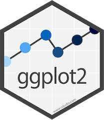
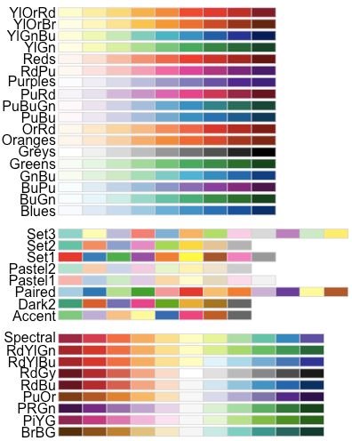

# Visualisering - ggplot2 dag 2 {#visual2}

```{r, echo=FALSE,out.height="25%",out.width="25%"}
# Bigger fig.width
library(jpeg)
library(knitr)

```

## Læringsmål og videoer

I det nuværende emne udvider du værktøjskassen af kommandoer i pakken __ggplot2__, så at du kan opnå større fleksibilitet i dine visualiseringer. Jeg anbefaler, at du bruger notaterne som en form for reference samtidig med at du arbejder med problemstillingerne.

:::goals
Du skal være i stand til at:

* Arbejde fleksibelt med koordinatsystemer - transformere, modificere og "flip" x- og y-aksen.
* Udvide brugen af farver og former.
* Tilføje tekst direkte på plottet ved hjælpe af `geom_text()` og `geom_text_repel()`.
* Bruge `facet_grid()` eller `facet_wrap()` til at opdele plots efter en kategorisk variabel.
:::


```{r,echo=FALSE}
library(ggplot2) #husk
```

:::checklist
Checklist til Kapitel 4: ggplot2 (dag 2)

* Se videoerne
* Kig igennem kursusnotaterne
* Lav quiz "ggplot2 - dag 2"
* Lav problemstillingerne
:::

### Video ressourcer

* Video 1: Koordinat systemer

```{r,echo=FALSE}
library("vembedr")
#Link her hvis det ikke virker nedenunder: https://player.vimeo.com/video/544201985

embed_url("https://vimeo.com/544201985")
```

* Video 2: Farver og punkt former 

```{r,echo=FALSE}
library("vembedr")
#Link her hvis det ikke virker nedenunder: https://player.vimeo.com/video/544218153

embed_url("https://vimeo.com/544218153")
```

* Video 3: Labels - `geom_text()` og `geom_text_repel()`

```{r,echo=FALSE}
library("vembedr")
#Link her hvis det ikke virker nedenunder: https://player.vimeo.com/video/544226498

#embed_url("https://vimeo.com/544226498")
embed_url("https://vimeo.com/939254856")
```

* Video 4 - Facets

```{r,echo=FALSE}
library("vembedr")
#Link her hvis det ikke virker nedenunder: https://player.vimeo.com/video/704140333

embed_url("https://vimeo.com/704140333")
```

## Koordinat systemer

Her arbejder vi videre med koordinater i pakken __ggplot2__.

### Zoom (`coord_cartesian()`, `expand_limits()`)

Man kan bruge funktionen `coord_cartesian()` til at zoome ind på et bestemt område på plottet. __Indenfor__ `coord_cartesian()` angives `xlim()` og `ylim()`, som specificerer de øvre og nedre grænser langs henholdsvis x-aksen og y-aksen. Man kan også bruge `xlim()` og `ylim()` uden `coord_cartesian()`, men i dette tilfælde bliver punkterne, som ikke kan ses i plottet (fordi deres koordinater ligger udenfor de angivne grænser) ignoreret (med en advarsel). Med `coord_cartesian()` beholder man til gengæld samtlige data, og man får således ikke en advarsel.

Nedenfor kan I ser vores oprindelige scatter plot:

```{r,fig.width=5,fig.height=4}
ggplot(iris, aes(x = Sepal.Length, y = Sepal.Width,color = Species)) +
  geom_point() + 
  theme_minimal() 
```

Og her anvender jeg funktionen `coord_cartesian()` samt `xlim()` og `ylim()` til at zoome ind på et ønsket område på plottet.

```{r,fig.width=5,fig.height=4}
ggplot(iris, aes(x = Sepal.Length, y = Sepal.Width,color = Species)) +
  geom_point() + 
  coord_cartesian(xlim = c(4,6), ylim = c(2.2,4.5)) +
  theme_minimal() 
```

Du kan også zoome ud ved at bruge `expand_limits()`. For eksempel, hvis jeg gerne vil have punkterne $x = 0$ og $y = 0$ (`c(0,0)`, eller "origin") med i selve plottet:

```{r,fig.width=5,fig.height=4}
ggplot(iris, aes(x=Sepal.Length, y=Sepal.Width,col=Species)) +
  geom_point() + 
  expand_limits(x = 0, y = 0) +
  theme_minimal() 
```

Det kan være brubart i situationer, hvor man for eksempel har flere etiketter omkring punkterne i selve plottet, som bedre kan ses, hvis man tillader lidt ekstra plads.  

### Transformering af akserne - log, sqrt osv (`scale_x_continuous`).

Nogle gange kan det være svært at visualisere visse variable på grund af deres fordeling. Hvis der er mange outliers i variablen, vil de fleste punkter samles i et lille område i plottet. Transformering af x-aksen og/eller y-aksen med enten `log` eller `sqrt` er især en populær tilgang, så dataene kan bliver visualiseret på en mere informativ måde.

```{r,fig.width=5,fig.height=4}
ggplot(iris, aes(x=Sepal.Length, y=Sepal.Width,col=Species)) +
  geom_point(size=3) + 
  scale_x_continuous(trans = "log2") +
  scale_y_continuous(trans = "log2") +
  theme_minimal() 
```

Man kan også prøve at bruge "sqrt" i stedet for "log2".

Det er dog vigtigt at bemærke, at dette er forskelligt fra at transformere selve dataene, som bruges i plottet. Jeg kan for eksempel opnå det samme resultat ved at ændre datasættet, før jeg anvender `ggplot2`. Her behøver jeg ikke at bruge `scale_x_continuous(trans = "log2")`, men jeg bemærker, at tallene på akserne reflekterer de transformerede data og ikke de oprindelige værdier. Beslutningen afhænger af, hvad man gerne vil opnå med analysen af dataene.

```{r,fig.width=5,fig.height=4}
iris$Sepal.Length <- log2(iris$Sepal.Length)
iris$Sepal.Width <- log2(iris$Sepal.Width)
ggplot(iris, aes(x=Sepal.Length, y=Sepal.Width,col=Species)) +
  geom_point(size=3) +
  theme_minimal() 
```

### Flip coordinates (`coord_flip`)

Vi kan bruge `coord_flip()` til at spejle x-aksen på y-aksen og omvendt (det svarer til at drejer plottet 90 grader). Se følgende eksempel, hvor jeg først opretter variablen `Sepal.Group`, laver et barplot og anvender `coord_flip` for at få søjlerne til at stå vandret.

```{r,fig.width=5, fig.height=3, message=FALSE, warning=FALSE}
#Sepal.Group defineret som i går
iris$Sepal.Group <- ifelse(iris$Sepal.Length>mean(iris$Sepal.Length),"Long","Short")

ggplot(iris,aes(x=Species,fill=Sepal.Group)) + 
  geom_bar(stat="count",position="dodge",color="black") +
  coord_flip() +
  theme_minimal()
```

Man kan ændre rækkefølgen af de tre `Species` ved at bruge funktionen `scale_x_discrete()` og angive den nye rækkefølge med indstillingen `limits`:

```{r,fig.width=5, fig.height=3, message=FALSE, warning=FALSE}
ggplot(iris,aes(x=Species,fill=Sepal.Group)) + 
  geom_bar(stat="count",position="dodge",color="black") +
  coord_flip() +
  scale_x_discrete(limits = c("virginica", "versicolor","setosa")) +
  theme_minimal()
```

## Mere om farver og punkt former

Der er flere måder at specificere farver på i `ggplot2`. Man kan nøjes med den automatiske løsning, som er hurtig (og effektiv i mange situationer), eller man kan bruge den manuelle løsning, som tager lidt længere tid at kode, men er brugbar, hvis man gerne vil lave et plot til at præsentere for andre.

### Automatisk farver

Her er den nemme løsning, hvor vi anvender automatiseret farvning ved at benytte `colour=Species` indenfor `aes()`.

```{r, fig.width=5,fig.height=5}
#automatisk løsning
ggplot(iris, aes(x=Sepal.Length, y=Sepal.Width, colour=Species)) +
  geom_point() +
  theme_minimal() 
```

### Manuelle farver

Hvis man foretrækker at bruge sine egne farver, kan man gøre det ved at benytte funktionen `scale_colour_manual()`. Her angiver man stadig `colour=Species` indenfor `aes()`, men man specificerer farverne for de forskellige arter indenfor `scale_colour_manual`, med indstillingen `values`.

```{r, fig.width=5,fig.height=4}
#manuelt løsning
ggplot(iris, aes(x=Sepal.Length, y=Sepal.Width, colour=Species)) +
  scale_colour_manual(values=c("purple", "yellow","pink")) +
  geom_point() +
  theme_minimal() 
```

En fantastisk pakke er `RColorBrewer`. Pakken indeholder mange forskellige "colour palettes", det vil sige grupper af farver, der passer godt sammen. Man kan derfor slippe for selv at sammensætte en farvekombination, der passer til plottet. Nogle af farvepaletterne tager også hensyn til, om man er farveblind, eller om man ønsker en farvegradient eller et sæt diskrete farver som ikke ligner hinanden.

I følgende eksempel indlæser jeg pakken `RColorBrewer` og anvender funktionen `scale_colour_brewer` med indstillingen `palette="Set1"`:

```{r, fig.width=5,fig.height=4}
#install.packages("RColorBrewer")
library(RColorBrewer)

#manuelt løsning
ggplot(iris, aes(x=Sepal.Length, y=Sepal.Width, colour=Species)) +
  scale_colour_brewer(palette="Set1") +
  geom_point() +
  theme_minimal() 
```

Bemærk, at både `scale_color_manual()` og `scale_color_brewer()` bruges til at sætte farver på punkter og linjer, hvorimod man ved boxplots eller barplots bruger `scale_fill_manual()` eller `scale_fill_brewer()` til at sætte farver på de udfyldte områder. For eksempel vil jeg i følgende eksempel gerne sætte farver på de udfyldte områder i et boxplot:

```{r, fig.width=5,fig.height=4}
ggplot(iris,aes(x=Species,y=Sepal.Length,fill=Species)) + 
  geom_boxplot() +
  scale_fill_brewer(palette="Set2")  + 
  theme_minimal()
```


Her er en oversigt over de fire funktioner:

Funktion | Beskrivelse
--- | ---
`scale_fill_manual(values=c("firebrick3","blue"))` | Bruges til manuelle farver i forbindelse med boxplots og barplots mv.
`scale_color_manual(values=c("darkorchid","cyan4"))` | Bruges til manuelle farver i forbindelse med punkter og linjer mv.
`scale_fill_brewer(palette="Dark2")` | Bruger farvepaletter fra `RColorBrewer` i forbindelse med boxplots, barplots mv.
`scale_color_brewer(palette="Set1")` | Bruger farvepaletter fra `RColorBrewer` i forbindelse med punkter og linjer mv.

Der er også andre muligheder, hvis man har behov for dem - for eksempel kan man google efter `scale_fill_gradient` for kontinuerlige data.


***Farver i RColourBrewer***

Her er en nyttig reference, der viser de forskellige farver i pakken `RColourBrewer`.




### Punkt former

Ligesom man kan lave forskellige farver, kan man også lave forskellige punktformer. Vi starter med den automatiske løsning ligesom vi gjorde med farver. Når det er en variabel, vi angiver, skal variabelnavnet skrives indenfor `aes()`. `shape` er en parameter, der er meget specifik for `geom_point`. Så vi vælger at skrive en ny `aes()` indenfor `geom_point()` i stedet for indenfor funktionen `ggplot()`. Husk, at man i funktionen `ggplot()` specificerer globale parametre, der gælder for hele plottet, mens man i funktionen `geom_point()` angiver parametre, der kun gælder for `geom_point()`. Se følgende eksempel:


```{r,fig.width=5,fig.height=4}
ggplot(data=iris, aes(x = Sepal.Length, y = Sepal.Width, color = Species)) +
  scale_color_brewer(palette="Set2") +
  geom_point(aes(shape=Species)) + 
  theme_minimal()
```

Nu har vi både en farve og en punkt-form til hver art i variablen `Species`.

***Sætte punkt form manuelt***

Hvis vi ikke kan lide de tre automatiske punktformer, kan vi ændre dem ved at bruge `scale_shape_manual`. Her vælger vi for eksempel `values=c(1,2,3)`, men der er en reference nedenfor, hvor du kan se kombinationer mellem de numeriske tal og punktformer. Så kan du vælge dine favoritter.

```{r,fig.width=5,fig.height=4}
ggplot(data=iris, aes(x = Sepal.Length, y = Sepal.Width, colour=Species)) +
  geom_point(aes(shape=Species)) + 
  scale_color_brewer(palette="Set2") +
  scale_shape_manual(values=c(1,2,3)) +
  theme_minimal()
```

***Reference for punkt former***

Her er reference-tabellen for forskellige punktformer i `ggplot2`:

```{r,fig.width=4,fig.height=4,echo=FALSE,comment=FALSE}
df_shapes <- data.frame(shape = 0:25, shape_name = factor(paste0(0:25)))

ggplot(df_shapes, aes(0, 0, shape = shape)) +
  geom_point(aes(shape = shape), size = 5, fill = 'red', stroke = 2) +
  scale_shape_identity() +
  facet_wrap(~reorder(shape_name, shape)) +
  theme_void()
```

## Annotations (`geom_text`)

### Tilføjelse af etiketter direkte på plottet.

Man kan bruge `geom_text()` til at tilføje tekst til punkterne direkte på plottet. Her kan man fortælle, hvad teksten skal være - i dette tilfælde specificerer vi navnene på biler fra datasættet `mtcars`. Plottet er et scatterplot mellem variablerne `mpg` og `wt`.

```{r,fig.width=4,fig.height=4}
data(mtcars)

mtcars$my_labels <- row.names(mtcars) #take row names and set as a variable

ggplot(mtcars,aes(x=mpg,y=wt)) + 
  geom_point() +
  geom_text(aes(label=my_labels)) + 
  theme_minimal()
```

For at gøre det nemmere at læse kan man også fjerne selve punkterne:

```{r,fig.width=4,fig.height=4}
ggplot(mtcars,aes(x=mpg,y=wt)) + 
  #geom_point() +
  geom_text(aes(label=my_labels)) + 
  theme_minimal()
```

Teksten på plottet kan stadig være svær at læse. En god løsning er at bruge R-pakken `ggrepel`, som vist i følgende eksempel:

### Pakken `ggrepel` for at tilføje tekst labeller

```{r}
#install.packages("ggrepel") #installere hvis nødvendeigt
```

For at anvende pakken `ggrepel` på datasættet `mtcars`, skal man blot erstatte `geom_text()` med `geom_text_repel()`:

```{r,fig.width=4,fig.height=4}
library(ggrepel)
ggplot(mtcars,aes(x=mpg,y=wt)) + 
  geom_point() +
  geom_text_repel(aes(label=my_labels)) + 
  theme_minimal()
```

Nu kan vi se, at der ikke er nogen etiketter, som sidder lige overfor hinanden, fordi `ggrepel()` har været dygtig nok til at placere dem tæt på deres tilhørende punkter men ikke ovenpå hinanden. Der er også nogle punkter, hvor funktionen har tilføjet en linje for at gøre det klart, hvilken punkt teksten refererer til.

Vi har dog fået en advarsel i ovenstående kode. Hvis vi vil undgå denne advarsel, kan vi f.eks. specificere `max.overlaps = 20`.

```{r}
library(ggrepel)
ggplot(mtcars,aes(x=mpg,y=wt)) + 
  geom_point() +
  geom_text_repel(aes(label=my_labels),max.overlaps = 20) +
  theme_minimal()
```

Nu kan du se, at du ikke længere får en advarsel, og der er tilføjet tekst til alle punkterne.

### Tilføjelse af rektangler i regioner af interesse (`annotate`)

Hvis man gerne vil fremhæve et bestemt område i plottet, kan man bruge funktionen `annotate()`. Prøv selv at regne ud, hvad de indstillinger inden for `annotate()` betyder i det følgende eksempel:

```{r,fig.width=4,fig.height=4}
ggplot(mtcars,aes(x=mpg,y=wt)) + 
  geom_point() +
  geom_text_repel(aes(label=my_labels)) +
  annotate("rect",xmin=18,xmax=23,ymin=2.5,ymax=3,alpha=0.2,fill="orange") +
  theme_minimal()
```

Man kan også benytte den samme funktion til at tilføje tekst på et bestemt sted:

```{r,fig.width=4,fig.height=4}
ggplot(mtcars,aes(x=mpg,y=wt)) + 
  geom_point() +
  geom_text_repel(aes(label=my_labels)) +
  annotate("rect",xmin=18,xmax=23,ymin=2.5,ymax=3,alpha=0.2,fill="orange") +
  annotate("text",x=25,y=2.75,label="Cars of interest",col="orange") + 
  theme_minimal()
```

## Adskille plots med facets (`facet_grid`/`facet_wrap`) 

En stor fordel ved at bruge `ggplot` er evnen til at bruge funktionerne `facet_grid()` og `facet_wrap()` til at adskille værdier af en kategorisk variabel over flere plots. I følgende kode få vi et density plot, hvor de tre kurver, der tilhører de tre arter, ligger oven på hinanden i det samme plot:

```{r,echo=F}
data(iris)
```

```{r,fig.width=5,fig.height=4}
ggplot(iris,aes(x=Sepal.Length,fill=Species)) + 
  geom_density(alpha=0.5) + 
  theme_minimal()
```

Med funktionerne `facet_grid()` eller `facet_wrap()` bruger vi `~` (tilde) til at angive, hvordan vi gerne vil visualisere de forskellige plots. Vi skal angive, om vi ønsker at opdele dem over rækker (variablerne venstre for `~`) eller over kolonner (variablerne til højre for `~`).

```{r,eval=F,echo=T}
#notrun
variable(s) to split into row-wise plots ~ variables(s) to split into column-wise plots
```

Det ovenstående density plot af `Sepal.Length` kan adskilles efter `Species`, således at man får tre plots med en kolonne til hver af de tre arter ved hjælp af `facet_wrap()` funktionen:

```{r,fig.width=5,fig.height=4}
ggplot(iris,aes(x=Sepal.Length,fill=Species)) + 
  geom_density(alpha=0.5) + 
  facet_grid(~Species) + #split Species into different column-wise plots
  theme_minimal()
```

Man kan også vælge at fordele plotterne over rækkerne ved hjælp af `facet_wrap()`. Her skal man dog huske at bruge en `.` efter `~` for at betegne, at man kun vil adskille plots over rækkerne, mens man til gengæld kan droppe `.` hvis man kun vil adskille over kolonner som i det foregående eksempel.

```{r,fig.width=5,fig.height=4}
ggplot(iris,aes(x=Sepal.Length,fill=Species)) + 
  geom_density(alpha=0.5) + 
  facet_grid(Species~.) + #split Species into different column-wise plots
  theme_minimal()
```

Her angives `Sepal.Group ~ Species`, hvilket betyder, at plotterne bliver adskilt efter både `Sepal.Group` og `Species` - `Sepal.Group` over rækkerne og `Species` over kolonnerne - ved hjælp af `facet_grid()` funktionen:

```{r,echo=F}
iris$Sepal.Group <- ifelse(iris$Sepal.Length > mean(iris$Sepal.Length), "Long", "Short")
iris$Sepal.Group <- as.factor(iris$Sepal.Group)
```

```{r,fig.width=5,fig.height=4}
ggplot(iris,aes(x=Sepal.Length,fill=Species)) + 
  geom_density(alpha=0.5) + 
  facet_grid(Sepal.Group~Species) + #split Species into different column-wise plots
  theme_minimal()
```

Bemærk forskellen mellem `facet_grid()` og `facet_wrap()`:

```{r,fig.width=5,fig.height=4}
#same plot, replace facet_grid with facet_wrap
ggplot(iris,aes(x=Sepal.Length,fill=Species)) + 
  geom_density(alpha=0.5) + 
  facet_wrap(Sepal.Group~Species) + 
  theme_minimal()
```

I `facet_grid()` bliver man tvunget til at få et "grid" layout. Vi har således 6 plot i en 2 x 3 grid (2 niveauer for variablen `Sepal.Group` og 3 niveauer for variablen `Species`), og det sker selvom den ene af dem ikke har nogen data - der findes altså ikke observationer, hvor `Species` er "Setosa" og `Sepal.Group` er "Long", men vi får et plot alligevel for at bevare strukturen. Med `facet_wrap()` bliver plot uden data droppet, og i dette tilfælde får man 5 plots i hvad der kaldes en "ribbon".

Med `facet_wrap()` kan man også angive antallet af rækker og kolonner man vil have for plotterne. For eksempel kan man angive `nrow = 1` eller `ncol = 5` for at få alle fem plots på en række.

```{r,fig.width=6.5,fig.height=3.5}
ggplot(iris,aes(x=Sepal.Length,fill=Species)) + 
  geom_density(alpha=0.5) + 
  facet_wrap(Sepal.Group~Species,nrow = 1) + 
  theme_minimal()
```

Til sidst kan det være, at vi vil gerne frigøre skalaen på y-aksen. På den måde har ikke alle plots de samme maksimale y-værdier, og de enkelte plot benytter i stedet egne værdier til at bestemme skalaen. Det kan være brugbart, hvis man inddrager forskellige målinger. Men vær dog opmærksom på, hvad der bedst giver mening - hvis man direkte vil sammenligne to af plottene, så er det bedre, at de deler samme y-akseskala.

```{r,fig.width=6.5,fig.height=3.5}
#same plot, replace facet_grid with facet_wrap
ggplot(iris,aes(x=Sepal.Length,fill=Species)) + 
  geom_density(alpha=0.5) + 
  facet_wrap(Sepal.Group~Species,ncol = 5,scales = "free") + 
  theme_minimal()
```


Disse funktioner er meget brugbare, selvom de opnår stort set samme resultat. Der er dog små forskelle mellem dem, som er værd at huske.

## Gemme dit plot

Her bruger vi R Markdown til at lave en rapport, som indeholder vores plots. Men det kan også være, at man gerne vil gemme sit plot som en fil på computeren. Til det kan man bruge kommandoen `ggsave()`:

```{r, eval=FALSE}
ggsave(myplot, "myplot.pdf")
```

Figuren vil blive gemt i din _working directory_ (eller den mappe, hvor din .Rmd fil ligger). Filtypen `.pdf` kan erstattes med andre formater, f.eks. `.png` eller `.jpeg`. Hvis man gerne vil redigere sit plot (f.eks. i Adobe Illustrator eller Inkscape), vil jeg anbefale at gemme det som `.pdf`.

Man kan godt ændre højden og bredden på det gemte plot med `width` og `height`:

```{r, eval=FALSE}
ggsave(myplot, "myplot.pdf", width = 4, height = 4)
```

## Problemstillinger

__Problem 1__) Lav quiz - "Quiz - ggplot2 dag 2"

- - -

__Problem 2__) (*Øvelse med factorer og plots*)
 
 __a__) Åbn datasættet `mtcars` og lav et barplot:

  * Brug variablen `cyl` på x-aksen og tilføj forskellige farver til de forskellige niveauer (dvs. factor levels) af `cyl`.
  * Hvad kunne være et problem med vejen `cyl` er plottet? Er farverne vist i plottet?
  * Tjek x-aksen - variablen er numerisk, men bør fortolkes som en faktor.
  * Lav variablen om til en faktor (eller bare skriv `as.factor(cyl)` i selve plottet) og lav dit plot igen.

```{r,echo=FALSE,eval=FALSE}
data(mtcars)
ggplot(data = mtcars, aes(x = cyl, fill = cyl)) +
  geom_bar(stat="count") +
  theme_minimal()
```

```{r,echo=FALSE,eval=FALSE}
mtcars$cyl <- as.factor(mtcars$cyl)
ggplot(data = mtcars, aes(x = cyl,fill = cyl)) +
  geom_bar(stat="count") +
  theme_minimal()
```

  __b__) Rediger nedenstående kode til at fordele data baseret på `gear`:
  
  * Opdel kolonnerne ved at angive farver efter variablen `gear` i dit plot. 
  * `gear`-kolonnerne skal sidde ved siden af hinanden. (Husk `position` argument.)
  * Vær igen opmærksom på, hvordan R fortolker variablen.

```{r}
ggplot(data = mtcars, aes(x = cyl,fill = (gear))) +
  geom_bar(stat = "count") + 
  theme_minimal()
```

```{r,echo=FALSE,eval=FALSE}
ggplot(data = mtcars, aes(x = cyl,fill = as.factor(gear))) +
  geom_bar(stat = "count", position = "dodge") + 
  theme_minimal()
```

- - -

I det følgende spørgsmål arbejder du med datasættet `Palmer Penguins`. Installere venligst pakken `palmerpenguins` hvis du ikke har brugt den før.

Data beskrivelse: *The palmerpenguins data contains size measurements for three penguin species observed on three islands in the Palmer Archipelago, Antarctica.*

```{r, echo=FALSE,comment=FALSE,warning=FALSE,out.width="20%"}
# Bigger fig.width
library(png)

```

```{r,comment=FALSE,warning=FALSE,message=FALSE}
#install.packages("palmerpenguins") #køre hvis ikke allerede installeret
library(palmerpenguins)
library(ggplot2)
library(tidyverse)
head(penguins)
```

Brug venligst `?penguins` for at se flere detaljer om variablenavner.

*Vi skal starte med at rydde lidt op i datasættet. Til det, brug "drop_na()" for at fjerne alle rækker med `NA` (manglende) værdier (her skal man have tidyverse-pakken indlæst):*

```{r}
penguins <- drop_na(penguins)
```

- - -

__Problem 3__) *Manuelt farver og punkter* 

__a__) Lav et spredningsdiagram / scatter plot med `ggplot()`-funktionen: 

  * `bill_length_mm` på x-aksen.
  * `bill_depth_mm` på y-aksen.
  *  Giv hver art (variablen `species`) sin egen farve.
  *  Sæt et tema.

```{r,echo=FALSE,fig.width=4,fig.height=3.5,fig.cap="Min løsning",eval=FALSE}
ggplot(data=penguins,aes(x = bill_length_mm, y = bill_depth_mm, color = species)) +
  geom_point() +
  xlab("Bill length (mm") +
  ylab("Bill depth (mm)") +
  ggtitle("Scatter plot for penguin data") +
  theme_minimal()
```

__b__) Lav følgende ændringer til dit plot fra __a__):
  
  * Ændr farver manuelt - prøv at angive farver med `scale_color_manual()` og løsningen med pakken `RColorBrewer` (husk at installere/indlæse pakken, hvis nødvendigt).
  * Brug forskellige punkt-former til hver art i variablen `species`.
  * Prøv at vælge punkt-former fra listen (i kursusnotaterne) og specificer dem manuelt.

```{r, echo=FALSE, fig.width=4, fig.height=3.5, fig.cap="Min løsning"}
ggplot(data = penguins, aes(x = bill_length_mm, y = bill_depth_mm, color = species, shape = species)) +
  geom_point() +
  scale_color_manual(values = c("black", "blue", "red")) +
  xlab("Bill length (mm)") +
  ylab("Bill depth (mm)") +
  ggtitle("Scatter plot for penguin data") +
  theme_minimal()
```

- - -

__Problem 4__) *Koordinatsystemer* 

Tag udgangspunkt i overstående scatter plot fra __3__):

__a__) Brug `coord_cartesian()`, så kun pingviner med en næblængde (variablen `bill_length_mm`) mellem 40 og 50 og en næbdybde (variablen `bill_depth_mm`) mellem 16 og 19 er medtaget på plottet.
__b__) Brug pakken `ggrepel` (husk at installere/indlæse) og tilføj navnene på de forskellige øer som tekst etiketter / labels direkte på plottet.
__c__) Lav en delmængde af datasættet `penguins` efter samme betingelser som i __a__) og brug din nye dataframe som parameteren `data` med `geom_text_repel()`-funktionen. Dette undgår at tekst bliver plottet for punkter udenfor området angivet med `coord_cartesian()`.

```{r, echo=FALSE, fig.width=5, fig.height=4, fig.cap="Min løsning"}
peng_subset <- subset(penguins, bill_depth_mm > 16 & bill_depth_mm < 19 & bill_length_mm > 40 & bill_length_mm < 50)

ggplot(data=penguins, aes(x = bill_length_mm, y = bill_depth_mm, color = species)) +
  geom_point(aes(shape=species)) +
  coord_cartesian(ylim = c(16, 19), xlim = c(40, 50)) +
  scale_color_brewer(palette = "Accent") + 
  geom_text_repel(data = peng_subset, aes(label = island)) +
  xlab("Bill length (mm)") +
  ylab("Bill depth (mm)") +
  ggtitle("Scatter plot for penguin data") +
  theme_minimal()
```

__Problem 5__) *Histogram med facets*

Lav et histogram:

  * Variablen `flipper_length_mm` på x-aksen.
  * Anvend `facet_grid` til at adskille dit plot i tre dele efter variablen `species`.
  * Kombiner samtidig forskellige farver med hver art fra `species` variablen.
  * Hvis nødvendigt, ændr parameteren `bins` til noget andet indenfor `geom_histogram()`.

Her er en mulig løsning:

```{r,echo=FALSE,eval=TRUE,fig.width=6,fig.height=4}
ggplot(data = penguins, aes(x = flipper_length_mm, fill = species)) +
  geom_histogram(bins = 30, alpha=0.5, colour="black") +
  scale_fill_brewer(palette = "Set1") +
  ggtitle("Histogram over flipperlængde fordelt på arter") +
  facet_grid( ~species) +
  xlab("Flipperlængde (mm)") +
  theme_minimal()
```

- - -

__Problem 6__) *Density plot med facets*

__a)__ Lav et tæthetsdiagram / density plot af `body_mass_g` variablen.

  * Anvend funktionen `facet_grid` til at lave tre plots, et til hver art i variablen `species`.
  * Brug også `fill` til at opdele hver af dine tre density kurver efter variablen `sex` (dvs. du har stadig 3 plots, og hvert plot har to density kurver).
  * Gør dine density plots gennemsigtige.
  * Skriv en sætning om forskellen i `body_mass_g` mellem "females" og "males".

<!-- * Hvorfor tror du, at disse densities har flere topper? -->

```{r,echo=FALSE,eval=FALSE,fig.width=4,fig.height=3}
ggplot(data = penguins,aes(x = body_mass_g, fill = sex)) +
  geom_density(alpha = 0.5) +
  facet_grid(~species) +
  xlab("Kropsmasse (g)") +
  ylab("Densitet") + 
  ggtitle("Densitetsplots fordelt efter køn") +
  theme_minimal()
```

__b__) Udvikl din `facet_grid` kode til at adskille plots yderligere således at du har en "grid" struktur med de forskellige øer (variablen `island`) på rækkerne og de tre arter (variablen `species`) på kolonnerne.

```{r,echo=FALSE,eval=FALSE,fig.width=4,fig.height=3}
ggplot(data = penguins,aes(x = body_mass_g, fill = sex)) +
  geom_density(alpha = 0.5) +
  facet_grid(island ~ species) +
  xlab("Kropsmasse (g)") +
  ylab("Densitet") + 
  ggtitle("Densitetsplots fordelt efter køn") +
  theme_minimal()
```

__c__) Kan du forklare, hvorfor der er blanke plots i din grid? Til det, eksperimenter f.eks. med `facet_wrap` i stedet for `facet_grid`. 

```{r,echo=FALSE,eval=FALSE,fig.width=4,fig.height=3}
ggplot(data = penguins,aes(x = body_mass_g, fill = sex)) +
  geom_density(alpha = 0.5) +
  facet_wrap(island ~ species) +
  xlab("Kropsmasse (g)") + ylab("Densitet") + 
  ggtitle("Densitetsplots fordelt efter køn") +
  theme_minimal()
```

<!-- __b)__ Vi vil gerne adskille vores densities yderligere, efter `species`. -->

<!-- * Nu tilføj linjen `facet_grid(~species)` til dit plot og opdag, hvad der sker.  -->
<!-- * Skriv endnu en sætning, som beskriver forskellen i `body_mass_g` mellem de to køn over de tre `species`. -->

<!-- ```{r,echo=FALSE,eval=FALSE} -->
<!-- ggplot(data=penguins,aes(x=body_mass_g,fill=sex)) + -->
<!--   geom_density(alpha=0.5) + -->
<!--   facet_grid(~species) + -->
<!--   theme_minimal() -->
<!-- ``` -->

- - -

__Problem 7__) *Koordinatsystemer* 

Lav et søjlediagram / bar plot af antallet for `species` opdelt efter `sex`. 

  * Anvend 'coordinate flip' for at ændre plottet til at være vandret / horizontal.
  * Vælg nogle farver - f.eks. `palette = "Accent"` fra `RColorBrewer`.

```{r,echo=FALSE,eval=FALSE,fig.width=4.5,fig.height=2.5}
ggplot(data = penguins, aes(x = species, fill = sex)) +
  geom_bar(stat = "count", position = "dodge") + 
  coord_flip() + 
  scale_fill_brewer(palette = "Accent") +
  theme_minimal()
```

  * Ændr rækkefølgen af de tre kolonner, således at arten med flest observationer er øverst, og arten med færrest er nederst.
  * Prøv også at tilføje `scale_y_reverse()` og kig på resultatet.

Her er en mulig løsning:

```{r,echo=FALSE,fig.width=5,fig.height=3,eval=TRUE}
#Løsning
ggplot(data=penguins,aes(x = species, fill = sex)) +
  geom_bar(stat = "count", position = "dodge") + 
  coord_flip() + 
  scale_fill_brewer(palette = "Accent") +
  scale_x_discrete(limits = rev(c("Adelie", "Gentoo","Chinstrap"))) + 
  theme_minimal()
```

- - -

__Problem 8__) Lav et boksplot / boxplot af `body_mass_g` opdelt efter `species`.

  * Tilføj "jitter" punkter ovenpå boksplottet.
  * Specificer nogle farver manuelt for både bokse og punkterne (en farve til hver art).
  * Giv det en passende titel og nogle akse-etiketter.
  * Tilføj en ny variabel `island_binary` til `penguins`, som er "Biscoe" hvis `island` er 'Biscoe' og "not Biscoe" hvis ikke.
  * Adskil plottene ved at opdele efter `island_binary`.

```{r,echo=FALSE,eval=FALSE,fig.width=5,fig.height=4,fig.cap="Min løsning"}
#Løsning
penguins$island_binary <- ifelse(penguins$island == "Biscoe","Biscoe","not Biscoe")

ggplot(data = penguins, aes(x = species, y = body_mass_g, fill = species, colour = species)) +
  geom_boxplot(show.legend = FALSE, alpha = 0.25) +
  geom_jitter(alpha = 0.75, show.legend = FALSE) +
  scale_colour_brewer(palette = "Set2") + 
  scale_fill_brewer(palette = "Set2") + 
  facet_grid(~island_binary) +
  theme_classic()
```

  * Ekstra: Prøv `?geom_violin` som erstatning for `geom_boxplot`.

- - -

__Problem 9__) *Annotationer og linjer*. 

__a__) Lav et spredningsdiagram / scatterplot af `bill_length_mm` vs `bill_depth_mm`.

  * Anvend passende titel/etiketter/tema.
  * Anvend forskellige farver for de tre `species`.
  * Tjek funktionen `?annotate` og brug den med `geom = "text"` og passende x- og y-akse værdier til at tilføje `species` navne som tekst direkte på plottet (se eksempel nedenfor for forklaringen).
  * Udforsk, hvordan man gør teksten større, som i løsningen nedenfor.
  * Fjern legenden med `show.legend = FALSE` indenfor `geom_point()`.

Her er en mulig løsning:

```{r,eval=TRUE,echo=FALSE,fig.width=4,fig.height=4}
ggplot(data = penguins, aes(x = bill_length_mm, y = bill_depth_mm, colour = species)) +
  geom_point(show.legend = FALSE) +
  scale_colour_brewer(palette = "Set2") + 
  annotate(geom = "text", x = 40, y = 20, label = "Adelie", size = 8) +
  annotate(geom = "text", x = 55, y = 19, label = "Chinstrap", size = 8) +
  annotate(geom = "text", x = 45, y = 15, label = "Gentoo", size = 8) +
  xlab("Næblængde (mm)") +
  ylab("Næbdybde (mm)") + 
  theme_minimal()
```

__b__) Vi vil gerne tilføje nogle lodrette og vandrette linjer til plottet, som viser gennemsnitsværdierne for variablerne for de tre arter.

* Først skal du bruge `tapply` til at beregne de gennemsnitlige værdier for henholdsvis `bill_length_mm` og `bill_depth_mm` opdelt efter `species` (gem dem som henholdsvis `mean_length` og `mean_depth`).
* Brug `mean_length` og `mean_depth` til at tilføje linjer til plottet med den relevante funktion.

```{r,echo = FALSE}
mean_length <- tapply(penguins$bill_length_mm, penguins$species, mean)
mean_depth <- tapply(penguins$bill_depth_mm, penguins$species, mean)
```

__c__) Kan du tilpasse linjerne så deres farver matcher punkterne af den samme art (se løsningen nedenfor)? Der er sikkert mange måder at gøre det på, men hvis du har brug for et hint, kan du kigge nedenfor:

* Hint: start med følgende dataframe, der bruger dine beregnede værdier:

```{r,echo=TRUE}
mydf <- data.frame("species" = names(mean_length), "mlength" = mean_length, "mdepth" = mean_depth)
mydf
```

* Angiv parameteren `data` til at være ovenstående dataframe i `geom_vline()` og brug lokal æstetik (`aes()`) til at angive parametre til linjerne.
* Gør det samme for `geom_hline()`.
* Specificer også "stiplede" linjer.

Her er en mulig løsning:

```{r,echo=FALSE,eval=TRUE,fig.width=5,fig.height=5}
ggplot(data = penguins, aes(x = bill_length_mm, y = bill_depth_mm, colour = species)) +
  geom_point(show.legend = FALSE) + 
  geom_vline(data = mydf, aes(xintercept = mlength, colour = species), show.legend = FALSE, lty = "dashed") +
  geom_hline(data = mydf, aes(yintercept = mdepth, colour = species), show.legend = FALSE, lty = "dashed") +
  #geom_hline(data=mydf,show.legend = FALSE,aes(yintercept=mdepth,colour=species),lty=2) +
  #geom_vline(xintercept =mean_length,show.legend = FALSE,aes(colour=species),lty=2) +
  annotate(geom = "text", x = 40, y = 20, label = "Adelie", size = 8) +
  annotate(geom = "text", x = 55, y = 19, label = "Chinstrap", size = 8) +
  annotate(geom = "text", x = 45, y = 15, label = "Gentoo", size = 8) +
  xlab("Bill length (mm)") +
  ylab("Bill depth (mm)") + 
  theme_minimal()
```

- - -

__Problem 10__) *Ekstra*. Kig på "cheatsheet" for ggplot2 (klik på "Help" > "Cheatsheets" og vælg den for ggplot2) og prøv nogle af de aspekter, som ikke er blevet dækket i kurset indtil videre! Vi vil gerne høre, hvis du finder noget meget nyttigt, som ellers er blevet glemt i notaterne.


