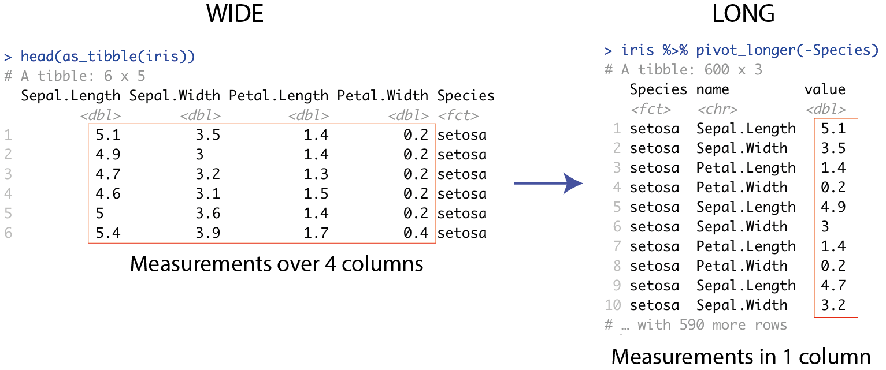
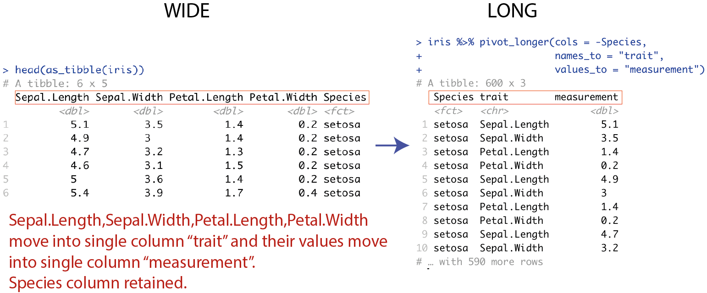
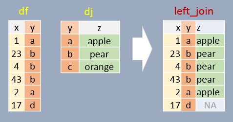

# Bearbejdning - tidyverse dag 2 {#data2}

```{r, echo=FALSE,fig.width = 1,fig.height=1,comment=FALSE,warning=FALSE,out.width="15%"}
# Bigger fig.width
library(png)
library(knitr)
include_graphics("plots/hex-tidyverse.png")
```

"Fejl ved brug af utilstrækkelige data er meget mindre end når man ikke bruger nogen data overhovedet." -- Charles Babbage

```{r,echo=FALSE,warning=FALSE,message=FALSE}
library(tidyverse)
library(titanic)
titanic <- as_tibble(titanic_train)

titanic_clean <- titanic %>% 
    select(-Cabin) %>%
    drop_na() 
```

## Introduktion og læringsmålene

I dag fortsætter vi arbejdet med `tidyverse`. Vi fokuserer især på pakkerne `dplyr` og `tidyr`, som kan bruges til at ændre strukturen af et datasæt. Det hjælper blandt andet med at tilpasse data til den krævede struktur for at lave plots med `ggplot2`.

I biologi er det ofte tilfældet at dataene er i een dataframe mens yderligere oplysninger om prøverne er i en anden dataframe. Derfor vil vi gerne lære, hvordan man forbinder disse dataframes i R. At integrere datasæt hjælper med visualisering af ekstra informationer i jeres plots.

### Læringsmålene

:::goals
Du skal kunne:

* Bruge kombinationen af `group_by()` og `summarise()`.
* Forstå forskellen mellem `wide` og `long` data og bruge `pivot_longer()` til at lette plotting.
* Bruge `left_join()` eller andre join-funktioner til at tilføje prøveinformation til datasættet.
:::

:::checklist
* Se videoerne
* Lav quiz på Absalon ('tidyverse - dag 2') 
* Lav problemstillingerne
:::

### Videoer

* Video 1: Kombination af `group_by()` og `summarise()`. Forbinde `tidyverse` og `ggplot2` kode sammen via `%>%` / `+`.

```{r,echo=FALSE}
library("vembedr")
#Link her hvis det ikke virker nedenunder: https://player.vimeo.com/video/546910681

embed_url("https://vimeo.com/546910681")
```

---

* Video 2: Wide/long dataformat, `pivot_longer()` og deres brug i ggplot2.

```{r,echo=FALSE}
#library("vembedr")

#Link her hvis det ikke virker nedenunder: https://player.vimeo.com/video/707081191

#embed_url("https://vimeo.com/546910660") #2021
embed_url("https://vimeo.com/707081191") #2022

```

---

* Video 3: `titanic` summary statistics eksempel.

```{r,echo=FALSE}
#library("vembedr")

#Link her hvis det ikke virker nedenunder: https://player.vimeo.com/video/707223997

#Link her hvis det ikke virker nedenunder: https://player.vimeo.com/video/707081191

#embed_url("https://vimeo.com/547096274") #2021
embed_url("https://vimeo.com/707223997") #2022

```

---

* Video 4: `left_join()` for at forbinde tabeller med ekstra oplysninger.

```{r,echo=FALSE}
#library("vembedr")

#Link her hvis det ikke virker nedenunder: https://player.vimeo.com/video/707082269
#Link her hvis det ikke virker nedenunder: https://player.vimeo.com/video/707081191

#embed_url("https://vimeo.com/549630870") #2021
embed_url("https://vimeo.com/707082269") #2022

```


## Kombinationen af `group_by()` og `summarise()` i `dplyr`-pakken

Ved at kombinere `group_by()` og `summarise()` kan man finde numeriske svar på spørgsmålet: Havde mænd eller kvinder en højere sandsynlighed for at overleve tragedien?

Lad os starte med at se på en løsning med `tapply`, hvor vi udregner proportionen af mænd og kvinder der overlevede. Følgende kode opdeler variablen `Survived` efter den kategoriske variabel `Sex` og tager det aritmetiske gennemsnit. Dermed får vi proportionen af overlevende efter køn. Vi kan beregne gennemsnittet på den måde, fordi `1` betyder at man overlevede, `0` betyder at man ikke overlevede og at man kan anvende disse numeriske værdier matematisk.

```{r,tidy=FALSE}
titanic_clean <- titanic %>% 
    select(-Cabin) %>%
    drop_na()

#tapply løsning 
tapply(titanic_clean$Survived,titanic_clean$Sex,mean)
```

Nu skifter vi over til en `tidyverse`-løsning. Lad os tage udgangspunkt i `summarise()`-funktionen. Vi vil beregne en variabel, som hedder "medianFare" og som er identisk med `median(Fare)`.

```{r}
titanic_clean %>%
  summarise("medianFare" = median(Fare))
  # summarise(medianFare = median(Fare))
```

Vi får faktisk en ny dataframe her med kun den variabel vi lige har specificeret. Vi er dog interesseret i proportionen af overlevende, så vi tager gennemsnittet af variablen `Survived`. Lad os gøre det med `summarise()`:

```{r}
titanic_clean %>%  
  summarise(meanSurvived = mean(Survived))
```

For at besvare spørgsmålet er vi også nødt til at opdele efter kolonnen `Sex`. Vi kan bruge kombinationen af `group_by()` og `summarise()`. Vi opdeler efter `Sex` ved at anvende funktionen `group_by()` og derefter bruger vi `summarise()` til at oprette en kolonne, der hedder `meanSurvived`, som viser proportionen af overlevende for både kvinder og mænd.

```{r}
#tidyverse løsning
titanic_clean %>%
    group_by(Sex) %>%
    summarise(meanSurvived = mean(Survived))
```

Lad os tage resultatet fra ovenstående kode chunk og visualisere det i et barplot / sølediagram:

```{r,fig.width=3,fig.height=4}
titanic_clean %>%  
  group_by(Sex) %>% 
  summarise(meanSurvived = mean(Survived)) %>%
  ggplot(aes(x = Sex, y = meanSurvived, fill = Sex)) + 
  geom_bar(stat = "identity",show.legend = FALSE) +
  theme_minimal()
```


### Reference af `summarise()`-funktioner

Her er nogle funktioner, som man ofte bruger med `summarise()` (der er mange andre muligheder).

Funktion | Beskrivelse
--- | ---
`mean()` | beregner gennemsnittet af en variabel (i en gruppe).
`sd()` | beregner standardafvigelsen af en variabel (i en gruppe).
`min()` | finder den laveste værdi af en variabel  (i en gruppe).
`max()` | finder den højeste værdi af en variabel (i en gruppe).
`n()` | taler observationer i en gruppe eller variabel.
`first()` | vælger den første værdi af en variabel (i en gruppe).

### Flere summeringsstatistikker på én gang

Vi kan også lave flere summeringsstatistikker på én gang. F.eks. kan vi anvende funktionen `group_by` med `Sex` igen, men beregne flere forskellige summeringsstatistikker:

```{r}
titanic_clean_summary_by_sex <- titanic_clean %>%  
  group_by(Sex) %>% 
  summarise(count = n(),                    #count
            meanSurvived = mean(Survived),  #middelværdi survived
            meanAge = mean(Age),            #middelværdi age
            propFirst = sum(Pclass==1)/n()) #proportionen i første klass
titanic_clean_summary_by_sex
```

Denne summeringstabel kan bruges igen som et datasæt til at lave et diagram med `ggplot2`. Bemærk, at her bruger vi `stat="identity"`, fordi vi skal ikke tælle observationerne op længere, men bare plotte præcis de tal som allerede er i dataframen. I nedenstående eksempel laver vi søjlediagrammer for `meanAge` og `propFirst`. De er plottet ved hjælp af to forskellige `ggplot`-kommandoer og ved siden af hinanden ved hjælp af en funktion kaldet `grid.arrange()` fra R-pakken `gridExtra`.
 
```{r,fig.width=5,fig.height=3,comment=FALSE,message=FALSE,warning=FALSE}
plotA <- ggplot(data=titanic_clean_summary_by_sex,aes(x=Sex,y=meanAge,fill=Sex)) + 
  geom_bar(stat="identity",show.legend = FALSE) + 
  theme_minimal()

plotB <- ggplot(data=titanic_clean_summary_by_sex,aes(x=Sex,y=propFirst,fill=Sex)) + 
  geom_bar(stat="identity",show.legend = FALSE) + 
  theme_minimal()

library(gridExtra)
grid.arrange(plotA,plotB,ncol=2) #plot both together
```
 
Vi kan se at kvinder var i gennemsnit lidt yngre end mænd og havde en højere sandsynlighed for at være i første klasse.


Et interessant spørgsmål er, hvordan man kan lave de ovenstående plots uden at bruge to forskellige `ggplot`-kommandoer. Med andre ord, hvordan man kan lave en automatisk løsning, hvor vi kan plotte flere summeringsstatistikker med kun én `ggplot`-kommando. Vi kommer til at se senere hvordan det kan gøres ved først at konvertere datasættet til long-formatet.

### Mere avanceret `group_by()`

Lad os også beregne, hvor mange passagerer der var, efter deres klasse og steden hvor de gik ombord på skibet:

```{r, tidy=FALSE}
titanic_clean %>%
   group_by(Embarked, Pclass) %>% # Grupper efter flere variable... 
   summarise(count = n(), .groups="keep")
```

Man kan se, at størstedelen gik ombord i Southampton (S), men der var også forholdsvis mange førsteklasses-passagerer, der gik ombord i Cherbourg (C). Lad os fortsætte med vores `Survived`-eksempel og beregne proportionen af overlevende efter de tre variabler `Adult`, `Sex` og `Pclass`.

```{r}
titanic_clean_summary_survived <- titanic_clean %>%  
  mutate(Adult = ifelse(Age>=18,"Adult","Child")) %>%
  group_by(Adult,Sex,Pclass) %>% 
  summarise(meanSurvived = mean(Survived), .groups="keep")
titanic_clean_summary_survived
```

Vi kan også visualisere resultatet i en `ggplot` med at kombinere de tre variabler og opdeler de i tre plots efter `Pclass`:

```{r,fig.width=5,fig.height=4}
ggplot(titanic_clean_summary_survived,aes(x=Sex,y=meanSurvived,fill=Adult)) +
  geom_bar(stat="identity",position = "dodge") + 
  facet_grid(~Pclass) + 
  ylab("Proportion survived") +
  theme_bw()
```

### Funktionen `ungroup()`

Nogle gange, når man er færdig med analysen, men gerne vil arbejde videre med et datasæt, er det nyttigt at anvende `ungroup()` på datasættet igen. Det er mest relevant i længere projekter. F.eks., vi kan se på følgende kode, hvor der står "Groups: Adult [2]" øverst i den nye dataframe med summeringsstatistikker:

```{r}
titanic_clean_summary <- titanic_clean %>%  
  mutate(Adult = ifelse(Age>=18,"Adult","Child")) %>%
  group_by(Adult,Sex) %>% 
  summarise(meanSurvived = mean(Survived), .groups = "drop_last")

titanic_clean_summary
```

Bemærk at vi først brugte `group_by()` på både `Adult` og `Sex`. Men hver gang man laver en beregning, fjernes én opdeling - i dette tilfælde opdeles der ikke længere efter `Sex`, men der opdeles stadig efter `Adult`. Det er ikke et problem, hvis vi ikke vil arbejde videre med dataframen. Men hvis vi gerne vil beregne den maksimale chance for overlevelse ud fra de fire beregnede tal (ikke opdele efter en kategorisk variabel), så dropper vi `group_by()`:

```{r}
titanic_clean_summary %>% 
  summarise(maxChance = max(meanSurvived))
```

Man kan dog se, at outputtet er blevet opdelt efter variablen `Adult`. For at undgå dette skal man først anvende `ungroup()`, så effekten af `group_by()` fjernes.

```{r}
titanic_clean_summary %>% 
  ungroup() %>%
  summarise("maxChance" = max(meanSurvived))
```

## `pivot_longer()`/`pivot_wider()` fra `tidyr`-pakken

__Tidy data__ findes i to former: wide data og long data. Det kan være nyttigt at transformere data fra én form til en anden, f.eks. for at lave et bestemt plot med `ggplot2`-pakken. Pakken `tidyr` indeholder funktioner, der kan bruges til at lave disse transformationer.

Før vi begynder at se lidt nærmere på `tidyr`, skal vi beskrive hvad `long` data og `wide` data betyder.

```{r, echo=FALSE,fig.width = 1,fig.height=1,comment=FALSE,warning=FALSE,out.width="75%",fig.cap="source: https://www.garrickadenbuie.com/project/tidyexplain/"}
# Bigger fig.width
library(png)
library(knitr)
include_graphics("plots/original-dfs-tidy.png")
```

__Wide data__: Her har man én kolonne for hver variabel og én række for hver observation. Dette gør dataene lette at forstå, og denne datatype findes ofte indenfor biologi - f.eks. hvis man har forskellige prøver (behandlinger, kontroller, betingelser osv.) som variabler.

__Long data__: Med long data har man værdier samlet i en enkelt kolonne og en kolonne som en slags nøgle, der også angiver, hvilken variabel hver værdi hørte til i det wide format. Datasættet betragtes stadig som __tidy__, men informationen opbevares på en anden måde. Det er lidt sværere at læse, men nemmere at arbejde med, når man analyserer dataene.

Når man transformerer data fra wide til long eller omvendt, kaldes det for __reshaping__.

### Oversigt over `tidyr` pakken

Her er en oversigt over de fire vigtigste funktioner fra R-pakken `tidyr`. Vi fokuserer mest på `pivot`-funktionerne, men det kan være nyttigt at bruge `separate` og `unite`.

`tidyr` funktion | Beskrivelse
--- | ---
`pivot_longer()` | reshape data fra wide til long
`pivot_wider()` | reshape data fra long til wide
`separate()` | opdele strenge fra én kolonne til to
`unite()` | føje strenge sammen fra to til én kolonne

### Reshape data fra wide til long med `pivot_longer()`

Lad os arbejde med datasættet `iris`. Man får `iris` i long format med følgende kommando: Her vil man gerne tage alle numeriske kolonner og placere deres værdier i en enkelt kolonne `value` (med en nøglekolonne `name` til at adskille mellem de forskellige variabler).

```{r,eval=TRUE}
iris %>%
  pivot_longer(cols = where(is.numeric))
```

At beholde numeriske kolonner svarer i dette tilfælde til at man ikke vil have variablen `Species` med i den enkelte kolonne: 

```{r,eval=T}
iris %>%
  pivot_longer(cols = -Species)
```

Her er et billede, der illustrerer wide- og long-formatet med datasættet `iris`:

```{r, echo=FALSE,fig.width = 1,fig.height=1,comment=FALSE,warning=FALSE,out.width="100%",fig.cap="wide til long med Iris"}
# Bigger fig.width
library(png)
library(knitr)

```

Til venstre har vi målingerne i datasættet fordelt over fire forskellige kolonner kaldet `Sepal.Length`, `Sepal.Width`, `Petal.Length` og `Petal.Width`, samt en ekstra kolonne, der adksiller mellem de tre `Species`. Til højre har vi samlet alle målingerne i en enkelt kolonne kaldet `values`, og så bruger vi en anden 'nøgle' kolonne kaldet `name` til at fortælle om det er en måling for `Sepal.Length` eller `Sepal.Width` osv.

Jeg kan ændre kolonnenavne for målingerne og nøglen til noget andet end standardnavnene. I den nedenstående eksempel skal målingerne hedde `measurements` og nøglen `trait`:

```{r}
iris.long <- iris %>% pivot_longer(cols = -Species,
                                    names_to = "trait",
                                    values_to = "measurement")
```

```{r, echo=FALSE,fig.width = 1,fig.height=1,comment=FALSE,warning=FALSE,out.width="100%"}
# Bigger fig.width
library(png)
library(knitr)

```

F.eks. kan man bruge long formatet til at visualisere alle mulige boxplots opdelt efter `Species` og `trait` i samme plot:

```{r,fig.width=6,fig.height=4}
ggplot(iris.long,aes(y=measurement,x=Species,fill=Species)) + 
  geom_boxplot() + 
  facet_grid(~trait) +
  theme_bw()
```

### `separate()`

Funktionen `separate()` fra pakken `tidyr` kan bruges til at opdele to informationer, som eksisterer i samme kolonne. F.eks., datasættet `iris` har variabler med navne `Sepal.Width`, `Sepal.Length` osv. - man kan opdele disse navne over to kolonner i stedet for - f.eks. "Sepal" og "Width" i tilfældet af `Sepal.Width`. I nedenstående kode chunk kan man se, hvordan man bruger `separate()`.

```{r}
iris %>%
  pivot_longer(cols = -Species, names_to = "trait", values_to = "measurement") %>%
  separate(col = trait, into = c("part", "measure"), sep = "\\.") %>% 
  head()
```

Man specificerer variablen `trait` og angiver, at den skal opdeles i de to variabler `part` og `measure`. Vi angiver `sep = "\\."`, hvilket betyder, at vi vil gerne have `part` som delen af `trait` foran '.' og `measure` som delen af `trait` efter `.`. Vi bruger "\\." for at fortælle, at vi er interesseret i punktummet og ikke en "anonym karakter", som punktum normalt betyder i "streng"-sprog. Man behøver faktisk ikke at specificere `sep = "\\."` i dette tilfælde - som standard kigger funktionen efter 'non-character' tegn og bruger dem til at lave opdelingen.

Sammenligne resultatet af den sidste kode chunk med den følgende:

```{r}
iris %>%
  pivot_longer(cols = -Species, names_to = "trait", values_to = "measurement") %>%
  separate(col = trait, into = c("part", "measure")) %>% 
  head()
```

Brug resultatet i et plot:

```{r}
iris %>%
  pivot_longer(cols = -Species, names_to = "trait", values_to = "measurement") %>%
  separate(col = trait, into = c("part", "measure")) %>%
  ggplot(aes(y=measurement,x=part,fill=part)) + 
  geom_boxplot() + 
  facet_grid(~measure) +
  theme_bw()
```

Se også `unite()` som gøre det modsatte til `separate()`.

## Eksempel: Titanic opsummeringsstatistikker

Her er et eksempel med datasættet `titanic`, der inddrager mange af de `tidyverse`-koncepter, vi har lært indtil videre.

* `group_by()` og `summarise()`

Vi producerer vores opsummeringsstatistikker som tidliger.

```{r}
titanic_clean_summary_by_sex <- titanic_clean %>%
  group_by(Sex) %>%
  summarise(count = n(),
            meanSurvived = mean(Survived),
            meanAge = mean(Age),
            propFirst = sum(Pclass == 1) / n())
titanic_clean_summary_by_sex
```

* `pivot_longer()`

Vi transformerer eller __reshape__ dataframen fra wide data til long data. Vi vil samle kun de numeriske opsummeringsstatistikker i en enkelt kolonne, så variablen `Sex` skal ikke inddrages.

```{r}
titanic_clean_summary_by_sex %>%
  pivot_longer(cols=-Sex)
```

* `ggplot()` med `facet_wrap()`

Vi kombinerer `pivot_longer()` med et plot af vores opsummeringsstatistikker og benytter `facet_grid()` til at adskille de forskellige statistikker.

```{r}
titanic_clean_summary_by_sex %>% 
  pivot_longer(cols = -Sex) %>%
  ggplot(aes(x = Sex, y = value, fill = Sex)) + 
  geom_bar(stat = "identity") + 
  facet_grid(~name) +
  theme_bw() +
  theme(aspect.ratio = 1)
```

* `facet_wrap()`

Vi laver det samme som før, men specificerer `facet_wrap()` i stedet for `facet_grid()`. Indenfor `facet_wrap()` kan man bruge indstillingen `scales="free"`, som gør, at de fire plots får hver deres egne aksegrænser.

```{r}
titanic_clean_summary_by_sex %>% 
  pivot_longer(cols=-Sex) %>%
  ggplot(aes(x=Sex,y=value,fill=Sex)) + 
  geom_bar(stat="identity") + 
  facet_wrap(~name,scales="free",ncol=4) +  
  theme_bw() +
  theme(aspect.ratio = 1)
```

### `pivot_wider()`

Hvordån skifter man fra long til wide formatet?

* Wide -> Long

```{r}
titanic_summary_long <- titanic_clean_summary_by_sex %>% 
  pivot_longer(cols=-Sex)
```

* Long -> Wide

```{r}
titanic_summary_long %>%
  pivot_wider(names_from = "name",values_from = "value")
```

Parametrene er:

* `names_from` - nøglekolonne, som vil blive opdelt i flere kolonner i den nye dataframe
* `values_from` - værdikolonne, som vil blive fordelt på tværs af de nye kolonner

## `left_join()`: forbinde dataframes

Vi tager udgangspunkt i følgende to dataframes:

```{r}
gene_table <- as_tibble(read.table("https://www.dropbox.com/s/6ll8ezrskly8joi/mouse_2gene_expr.txt?dl=1",header=T))
coldata <- as_tibble(read.table("https://www.dropbox.com/s/jlrszakmqlnmu2m/bottomly_phenodata.txt?dl=1"))
```

Lad os først kigge på datasættet `gene_table`, som viser genekspressionsmålinger over forskellige prøver fra mus.

```{r}
gene_table
```

Man kan se, at der er 22 kolonner i datasættet - én der refererer til gener og 21 som indikerer forskellige prøver fra eksperimentet. Men det er ikke klart, hvad den enkelte prøve egentlig er. Lad os derfor kigge på de prøveoplysninger, som kan være nyttige at inddrage i vores analyse/plots for at undersøge eventuelle batcheffekter osv.

```{r}
coldata
```

Man kan se detaljerede oplysninger om de 21 prøver, blandt andet den stamme af mus prøven stammer fra og dens batch. Her refererer `batch` til de forskellige omstændigheder eller tidspunkter, hvor prøverne blev samlet. Hvis man er interesseret i, om der er en forskel i ekspressionsniveau mellem de to stammer (strains), kan det være nødvendigt at kontrollere efter batch for at sikre, at forskellen skyldes `strain` og ikke tekniske effekter på grund af `batch`.

### `left_join()` fra dplyr-pakken

Funktionen `left_join()` er en del af pakken `dplyr`, som vi har arbejdet meget med indtil videre i kurset.

funktion | Beskrivelse (kopieret)
--- | ---
`left_join()` | Tilføj matchende rækker fra en anden tabel til den første
`right_join()` | Tilføj matchende rækker fra den første tabel til den anden
`inner_join()` | Sammenføj to tabeller og returner alle rækker, der er til stede i begge
`full_join()` | Sammenføj data med alle rækker til stede

Vi fokuserer her på funktionen `left_join()`, men vi kigger også på de øvrige funktioner i problemstillingerne nedenfor. Her er en grafisk demonstration af `left_join()` (kilde: https://mgimond.github.io/ES218/Week03c.html):

```{r, echo=FALSE, comment=FALSE, warning=FALSE, out.width="60%"}
# Bigger fig.width
library(png)
library(knitr)

```

Det særlige ved `left_join` i forhold til de andre funktioner er, at `left_join` bevarer samtlige data i den første dataframe - det vil sige `df` i ovenstående billede. Det gælder også selvom `d` ikke matcher med en frugt i `dj`. I ovenstående genekspressionseksempel betyder det, at man bevarer alle målinger i `gene_table`, uanset om der er oplysninger om deres pågældende prøver.

### Anvend `left_join()` på vores datasæt.

Ligesom man matcher kolonnen `y` i `df` og `dj` i ovenstående eksempel, skal vi også have en kolonne, vi kan matche. Vi vil gerne bruge kolonnen `sample` fra `sample_info` til at sammenligne med de forskellige prøvenavne i `gene_table`. Men først er vi nødt til at lave `gene_table` om til long-formatet, således at prøvenavne fremgår i en enkelt kolonne, `sample` (der kan bruges i `left_join`).

```{r}
gene_table_long <- gene_table %>% 
  pivot_longer(cols = -gene,
               names_to = "sample",
               values_to = "expression") 
gene_table_long
```

Derefter kan vi tilføje oplysningsdata fra `sample_info`. Her angiver vi `by = "sample"` fordi det er navnet af kolonnen vi vil gerne bruge til at forbinde de to dataframes og fordi det er med i begge dataframes.

```{r}
data_join <- gene_table_long  %>%
  left_join(coldata, by="sample")
```

Efter vi forenede de to dataframes, kan man inddrage de ekstra oplysninger vi tilføjede i et plot. Her laver vi et plot med en farve til hver stamme og et plot med en farve til hver batch.

```{r,fig.width=6,fig.height=4}
gg2 <- data_join %>% 
  ggplot(aes(y=expression,x=as.factor(strain),fill=gene)) + 
  geom_boxplot() + 
  facet_wrap(~gene,scales="free") +
  theme_minimal() +
  theme(legend.position = "none") + 
  ggtitle("Expression split according to strain")
gg2
```


```{r,fig.width=6,fig.height=4}
gg1 <- data_join %>% 
  ggplot(aes(y=expression,x=as.factor(batch),fill=gene)) + 
  geom_boxplot() + 
  facet_wrap(~gene,scales="free") +
  theme_minimal() +
  theme(legend.position = "none") +
  ggtitle("Expression split according to batch")

gg1
```

## Problemstillinger

__Problem 1__) Lav quizzen - "Quiz - tidyverse dag 2".

---

*Vi øver os videre med datasættet `titanic`. Indlæs datasættet og udfør oprydning med følgende kode:*

```{r,echo=TRUE,eval=FALSE,comment=FALSE,message=FALSE,warning=FALSE}
library(tidyverse)
library(titanic)
titanic <- as_tibble(titanic_train)

titanic_clean <- titanic %>%
    select(-Cabin) %>%
    drop_na()
```

---

__Problem 2__)

Baseret på `titanic_clean` datasættet, beregn den gennemsnitlige alder af alle passagerer ombord på skibet.

```{r,eval=FALSE,echo=TRUE}
titanic_clean %>%
    summarise(....) #rediger her
```

```{r,eval=FALSE,echo=FALSE}
titanic_clean %>%
    summarise(mean_alder = mean(Age))
```

* I samme kommando, beregn også den maksimale alder og den minimale alder, samt proportionen af passagerer, der er under 18 (for den sidste, se eksempeln med `Pclass` tidligere i sektion **6.2.2**). Dataframen skal se sådan ud:

```{r,eval=TRUE,echo=FALSE}
titanic_clean %>%
  summarise(mean_alder=mean(Age),
            max_alder=max(Age),
            min_alder=min(Age),
            under_18p=sum(Age<18)/n())
```

---

__Problem 3__) *`summarise() og ggplot()`*.

__a)__ Beregn samme opsummeringsstatistikker som i sidste problemstilling, men brug `group_by()` for at opdele efter variablen `Pclass`.

```{r,echo=FALSE,eval=FALSE}
titanic_clean %>%
    group_by(Pclass) %>%
    summarise(mean_alder=mean(Age),
            max_alder=max(Age),
            min_alder=min(Age),
            under_18p=sum(Age<18)/n())
```

__b)__ Brug din nye dataframe med opsummeringsstatistikker til at lave et søjlediagram med `stat="identity"` (i stedet for `stat="count"` som er default / standarden), der viser den gennemsnitlige alder på y-aksen og er opdelt efter `Pclass` på x-aksen (vær opmærksom på datatypen for `Pclass` med hensyn til farverne / x-aksen).

```{r,echo=FALSE,eval=FALSE}
titanic_clean %>%
    group_by(Pclass) %>%
    summarise(mean_alder=mean(Age),
            max_alder=max(Age),
            min_alder=min(Age),
            under_18p=sum(Age<18)/n()) %>%
  ggplot(aes(x=as.factor(Pclass),y=mean_alder,fill=as.factor(Pclass))) + 
  geom_bar(stat="identity")
```

__c)__ Anvend `pivot_longer()` på din dataframe med opsummeringsstatistikker (brug indstillingen `cols = -Pclass` i funktionen) for at skifte datframen til et long-format baseret på `Pclass`.

```{r,eval=TRUE,echo=FALSE}
titanic_long <- titanic_clean %>%
  group_by(Pclass) %>%
  summarise(mean_alder=mean(Age),
          max_alder=max(Age),
          min_alder=min(Age),
          under_18p=sum(Age<18)/n()) %>%
  pivot_longer(cols = -Pclass)
```

__d)__ Brug venligst din long-format dataframe for at plotte opsummeringsstatistikker. På denne måde, kan man lave plots af alle opsummeringsstatistikker med kun én `ggplot` kommando. Adskil opsummeringsstatistikerne ved at benytte `facet_wrap` så du har et plot til hvert statistik og opdele efter `Pclass` indenfor hvert plot, ligesom i følgende.

```{r,eval=TRUE,echo=FALSE,fig.width=5,fig.height=4}
ggplot(data = titanic_long, aes(x = as.factor(Pclass), y = value, fill = as.factor(Pclass))) +
    geom_bar(stat = "identity",show.legend = F) +
    facet_wrap(~name, scales = "free", ncol = 4) + 
    theme_bw() +
    theme(aspect.ratio = 1)
```

---

__Problem 4__) *`pivot_longer(), pivot_wider() og ggplot()`*.

__a)__ Beregn de samme opsummeringsstatistikker som i __Problem 2__), men brug `group_by()` for at opdele efter **både** variablerne `Pclass` og `Sex` først.

  * OBS! Du får advarseln at "`summarise()` has grouped output by 'Pclass' ...", fordi din dataframe stadig betragtes som opdelt efter `Pclass`. Dette skal tages i betragtning, hvis du foretager yderligere beregninger på den.
  * Brug til sidst `ungroup()` på din nye dataframe for at sikre, at den ikke længere er opdelt efter nogen variabel.

```{r,echo=FALSE,eval=FALSE}
titanic_clean %>%
  group_by(Pclass,Sex) %>%
  summarise(mean_alder=mean(Age),
          max_alder=max(Age),
          min_alder=min(Age),
          under_18p=sum(Age<18)/n()) %>% 
  ungroup()
```

__b)__ Brug `pivot_longer()`-funktionen til at omdanne datasættet til long-formatet med opsummeringsstatistikker i en enkelt kolonne. Nøglekolonnen skal hedde `stat`, og kolonnen med værdierne skal hedde `values`.

```{r,echo=FALSE,eval=TRUE}
summary_long <- titanic_clean %>%
    group_by(Pclass,Sex) %>%
    summarise(mean_alder=mean(Age),
            max_alder=max(Age),
            min_alder=min(Age),
            under_18p=sum(Age<18)/n()) %>% 
    ungroup(Pclass) %>%
    pivot_longer(-c(Pclass,Sex))
```

__c)__ Lav et plot af alle opsummeringsstatistikker, som er i long-formatet.

```{r,eval=TRUE,echo=FALSE}
summary_long %>% 
  ggplot(aes(x=as.factor(Pclass),y=value,fill=Sex)) +
    geom_bar(stat="identity",position="dodge") +
    facet_wrap(~name,ncol=4,scales = "free") +
    theme_bw() +
    theme(aspect.ratio = 1)
```

---

__Problem 5__) *`group_by()` med tre variabler og `summarise()`*.

Prøv en kombination med tre forskellige variabler (vælg selv) indenfor `group_by()` og brug `summarise()` til at beregne gennemsnittet af variablen `Fare`.

  * Anvend `ungroup()` når du er færdig med at opsummere.
  * Lav et plot for at visualisere `meanFare`.
  * Idé: som en mulighed, kan man tilføje variabler til `facet_grid()`, f.eks. `facet_grid(~Var1 + Var2)`.

```{r,eval=FALSE,echo=FALSE}
titanic_clean %>%
  filter(Embarked!="") %>%
  group_by(Embarked, Pclass, Sex) %>%
  summarise(meanFare = mean(Fare)) %>% 
  ungroup() %>%
  ggplot(data = ., aes(x = Embarked, y = meanFare, fill = Sex)) + 
    facet_grid(rows = ~ Pclass + Sex) + 
    geom_bar(stat = "identity") + 
    theme_bw()
```

---

__Problem 6__) *`pivot_longer()`*.

Opret venligst 2 nye variabler baseret på enten `SibSp` eller `Parch` med "yes"-resultatet hvis værdien er større end 0. Brug derefter `select()` på `Fare`, `Age` og dine to nye variabler. Tag det som udgangspunkt for at lave følgende plot:

```{r,eval=TRUE,echo=FALSE}
titanic_clean %>% 
  mutate(has.siblings.spouse = ifelse(SibSp>0,"yes","no"),
         has.parents.kids = ifelse(Parch>0,"yes","no")) %>%
  select(Fare,has.siblings.spouse,has.parents.kids,Age) %>% 
  pivot_longer(c(Fare,Age)) %>% 
  ggplot(data = ., aes(x = as.factor(has.siblings.spouse), y = value, fill = as.factor(has.parents.kids))) +
    geom_boxplot() +
    facet_wrap(~name, scales = "free") + 
    theme_bw()
```

---

__Problem 7__) *`pivot_wider()`*.

Vi vil gerne anvender en `tribble`, som vi kopierer fra https://r4ds.had.co.nz/index.html. Er dataene i `tidy` formatet?

```{r}
people <- tribble(
    ~name,             ~names,  ~values,
    #-----------------|--------|------
    "Phillip Woods",   "age",       45,
    "Phillip Woods",   "height",   186,
    "Jessica Cordero", "age",       37,
    "Jessica Cordero", "height",   156,
    "Brady Smith",     "age",       23,
    "Brady Smith",     "height",   177
  )
```

Brug `pivot_wider()` på `people` for at skifte datasættet til wide-formatet så at `age` og `height` hver har deres egne kolonner.

```{r,echo=FALSE,eval=FALSE}
people %>% 
  pivot_wider(names_from = "names", values_from = "values")
```

---

__Problem 8__) *`left_join()`*.

Kør følgende kode med to tribbles:

```{r}
superheroes <- tribble(
       ~name, ~alignment,  ~gender,          ~publisher,
   "Magneto",      "bad",   "male",            "Marvel",
     "Storm",     "good", "female",            "Marvel",
  "Mystique",      "bad", "female",            "Marvel",
    "Batman",     "good",   "male",                "DC",
     "Joker",      "bad",   "male",                "DC",
  "Catwoman",      "bad", "female",                "DC",
   "Hellboy",     "good",   "male", "Dark Horse Comics"
  )

publishers <- tribble(
  ~publisher, ~yr_founded,
        "DC",       1934L,
    "Marvel",       1939L,
     "Image",       1992L
  )
```

Vi har to dataframes - `superheroes` og `publishers`. Hvilken kolonne kan man bruge til at forbinde de to? Brug `left_join()` til at tilføje oplysninger __fra__ `publishers` __til__ dataframen `superheroes`.

```{r,echo=FALSE,eval=FALSE}
superheroes %>%
  left_join(publishers, by="publisher") 
```

* Får man alle observationerne fra dataframen `superheroes` med i din nye dataframe? Hvis "nej", hvorfor?
* Brug `inner_join()` til at forbinde `publishers` med `superheroes` - få man så nu alle observationer med denne gang?
* Brug `full_join()` til at forbinde `publishers` med `superheroes` - hvor mange observationer få man med nu? Hvorfor?

```{r,echo=FALSE,eval=FALSE}
superheroes %>%
  inner_join(publishers, by = "publisher")
```

```{r,echo=FALSE,eval=FALSE}
superheroes %>%
  full_join(publishers, by = "publisher")
```

---

__Problem 9__) *`left_join()`*.

Kør nedenstående kode inklusive dataframes - `iris2` og `sample_table`. Efter vores ændringer er dataframen `iris2` ikke særlig informativ med hensyn til kilden af de forskellige prøver. Men mere oplysningerne findes i `sample_table`. Brug `left_join()` til at tilføje `sample_table` til `iris2` for at få en dataframe, som indeholder data og oplysninger om prøverne.

```{r}
data(iris)
iris2 <- as_tibble(iris)
names(iris2) <- c("sample1","sample2","sample3","sample4","Species")

samp_table <- tribble(
    ~sample, ~part, ~measure,
    #------|-------|--------#
    "sample1", "Sepal", "Length",
    "sample2", "Sepal", "Width",
    "sample3", "Petal", "Length",
    "sample4", "Sepal", "Width"
  )

iris2 %>%
  glimpse()
samp_table %>%
  glimpse()
```

```{r,echo=FALSE,eval=FALSE}
iris2 %>% 
  pivot_longer(-Species,names_to="sample") %>%
  left_join(samp_table,by = "sample") %>%
  head()
```

---

__Problem 10__) *`separate()`*.

  * Tag udgangspunkt i datasættet `titanic_clean` og brug `separate()` til at opdele variablen `Name` i to variabler, `Surname` og `Rest`
    + Brug `sep=", "` for at undgå, at man får et unødvendigt mellemrum lige før `Rest`.
  * Anvend `separate()` en gang til, men for at opdele variablen `Rest` i to variabler, `Titel` og `Names`. Hvad skal man bedst bruge som `sep`?
    + Tip: Brug "\\\\" foran en punktum.
  * Beregn opsummeringsstatistikker for hver `Titel` - antal passagerer, gennemsnitsalder, andelen der overlevede og andelen der rejste i første klasse.
  * Arrangere din nye dataframe efter, hvor mange personer der er for hver `Titel` - flest øverst og færrest nederst.

```{r,eval=FALSE,echo=FALSE}
titanic_clean %>% 
  separate(Name,into=c("Surname","Rest"),sep=", ") %>% 
  separate(Rest,into=c("Title","Names"),sep="\\. ") %>%
  group_by(Title) %>%
  summarise(nPersons = n(),
            meanAge = mean(Age),
            propSurvived = sum(Survived==1)/n(),
            førstKlass = sum(Pclass==1)/n()) %>%
  arrange(desc(nPersons))
```

---

__Problem 11__) *Ekstra `pivot_longer()`*.

Åbn datasættet `airquality` (`data(airquality)`) og lav venligst følgende plot:

  * Husk at tag hensyn til `NA` værdier under forberedning af dataene til plottet (f.eks. `mean(value, na.rm = TRUE)`).

```{r,eval=TRUE,echo=FALSE}
# Skift airquality datasættet til long-format
airquality_long <- airquality %>%
  pivot_longer(
      cols = c("Ozone", "Solar.R", "Wind", "Temp"),
      names_to = "variable",
      values_to = "value"
    )
```

```{r,eval=TRUE,echo=FALSE}
# Beregn gennemsnitstemperaturen for hver måned
monthly_avg_temp <- airquality_long %>%
  group_by(Month,variable) %>%
  summarise(mean_temp = mean(value, na.rm = TRUE))
```

```{r,eval=TRUE,echo=FALSE}
# Plot gennemsnitstemperaturen for hver måned
ggplot(monthly_avg_temp, aes(x = Month, y = mean_temp, colour = variable, fill = variable)) +
  geom_bar(stat="identity") + 
  facet_wrap(~variable, scales="free") +
  labs(title = "Gennemsnitsværdier for hver måned",
       x = "Måned", y = "Gennemsnit") +
  scale_x_continuous(breaks = 1:12, labels = month.abb) + 
  theme_bw() +
  theme(legend.position = "none")
```

--------

__Problem 12__)

Åbn `table2` (`data(table2)`) og reshape den til:

```{r,echo=FALSE,eval=TRUE}
table2 %>%
  pivot_wider(
      names_from = type,
      values_from = count,
      id_cols = c("country","year")
    )
```

--------

__Problem 13__)

Tag udgangspunkt i `my_tibble`:

```{r}
cause <- rep(c("Communicable diseases","Injuries","Non-communicable diseases"),each=4)
year <- rep(c(1990,2017),times=6)
sex <- rep(c("Female","Female","Male","Male"),times=3)
deaths_millions <- c(7.30,4.91,8.06,5.47,1.41,1.42,2.84,3.05,12.80,19.15,13.91,21.74)

my_tibble <- tibble(cause,year,sex,deaths_millions)
```

Og reshape den til:

 * Brug funktionen `unite()` fra `tidyr` pakken for at kombinere `sex`og `year`.
 * Find syntaks eksempler til `unite()` enten via "?unite" eller online

```{r,echo=FALSE,eval=TRUE}
my_tibble %>%
  unite("sex_year",sex:year,sep="_") %>%
  pivot_wider(names_from = sex_year,
              values_from = deaths_millions)
```

__Problem 14__)

Valgfri ekstra: Lav en ny dataframe med alle passagerer på skibet `titanic`, der hedder "Alice" eller "Elizabeth".

  * Se venligst online hvis `stringr` pakken kunne tilbyde muligheder at løse opgaven.

```{r,eval=FALSE,echo=FALSE}
titanic_clean %>% 
  filter(str_detect(Name, 'Alice|Elizabeth'))
```

---

## Ekstra links

Cheatsheet: https://github.com/rstudio/cheatsheets/blob/master/data-import.pdf
