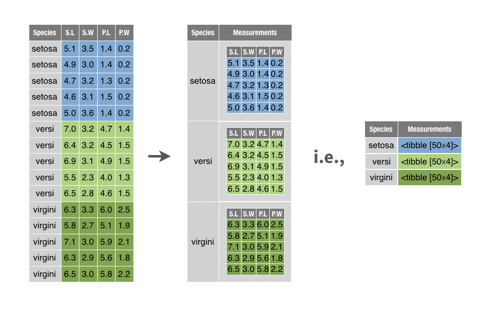

# Functional programming med purrr-pakken

```{r, echo=FALSE,fig.width = 1,fig.height=1,comment=FALSE,warning=FALSE,out.width="25%"}
# Bigger fig.width
library(png)
library(knitr)
#include_graphics("plots/hex-tidyverse.png")
include_graphics("plots/purrr.png")
```


"Den grundlæggende fordel ved data er, at de fortæller dig noget om verden, som du ikke vidste før." -- Hilary Mason

```{r,comment=FALSE,message=FALSE,warning=F,echo=FALSE}
library(ggplot2)
library(tidyverse)
library(gridExtra)
```

## Inledning og læringsmålene

Når du arbejder med biologiske data, har du ofte mange datasæt – forskellige prøver, replikater eller batches – der alle skal igennem den samme analysepipeline. Ved at bruge funktionel programmering kan hvert trin pakkes ind i små, rene funktioner, hvilket øger både reproducerbarhed og gennemsigtighed.

I emnet bruger vi R‑pakken `purrr` og dens `map()`‑familie for at anvende den samme funktion på tværs af alle mulige variabler i ét kald -- det sparer dig for lange for‑løkker, gør koden kortere og mere læsbar og mindsker risikoen for fejl – alt sammen væsentlige færdigheder i biologiske analyser.

:::goals
Du skal være i stand til at:

* Forstår hvad funktionel programmering indebærer, og hvorfor det er nyttigt i R.
* Anvende purrr-pakkens `map()`-familie af funktioner til at iterere over elementer i vektorer, lister og data frames.
* Ved hvordan man bruger map2() (og pmap()) til iteration over flere parallelle datastrukturer.
* Kan strukturere data i liste-kolonner med nest() og iterere over underdatasæt (fx grupperinger) med map(), samt konvertere tilbage med unnest().
* Kan skrive og anvende brugerdefinerede funktioner sammen med map()-funktionerne for at løse specifikke opgaver.
:::

:::checklist
* Husk at aflevere Workshop 2: tidyverse inden kl. 9 i morgen
* Se videoerne
* Quiz på Absalon - videre dag 1
* Lav problemstillingerne
:::


### Videorressourcer

* Video 1: Introduktion til `map()`-funktioner for iteration over kolonner

```{r,echo=FALSE}
library("vembedr")
#Link her hvis det ikke virker nedenunder: https://player.vimeo.com/video/549630848


embed_url("https://vimeo.com/549630848")
```


* Video 2: Introduction to custom functions and combining them with map

```{r,echo=FALSE}
#library("vembedr")
#Link her hvis det ikke virker nedenunder: https://player.vimeo.com/video/549630825


embed_url("https://vimeo.com/549630825")
```


* Video 3: Introduction to nest functions for breaking data into sections

```{r,echo=FALSE}
#library("vembedr")
#Link her hvis det ikke virker nedenunder: https://player.vimeo.com/video/549630798

embed_url("https://vimeo.com/549630798")
```


## Iterative processer med `map()` funktioner

Når man udfører en iterativ proces, gentager man typisk den samme handling flere gange. Forestil dig for eksempel, at vi har ti variabler og ønsker at beregne middelværdien for hver af dem. I dette eksempel arbejder vi med datasættet `eukaryotes`, der indeholder oplysninger om forskellige eukaryote organismer – blandt andet deres navne, grupper, undergrupper, antal proteiner/gener og genomstørrelse. Du kan indlæse dataene med kommandoen nedenfor og bagefter se en liste over alle kolonnenavnene.

```{r}
eukaryotes <- read_tsv("https://www.dropbox.com/s/3u4nuj039itzg8l/eukaryotes.tsv?dl=1")
```


For at gøre eksemplet mere overskueligt fokuserer vi på fire variabler. Med `select()` udtrækker vi kun kolonnerne `organism_name`, `center`, `group` og `subgroup` og gemmer dem i en ny data frame.

```{r}
#eukaryotes_full <- eukaryotes
eukaryotes_subset <- eukaryotes %>% 
  select(organism_name, center, group, subgroup)

eukaryotes_subset %>% glimpse()
```

Lad os derefter beregne antallet af unikke organismer (`organism_name`). Funktionen `n_distinct()` tæller, hvor mange unikke værdier der findes i en vektor. Vi vælger først kolonnen organism_name og anvender derefter `n_distinct()`:

```{r}
eukaryotes_subset %>% 
  select(organism_name) %>% 
  n_distinct()
```


Lad os forestille os, at vi også vil finde antallet af unikke værdier i variablerne `center`, `group` og `subgroup` – altså de tre øvrige kolonner i datasættet. Vi har flere muligheder:

* **Den manuelle tilgang**: vi kan skrive dem ud - men hvad nu hvis der er 100 variabler at håndtere?

```{r,results="hold"}
eukaryotes_subset %>% select(organism_name) %>% n_distinct()
eukaryotes_subset %>% select(center) %>% n_distinct()
eukaryotes_subset %>% select(group) %>% n_distinct()
eukaryotes_subset %>% select(subgroup) %>% n_distinct()
```

* **En mere automatiseret løsning**: der er den traditionelle programmeringsløsning: en for-løkke, som også fungerer i R:

```{r,results="hold"}
col_names <- names(eukaryotes_subset)

for(column_name in col_names)
{
  print(eukaryotes_subset %>% 
          select(column_name) %>% 
          n_distinct())
}
```

* **Den tidyverse tilgang**. Når man først har vænnet sig til den, er den ofte mere intuitiv og læsevenlig – og den spiller bedre sammen med resten af `tidyverse`. Den løsning viser jeg i næste afsnit.

### Introduktion til `map()` funktioner


`Tidyverse`-løsningen er de såkaldte `map()`-funktioner, som er en del af `purrr`-pakken. Jeg introducerer dem her frem for base-R-løsningerne, ikke kun fordi de er en del af `tidyverse`, men også fordi de er en meget fleksibel og letforståelig tilgang, når man først er blevet vant til dem.

Nedenfor demonstrerer jeg først, hvordan `map()` anvendes på datasættet `eukaryotes`; derefter viser jeg, hvordan samme idé kan kombineres med brugerdefinerede funktioner og `nest()` for at opdele datasættet og gentage processen på hver del.

Man anvender `map()` ved at angive funktionsnavnet `n_distinct` inden i `map()`, og `map()` beregner så `n_distinct()` for hver kolonne i datasættet.

```{r}
eukaryotes_subset %>% map(n_distinct) #do 'n_distinct' for every single column
```

Så kan man se, at vi har fået en `list` tilbage, der indeholder tal, som viser antallet af unikke værdier for hver af de fire kolonner. Det fungerer lidt som base-R funktionen `apply`, men med `apply` skal man bruge `2` på anden pladsen for at angive, at vi gerne vil iterere over kolonnerne.

```{r}
apply(eukaryotes_subset,2,n_distinct)
```

Bemærk, at vi her har fået en vektor af tal tilbage, men med `map` har vi fået en `list`. Der er faktisk andre varianter af `map`, som kan benyttes til at returnere resultatet i forskellige datatyper. For eksempel, kan man bruge `map_dbl()` til at få en double `dbl` tilbage - en vektor af tal, ligesom vi fik med `apply` i ovenstående. 

```{r}
# Apply n_distinct to all variables, returning a double
eukaryotes_subset %>% map_dbl(n_distinct)
```

Man kan også bruge `map_df()` for at få en dataramme (`tibble`) tilbage - det er særligt nyttigt for os, da vi altid tager udgangspunkt i en dataramme, når vi skal lave et plot.

```{r}
# Apply n_distinct to all variables, returning a dataframe
eukaryotes_subset %>% map_df(n_distinct)
```

For eksempel, kan man tilføje de tal fra `map_df` direkte ind i et ggplot.

```{r,fig.width=5,fig.height=2}
eukaryotes_subset %>% 
  map_df(n_distinct) %>% 
  pivot_longer(everything(), names_to = "variable", values_to = "count") %>%
  ggplot(aes(x = variable, y = count,fill = variable)) +
  geom_col() +
  coord_flip() + 
  theme_minimal()
```


<!-- ### Map funktion med arguments -->

<!-- En ting som er vigtig at husk - hvis man gerne vil tilføje arguments indenfor de funktioner de specificer med `map()` så skal man tilføj `~` som i følgende: -->

<!-- ```{r} -->
<!-- eukaryotes_subset %>% map_df(n_distinct) -->
<!-- ``` -->

<!-- ```{r} -->
<!-- eukaryotes_subset %>% map_df(~.x %>% n_distinct(na.rm=TRUE)) -->
<!-- ``` -->


### Reference for de forskellige map-funktioner

<!-- Der findes en hel familie af map-funktioner som alle arbejder ens, men returnerer forskellige typer output eller håndterer input anderledes. Figur 1 giver et overblik: -->

Dette er en kort oversigt over de forskellige `map`-funktioner i R og hvilken type data, de returnerer.

| Funktion    | Returnerer             | Typisk brug                                                                    |
|-------------|------------------------|--------------------------------------------------------------------------------|
| `map()`     | **list**               | Standardvalg, når elementerne kan have forskellig type/længde.                 |
| `map_lgl()` | **logisk vektor**      | Ja/nej-tests, fx `is.na`, `grepl`.                                             |
| `map_int()` | **integer-vektor**     | Heltal, fx antal karakterer pr. streng.                                        |
| `map_dbl()` | **double-vektor**      | Numeriske resultater med decimaler (gennemsnit, sum, SD).                      |
| `map_chr()` | **karaktervektor**     | Tekstoutput, fx udtræk af navne eller labels.                                  |
| `map_df()`  | **data frame / tibble**| Binder liste-output sammen kolonne for kolonne (som `dplyr::bind_rows()`).     |


:::tip
**Tip 1**: Hvis du arbejder med flere input-vektorer samtidig, findes søsterfunktionerne `map2()` (to input-objekter) og `pmap()` (liste af input-objekter).
:::

:::tip
**Tip 2 (valgfri)**: Når du blot vil klistre resultaterne sammen på tværs af rækker eller kolonner, kan du bruge de praktiske alias-varianter `map_dfr()` (row-bind) og `map_dfc()` (column-bind).
:::

## Brugerdefinerede funktioner

Vi kan lave vores egne funktioner og benytte dem indenfor `map()`-funktionen for at yderligere øge fleksibiliteten i R. For eksempel, kan det være, at vi har en bestemt metode, vi gerne vil bruge til at normalisere vores data, og der eksisterer ikke en relevant funktion i R i forvejen. Ved at lave vores egne funktioner kan vi skræddersy vores dataanalyse til specifikke behov.

### Simple funktioner

Vi starter med en simpel funktion fra base-R og forklarer derefter dens struktur i tabellen nedenfor. Vi benytter oftest en anden form for funktioner i __tidyverse__, som vi ser på næste gang, men konceptet er det samme.

```{r}
my_function <- function(.x)
{
  return(sum(.x)/length(.x))
}
```

Kode                 | Beskrivelse
-------------------- | -----------------------------
`my_function_name`   | funktionens navn
`<- function(.x)`    | fortæller R, at vi laver en funktion, der tager data `.x` som input
`sum(.x)/length(.x)` | beregner gennemsnittet af data `.x`
`return()`           | det output, som funktionen skal give - her gennemsnittet

Lad os også afprøve vores nye funktion ved at beregne den gennemsnitlige værdi for `Sepal.Length` i datasættet `iris`.

```{r,results="hold"}
my_function(iris$Sepal.Length)
mean(iris$Sepal.Length)
```


### Brugerdefinerede funktioner med map

Inden for `tidyverse` skriver man funktioner på en lidt anden måde. Her er et eksempel på, hvordan den samme funktion kan skrives.

```{r}
my_function <- ~ sum(.x)/length(.x)
```

* `~` gør udtrykket til en formel, som `purrr` automatisk konverterer til en funktion.
* `.x` står for de data, der sendes ind i funktionen (for eksempel variablen `Sepal.Length` fra `iris`). Man bruger symbolet `.x` konsekvent, og R forstår automatisk, hvad det repræsenterer.

Vi kan bruge `my_function` inden for `map()` for at beregne den gennemsnitlige værdi for alle variabler (uden Species), og vi kan se, at vi får et resultat, der svarer til funktionen `mean()`:

```{r,results="hold"}
iris %>% 
  select(-Species) %>% 
  map_df(my_function)

iris %>% 
  select(-Species) %>% 
  map_df(mean)
```

Man kan også placere funktionen direkte inden for `map_df`, i stedet for at oprette og henvise til den ved navn (f.eks. `my_function`):

```{r}
iris %>%
  select(-Species) %>%
  map_df(~ sum(.x)/length(.x)) #for hver datakolonne, beregn summen og divider med længden
```


Vi kan også specificere andre funktioner. 

```{r}
iris %>%
  map_df(~nth(.x,10)) #tag hver kolonne, kald den for .x og find den 10. værdi
```

eller når `nth` er en __tidyverse__ funktion, kan vi bruge `%>%`:

```{r}
iris %>%
  map_df(~.x %>% nth(10)) #tag hver kolonne, kald den for .x og find den 10. værdi
```

Antallet af distinkte værdier, som ikke er `NA`:

```{r}
#tag hver kolonne, kald den for .x og beregn n_distinct
iris %>%
  map_df(~.x %>% n_distinct(na.rm = TRUE)) #n_dinstict er fra tidyverse
```

Bemærk, at hvis det er en indbygget funktion og vi benytter standardparametre (altså na.rm = FALSE i ovenstående), kan man blot skrive:

```{r}
iris %>%
  map_df(n_distinct)
```

Et andet eksempel: læg 3 til og kvadrer resultatet:

```{r}
iris %>%
  select(-Species) %>%
  map_df(~(.x + 3)^2) %>% head()
```

Jo mere kompleks en funktion bliver, desto mere mening giver det at definere den uden for `map()`-funktionen:

```{r}
my_function <- ~(.x - mean(.x))^2 + 0.5*(.x - sd(.x))^2 #en lang, meningsløs funktion

iris %>%
  select(-Species) %>%
  map_df(my_function) #beregn my_function for hver kolonne og output en dataramme 
```


:::pin
**Som du kan se, er der flere måder at skrive en “custom function” til `map()`-familien**

1. **Navngiven funktion**  

```r
map_df(mean)        # kalder en eksisterende funktion
```
   
2. **Formula-shorthand** (~)

```r
map_df(~ sum(.x)/length(.x))
```

3. **Forud-defineret, længere funktion**

```r
my_fun <- function(x) (x - mean(x))^2
map_df(my_fun)
```

4. **Lambda-operatoren \(…) (R ≥ 4.1)**

```r
map_df(\(x) mean(x, na.rm = TRUE))
```

**Formula-shorthand** er praktisk til én-linjes funktioner, men brug en eksplicit function() eller lambda, hvis du skal passere flere ekstra argumenter eller skrive mange linjer. 

:::


## Effekten af `map()` på vektorer, dataframe eller liste

I det ovenstående fokuserede jeg på `map` i forhold til dataframes. I `group_by` + `nest` anvender man `map()` på en liste af dataframes, kaldet `data`, hvilket tillader os at arbejde med hvert datasæt individuelt. Det er derfor værd at bruge lidt tid på at se, hvordan `map()` håndterer forskellige datatyper.

### __Input: vektor__

* `.x` refererer til en værdi i vektoren. Hvis man tager heltallet `1:10` og anvender `map`, så tager man hvert tal for sig og beregner en funktion med det - i det følgende simulerer man et tal fra den normale fordeling med parameteren `mean=.x`:

```{r}
c(1:10) %>% map_dbl(~rnorm(1,mean=.x))
```

### __Input: dataframe__

* `.x` refererer til en variabel fra dataframe. I det ovenstående er den første variabel `int1`, og i `map` tager man det første element med funktionen `pluck(1)`. 

```{r}
tibble("int1"=1:10,"int2"=21:30) %>% map(~.x %>% pluck(1))
```

Med `nest` ser vi på muligheden for at lave `map` over en liste, der er skabt med funktionen `nest()`. 

### __Input: liste__

* `.x` refererer til et element i listen - i det nedenstående er det første element `c(1,2)`, så hvis man anvender funktionen `max`, så finder man den højeste værdi (`2` i dette tilfælde).

```{r}
list(c(1,2),c(2,3),c(3,4)) %>% map(~max(.x))
```

Bemærk, at hvis der kun kommer et tal som resultat, kan man bruge `map_dbl` i stedet for `map` - så får man en vektor som output, selvom inputtet er en liste.

```{r}
list(c(1,2),c(2,3),c(3,4)) %>% map_dbl(~max(.x))
```

### __Liste af dataframes__

* `.x` refererer til et datasæt - så kan man referere til de forskellige variabler i `.x`, som man plejer i tidyverse.

Det følgende er ligesom tilfældet med konceptet "nesting" i den næste sektion. Man tager en liste af tibbles og vælger det første tal fra variablen `int`. 

```{r}
list(tibble("int"=1:10),tibble("int"=1:10),tibble("int"=1:10)) %>% 
  map_int(~.x %>% pluck("int",1))
```

## Nesting med `nest()`

I den næste lektion skal vi se, hvor nyttigt det kan være at bruge funktionen `nest()` til at besvare en række statistiske spørgsmål. Eksempelvis:

* Vi har udført 10 eksperimenter under lidt forskellige betingelser og ønsker at køre præcis den samme analyse på dem alle.
* Vi har 5 bakterietyper med 3 replikater hver og vil transformere dataene ens for hver kombination af bakterietype og replikat.

<!-- Funktionen `nest()` kan virke lidt abstrakt i starten, men konceptet er faktisk ret simpelt. Vi kan opdele vores datasæt (som indeholder vores forskellige betingelser/replikater osv.) med `group_by()` og derefter bruge `nest()` til at gemme de opdelte "underdatasæt" i en liste. Disse gemmes indenfor en kolonne i en `tibble`, hvilket gør det bekvemt at arbejde med de forskellige datasæt på samme tid (med hjælp fra `map()`). -->

`nest()` kan virke abstrakt ved første øjekast, men konceptet er faktisk ret enkelt:
	1.	Del først datasættet op i de ønskede grupper med `group_by()`.
	2.	Brug derefter `nest()` til at pakke hver gruppe ned i sit eget "mini-datasæt", som gemmes i en listekolonne i en tibble.

Resultatet er en kompakt tabel, hvor hver række indeholder et underdatasæt (f.eks. ét eksperiment eller én bakterietype). Det gør det nemt at køre den samme analyse eller transformation på tværs af alle underdatasæt ved hjælp af `map()`-funktionerne fra __purrr__ – og bagefter kan du folde resultaterne ud igen med `unnest()`, hvis det er nødvendigt.


```{r, echo=FALSE,out.width="100%",fig.cat="reference: https://rstudio-education.github.io/tidyverse-cookbook/transform-tables.html"}
# Bigger fig.width
library(png)
library(knitr)

```

Lad os opdele `eukaryotes_subset` efter variablen 'group' og anvende `nest()`:

```{r}
eukaryotes_subset_nested <- eukaryotes_subset %>% 
  group_by(group) %>%     # del data i grupper
  nest()                  # gem hver gruppe som en tibble i kolonnen `data`

eukaryotes_subset_nested
```

Vi kan se, at vi har to variabler - `group` og `data`. Variablen `data` indeholder faktisk fem datarammer (tibbles). For eksempel indeholder det første datasæt kun observationer, hvor `group` er lig med "Other", det andet datasæt har kun observationer, hvor `group` er lig med "Protists", osv.

Vi kan kontrollere dette ved at kigge på det første datasæt. Her er to måder at gøre det på:

```{r}
# Direkte via liste-indeks
first_dataset <- eukaryotes_subset_nested$data[[1]]

# Eller med purrr::pluck()
first_dataset <- eukaryotes_subset_nested %>% pluck("data", 1)

first_dataset %>% head()
```

Hvis vi ønsker at vende tilbage til vores oprindelige datasæt, kan vi bruge `unnest()` og specificere kolonnen `data`:

```{r}
eukaryotes_subset_nested %>% 
  unnest(data) %>% 
  head()
```

Spørgsmålet er så: hvordan kan vi inkorporere "nested" data i vores analyser?

### Anvendelse af map() med nested data

De fleste gange vi arbejder med nested data, er fordi vi ønsker at udføre den samme operation på hvert af de "sub" datasæt. Derfor er det her, funktionen `map()` kommer ind i billedet. Den typiske proces er:

* Tag det nestede datasæt
* Tilføj en ny kolonne med `mutate()`, hvor vi:
* Tager hvert datasæt fra kolonnen `data` og bruger `map()`, i det nedenstående eksempel til at finde antallet af rækker.

```{r}
eukaryotes_subset_nested %>% 
  mutate(n_row = map_dbl(data,nrow))
```

Vi kan også bruge en brugerdefineret funktion. I det nedenstående eksempel beregner vi antallet af unikke organismer fra variablen `organism_name` i datasættet. Husk:

* `~` betyder, at vi laver en funktion, som kommer til at fungere for alle fem datasæt.
* Tag et datasæt og kald det for `.x` - det refererer til et bestemt datasæt fra en af de fem datasæt, som hører under kolonnen `data` i det nestede datasæt.
* Vælg variablen `organism_name` fra `.x`
* Beregn `n_distinct`

```{r}
n_distinct_organisms <- ~ .x %>% #tag data
  select(organism_name) %>%  #vælg organism_name
  n_distinct #returner antallet af unikke værdier
```

```{r}
# Gentag funktionen for hver af de fem datasæt:
eukaryotes_subset_nested %>% 
  mutate(n_organisms = map_dbl(data, n_distinct_organisms))
```

Her er et andet eksempel. Her handler det om `eukaryotes` data (ikke subsettet), som har oplysninger om fx GC-indholdet med variablen `gc`. Her bruger vi `pull` i stedet for `select` - det er næsten det samme, men med `pull()` får vi en vektor, som fungerer med `median`, som er en base-R-funktion. 

```{r}
# func_gc <- ~ .x %>% 
#   pull(gc) %>%       # ligesom select, men vi har brug for en vektor for at beregne median
#   median(.x,na.rm=T) # `na.rm` fjerner `NA` værdier)

func_gc <- ~median(.x %>% pull(gc),na.rm=T) 

ekaryotes_gc_by_group <- eukaryotes %>% 
  group_by(group) %>% 
  nest() %>% 
  mutate("median_gc"=map_dbl(data, func_gc))
ekaryotes_gc_by_group
```

En mere "tidyverse" måde at opnå samme ting:

```{r}
func_gc <- ~.x %>% 
  summarise(my_median = median(gc,na.rm=T)) %>% 
  pull(my_median) 

ekaryotes_gc_by_group <- eukaryotes %>% 
  group_by(group) %>% 
  nest() %>% 
  mutate("median_gc"=map_dbl(data, func_gc))
ekaryotes_gc_by_group
```


Og jeg kan bruge resultatet i et plot, ligesom vi plejer:

```{r,fig.width=4,fig.height=2}
ekaryotes_gc_by_group %>% 
  ggplot(aes(x=group,y=median_gc,fill=group)) + 
  geom_bar(stat="identity") + 
  coord_flip() +
  theme_minimal() 
```


__flere statistik på en gang__

Lave funktionerne:

```{r,eval=TRUE}
func_genes <-       ~median(.x %>% pull(genes),   na.rm=T) 
func_proteins <-    ~median(.x %>% pull(proteins),na.rm=T) 
func_size <-        ~median(.x %>% pull(size_mb), na.rm=T) 
```

Anvende `nest()`:

```{r,eval=TRUE}
eukaryotes_nested <- eukaryotes %>% 
  group_by(group) %>% 
  nest() 
```

Tilføje resultatet over de fem datasæt med `mutate()`:

```{r,eval=TRUE}
eukaryotes_stats <- eukaryotes_nested %>%
  mutate(mean_genes = map_dbl(data,func_genes),
         proteins = map_dbl(data,func_proteins),
         mean_size_mb = map_dbl(data,func_size))
```

Husk at fjerne kolonnen `data` før man anvende `pivot_longer()` (ellers får man en advarsel):

```{r,fig.height=3,fig.width=8}
eukaryotes_stats %>% 
  select(-data) %>%
  pivot_longer(-group) %>%
  ggplot(aes(x=group,y=value,fill=group)) + 
  geom_bar(stat="identity") + 
  facet_wrap(~name,scales="free",ncol=4) + 
  theme_bw()
```


## Andre brugbar purrr

### `map2()` funktion for to input-vektorer

`map2()` fungerer på samme måde som `map()`, men den tager to parallelle input-objekter (typisk to vektorer, listekolonner eller andre sekventielle strukturer) og anvender en funktion på hvert "par" af elementer. Det er særligt nyttigt, når:

* du skal iterere over to kolonner i et datasæt – f.eks. for at beregne noget ud fra værdierne i begge kolonner
* du har to matchende lister (fx filstier og ark-navne) og vil kalde en funktion på hver kombination
* du vil sammenligne eller kombinere observationer to-og-to (fx korrelationer eller forskelle)

```{r}
eukaryotes_subset %>% 
  mutate(
    combined = map2_chr(organism_name, center, ~ paste(.x, .y, sep = " - "))
  ) %>% 
  select(organism_name, center, combined) %>% 
  head()
```

I eksemplet herunder tager vi to numeriske kolonner i eukaryotes_stats, `mean_genes` og `proteins`, og lægger dem sammen med `sum()`. Resultatet gemmes i den nye kolonne colstat (vi bruger `map2_dbl()` for at få en numeric vektor tilbage):

```{r}
eukaryotes_stats %>% 
  mutate(colstat = map2_dbl(mean_genes, proteins, sum))
```

Den helt samme værdi kunne opnås endnu kortere ved blot at lægge kolonnerne sammen:

```{r}
eukaryotes_stats %>% mutate(colstat2 = mean_genes + proteins)
```

Der findes dog mange situationer, hvor en simpel "+" ikke rækker, og hvor `map2()` (eller de beslægtede `map2_*()`-varianter) fungerer virkelig godt — fx når du genererer grafer eller kalder mere komplekse funktioner:

```{r}
eukaryotes_stats_with_plots <- eukaryotes_stats %>% 
  mutate(
    # log10-transformer hver mini-tibble i kolonnen `data`
    log10_genes = map(data, ~ .x %>% pull(genes) %>% log10()),
    
    # opret én density-plot pr. gruppe
    myplots = map2(
      group,
      log10_genes,
      ~ tibble(log10_genes = .y) %>% 
          ggplot(aes(x = log10_genes)) +
          geom_density(colour = "red", alpha = 0.3) +
          theme_bw() +
          ggtitle(paste("Density plot of log10(genes) in", .x))
    )
  )
```

For at vise fx plot nummer 2 (dvs. den anden gruppe) kan du blot plukke det frem:

```{r,fig.width=4,fig.height=4}
eukaryotes_stats_with_plots %>% 
  pluck("myplots", 2)
```

Denne fremgangsmåde holder alle delresultater – de rå data, de afledte værdier og selve plot-objekterne – samlet i én overskuelig tibble. Det gør workflowet reproducérbart og skalerbart, især når man analyserer mange biologiske grupper eller prøver.

### `map_if()` til transformering af numeriske variabler

Som en sidste bemærkning, her er en nyttig variant af `map` - her kan man udføre en operation på kun bestemte variabler - for eksempel anvender jeg i det følgende funktionen `log2()` på alle numeriske variabler. Bemærk, at man er nødt til at anvende `as_tibble()` igen bagefter (som kun fungerer, hvis alle variabler stadig har samme længde efter `map_if()`):

```{r}
eukaryotes %>% map_if(is.numeric,~log2(.x)) %>% as_tibble()
```


Der er flere `map` funktion der tager flere `input` fk. `pmap` (du kan godt læse mere om dem hvis du har bruge for dem: https://purrr.tidyverse.org/reference/map2.html)

Med `pmap_*()` kan du anvende en funktion element-for-element på flere parallelle vektorer (en generalisering af `map2_*()`). Her lægger vi tre tal sammen ad gangen:

```{r}
a <- 1:3
b <- 4:6
c <- 7:9

# summerer 1 + 4 + 7, 2 + 5 + 8, 3 + 6 + 9
pmap_dbl(list(a, b, c), ~ ..1 + ..2 + ..3)
#> [1] 12 15 18
```


## Problemstillinger

__Problem 1)__ Lave Quiz på Absalon "Quiz - funktionel programmering"

---

__Problem 2)__ *Basis øvelser med `map()`* 

Indlæse `msleep`:

```{r}
data(msleep)
```

Første eksempel:

```{r}
msleep %>%                        # hele datasættet
  select(vore, order, conservation) %>%   # tre kategoriske variabler
  map(n_distinct)                 # antal unikke værdier i hver kolonne
```

Brug de forskellige `map_*()`-varianter (se 7.2.2 ovenstående) til at beregne følgende:

__a)__  Vælg variablerne `vore`, `order` og `conservation` and beregn antallet af unikke værdier i hver kolonne med `n_distinct()`. _Output skal være en **liste**._

```{r, echo=TRUE,eval=TRUE}
msleep %>%
  select(vore, order, conservation) %>%
  map(n_distinct)
```

__b)__ Vælg alle numeriske variabler (hint: where(is.numeric)) og beregn gennemsnittet for hver kolonne. _Output skal være en double-vektor (`dbl`)_.

```{r, echo=TRUE,eval=TRUE}
msleep %>%
  select(where(is.numeric)) %>%
  map_dbl(mean, na.rm = TRUE)
```

__c)__ Beregn datatypen (`typeof()`) for alle variabler. _Output skal være en dataframe / tibble._

```{r, eval=FALSE,echo=FALSE}
msleep %>%
  map_df(typeof)
```

---

__Problem 3__) *`map()` øvelse med brugerdefinerede funktioner*.

Indlæse `diamonds` med `data(diamonds)`. 

Husk: Når I bruger en custom-lavet funktion eller vil gerne tilføje ekstra argumenter til en ekisisterende funktion (dvs. burge ikke-standard indstillinger), skal I skrive `~` og bruge `.x` ind i funktionen:

```{r,eval=FALSE,echo=TRUE}
data(diamonds)
# specificere funktion unden instillinger
msleep %>%
  map_df(n_distinct)
# custom funktion - skal have ~ og .x
msleep %>%
  map_df( ~ n_distinct(.x, na.rm = TRUE)) 
```

__a__) Kør venligst følgende kode og forklar kort, hvad der sker i hver linje (`nth(.x,1)` henter første værdi) :

```{r,echo=TRUE,eval=FALSE}
msleep %>%
  select(sleep_total, sleep_rem) %>%
  map_df( ~ mean(.x, na.rm = TRUE))

msleep %>%
  select(sleep_total, sleep_rem) %>%
  map_df( ~ ifelse(.x > mean(.x, na.rm = TRUE), "above", "below"))

msleep %>%
  filter(order == "Primates") %>%
  select(vore, conservation) %>%
  map( ~ nth(.x, 10))
```

__b__) Tag udgangspunkt i `msleep`:

  * Vælg kolonnerne `sleep_total`, `sleep_rem`, `sleep_cycle` og `awake`.
  * Fjern alle rækker med manglende værdier (dvs. __'not available'__).
  * Læg 2 til værdierne i hver kolonne og tager kvadratroden (`sqrt()`).
  * Resultatet skal være i tibble-format.

```{r,eval=FALSE,echo=TRUE}
msleep %>%
  select(sleep_total, sleep_rem, sleep_cycle, awake) %>%
  drop_na() %>%
  map_df( ~ sqrt(.x + 2))
```

__c__) Tag udgangspunkt i `msleep` igen:

  * Anvend `log2()` på samtlige **numeriske** kolonner i `msleep` (7.6.2).
  * Resultatet skal igen være i tibble-format.

```{r,echo=FALSE,eval=FALSE}
msleep %>%
  map_if(is.numeric,  ~ log2(.x)) %>%
  as_tibble()
```

---

__Problem 4)__ *Brug af map på forskellige datatyper*.

Vi så at når vi anvender `map()` på en dataframe, anvendes en funktion på hver kolonne. Lad os se, hvad der sker, når vi har forskellige datatyper:

__a__) (_En vektor af tal_) 

  * Kør det følgende og bemærk, at funktionen i `map()` anvendes til hvert tal i vektoren.

```{r,eval=FALSE,echo=TRUE}
c(1:10) %>%
  map_dbl( ~ .x * 2)

c(1:10) %>%
  map_dbl( ~ rnorm(1, mean = .x, sd = 1))
```

  * Tag udgangspunkt i `c(1:10)` og brug `map_dbl` til at beregne `log()` for hvert tal i vektoren (angiv indstillingen `base=5`):

```{r,echo=T,eval=F}
c(1:10) %>% ???
```

```{r,echo=FALSE,eval=FALSE}
c(1:10) %>%
  map_dbl( ~ log(.x, base = 5))
```

__b__) Ændr venligst `c(1:10)` til en liste ved at bruge `as.list(c(1:10))`.

  * Anvend de samme funktioner som i __a__) på listen.
  * Bemærk, at funktionerne denne gang anvendes på hvert element i listen. I får samme resultat selvom inputtet er forskellige.
  * Ved siden af vektorer og lister, kan inputtet også være dataframes - ligesom i det næste spørgsmål.
  
```{r}
c(1:10) %>%
  as.list() %>%
  map_dbl( ~ .x * 2)

c(1:10) %>%
  as.list() %>%
  map_dbl( ~ rnorm(1, mean = .x, sd = 1))

c(1:10) %>%
  as.list() %>% 
  map_dbl( ~ log(.x, base = 5))
```


<!-- __b__) (_En list af tibbles_)  -->

<!-- ```{r,echo=T,eval=T} -->
<!-- my_list_of_tibbles <- list( tibble("letter" = c("a","a","a"), "number" = c(1,3,3)), -->
<!--                             tibble("letter" = c("a","b","b"), "number" = c(3,3,1)), -->
<!--                             tibble("letter" = c("a","b","a"), "number" = c(2,3,3))) -->
<!-- ``` -->


<!-- * Kør følgende kode, der tager den første `tibble` i listen `my_list_of_tibbles`, udvælger observationer hvor `letter` = "a", og beregner dernæst middelværdien af "number". -->

<!-- ```{r,echo=T,eval=F} -->
<!-- my_list_of_tibbles %>% pluck(1) %>% filter(letter=="a") %>% summarise(mn = mean(number)) -->
<!-- ``` -->

<!-- * Da min kode virker for den første `tibble`, kan jeg ændre den til en funktion og anvende den med `map()` for at udføre samme proces på alle dataframes i listen. Prøv at køre følgende: -->

<!-- ```{r,eval=F,echo=T} -->
<!-- my_list_of_tibbles %>% map(~.x %>% filter(letter=="a") %>% summarise(mn = mean(number))) -->
<!-- ``` -->

<!-- ```{r,eval=F,echo=T} -->
<!-- my_function <- ~.x %>% filter(letter=="a") %>% summarise(mn = mean(number)) -->

<!-- my_list_of_tibbles %>% map(my_function) -->
<!-- ``` -->


<!-- * Tag udgangspunkt i `my_list_of_tibbles`, og for hver tibble, vælg alle tilfælde, hvor variablen `number` er 3, og tæl dernæst, hvor mange `a` der er tilbage i variablen `letter`. Du kan afprøve på den første `tibble`, hvis det hjælper. -->

<!-- ```{r,echo=F,eval=F} -->
<!-- my_list_of_tibbles %>% map(~.x %>% filter(number==3) %>% summarise("no_a"=sum(letter=="a"))) -->

<!-- #my_list_of_tibbles %>% map(~.x %>% filter(number==3) %>% count(letter)) -->
<!-- ``` -->

___

__Problem 5__) *Kombination af `group_by()` og `nest()`*.

__a__) For datasættet `iris`, anvend `group_by(Species)` og tilføj dernæst `nest()`, og kigger på resultatet.

```{r,eval=FALSE,echo=FALSE}
data(iris)
iris %>% 
  group_by(Species) %>% 
  nest()
```

__b__) Tag udgangspunkt i dit nested `iris`-dataframe fra __a__).

  * Tilføj `pull(data)` og se på resultatet.
  * Fjern `pull(data)` og tilføj `pluck("data",1)` i stedet for, for at se den første dataramme.
  * Fjern `pluck("data",1)` og tilføj `unnest(data)` i stedet for og se på resultatet.
  * Fjern `unnest(data)` og tilføj følgende i stedet for og prøve at forstå hvad der sker:
      + `mutate(new_column_nrow = map_dbl(data,nrow))`
      + `mutate(new_column_ratio = map(data,~(.x$Sepal.Width/.x$Sepal.Length)))`

```{r,eval=TRUE,echo=FALSE}
## Isolere alle delmængder
iris %>% 
  group_by(Species) %>% 
  nest() %>%
  pull(data)

## Isolere individuelle delmængder
iris %>%
  group_by(Species) %>%
  nest() %>%
  pluck("data",1)

## Rékombiner alle delmængder igen
iris %>%
  group_by(Species) %>%
  nest() %>%
  unnest("data")
```

```{r,eval=TRUE,echo=FALSE}
# Map funktioner over alle elementer i hver delmængde
iris %>% 
  group_by(Species) %>% 
  nest() %>% 
  mutate(
    new_column_nrow = map_dbl(
        .x = data,
        .f = nrow
      ),
    new_column_ratio = map(
        .x = data,
        ~ (.x$Sepal.Width/.x$Sepal.Length)
      )
    ) %>%
  pluck("new_column_ratio", 1)

# Sammenlign ovenstående resultat med følgende
iris %>%
  filter(Species == "setosa") %>%
  mutate(
      new_column_ratio = Sepal.Width/Sepal.Length
    ) %>%
  pull(new_column_ratio)
```

---

__Problem 6__) *map() i kombination med brugerdefinerede funktioner*.

Tag udgangspunkt i `msleep` igen:

__a__) Brug `map()`-funktionen for at beregn gennemsnitsværdierne for de numeriske variabler i `msleep`-datasættet.

  * Husk at anvende parameteren `na.rm = T` i `mean()`-funktionen for at fjerne manglende værdier i beregningen.
  * Se __Problem 3)__, når du er i tvivl.

```{r,echo=FALSE,eval=FALSE}
msleep %>%
  select(where(is.numeric)) %>%
  map_dbl( ~ mean(.x, na.rm = T))
```

__b__) Foretag samme beregning som i __a__), men kun for observationerne, hvor variablen `vore` er "carni".

```{r,echo=FALSE,eval=FALSE}
msleep %>%
  filter(vore == "carni") %>%
  select(where(is.numeric)) %>%
  map_dbl( ~ mean(.x, na.rm = T))
```

__c__) Brug funktionerne `group_by()` og `nest()` til at opdele datasættet efter variablen `vore`.

```{r,echo=FALSE,eval=FALSE}
msleep_nested <- msleep %>% 
  group_by(vore) %>% 
  nest()
```

__d__) Tag udgangspunkt i jeres nestede dataframe fra __c__).

  * Anvend `map()`-funktionen inden for `mutate()` for at oprette to nye kolonner:
    + `num_rows` - antallet af rækker i hver delmængde (resultat skal være et heltal).
    + `mean_sleep` - gennemsnitlig søvn (variablen `sleep_total`) i hver delmængde.
    + Brug en custom-lavet / brugerdefinerede funktion for at fjerne NA-værdierne i beregningen
    + Angiv resultat som en `dbl` datatype.

```{r,echo=TRUE,eval=FALSE}
msleep_nested <- msleep_nested %>% 
  mutate(
      nrow = map_int(data, ???),
      mean_sleep = map_dbl(data, ???)
    )
```

```{r,echo=FALSE,eval=FALSE}
msleep_nested <- msleep_nested %>% 
  mutate(
    nrow = map_int(data, nrow),
    mean_sleep = map_dbl(
        .x = data,
        ~ mean(.x$sleep_total, na.rm = TRUE)
      )
    )
```

__e__) Tilføj også en kolonne til din dataframe fra __d__), der hedder `unique_genus`.

  * `unique_genus` bør vise antallet af unikke værdier i kolonne `genus` i hver delmængde.
  * Hint: Brug funktionenerne `length()` og `unique()`, samt `pull` for at trække variablen `genus` fra datasættet `.x`.
  * Resultat skal være `int`.

```{r,echo=FALSE,eval=FALSE}
msleep_nested <- msleep_nested %>% 
  mutate(
    unique_genus = map_int(
      .x = data,
      ~ length( unique(.x %>% pull(genus))))
    )

# Alternativ mere i overensstemmelse med tidyverse-style
msleep_nested <- msleep_nested %>% 
  mutate(
    unique_genus = map_int(
      .x = data,
      .f = function(df){
        df %>%
          pull(genus) %>%
          unique() %>%
          length()
      }
    )
  )
```

__f__) Tag udgangspunkt i dit resultat fra __d__) + __e__) og lav venligst plots af dine opsummeringsstatistikker.

```{r,echo=FALSE,eval=FALSE}
msleep_nested %>% 
  pivot_longer(cols = -c("vore","data")) %>% 
  ggplot(
    data = .,
    mapping = aes(
        x = name,
        y = value,
        fill = vore
      )
    ) + 
  geom_bar(
      stat = "identity",
      position = "dodge"
    ) +
  theme_bw() +
  theme(aspect.ratio = 1)
```

__g__) Prøv at få plottet fra __f__) også ved at bruge `group()` og `summarise()`-funktioner i stedet.

  * Til dette, tag udgangspunkt i det oprindelige datasæt `msleep`.

```{r,echo=FALSE,eval=FALSE}
msleep %>% 
  group_by(vore) %>% 
  summarise(
      nrow = n(),
      unique = length(unique(genus)),
      mean_sleep = mean(sleep_total)
    ) %>%
  pivot_longer(cols = -"vore") %>% 
  ggplot(
      data = .,
      mapping = aes(
          x = name,
          y = value,
          fill = vore
        )
      ) + 
    geom_bar(
        stat = "identity",
        position = "dodge"
      ) +
    theme_bw() +
    theme(aspect.ratio = 1)
```

---

__Problem 7__) *Kombination af map() og ggplot()*.

__a__) Anvend `group_by` og `nest()` for at adksille `msleep` efter variablen `vore`.

  * Gem din nye dataframe igen som `msleep_nested` for at arbejde videre med det.

```{r,echo=FALSE,eval=FALSE}
msleep_nested <- msleep %>% 
  group_by(vore) %>% 
  nest()
```

  * Brug følgende funktion sammen med `map()` for at oprette en ny kolonne i din nested dataframe, der hedder `my_plots`.

```{r,echo=TRUE,eval=FALSE}
my_plot_func <- ~ggplot(.x, aes(brainwt, sleep_total)) +
  geom_point()
```

```{r,echo=TRUE,eval=FALSE}
my_plots <- msleep_nested %>% 
  ??? # opret en ny kolonne her hvor du anvender funktionen
```

```{r,echo=FALSE,eval=FALSE}
my_plots <- msleep_nested %>%
  mutate(myplot = map(data, my_plot_func))
```

__b__) Brug funktionen `grid.arrange()` fra R-pakken `gridExtra` til at vise plotterne fra din nye kolonne.

  * Angive at parameteren `grobs` af `grid.arrange()` skal være din nye kolonne.

```{r,echo=FALSE,eval=FALSE}
library(gridExtra)
grid.arrange(
    grobs = pull(my_plots, myplot)
  )
```
  
  * Prøv at lave din plots pænere ved at tilføje et tema / farver osv. til `my_plot_func` fra __a__).

```{r,echo=FALSE,eval=FALSE}
my_plot_func <- ~ggplot(.x, aes(brainwt, sleep_total)) +
  geom_point() +
  theme_bw() +
  theme(aspect.ratio = 1)

my_plots <- msleep_nested %>%
  mutate(myplot = map(data, my_plot_func))

grid.arrange(
    grobs = pull(my_plots, myplot)
  )
```

---

__Problem 8__)  *Skift mellem long og wide formatet*.

  * Tag udgangspunkt i datasættet `iris`.
  * OBS! Vi tilføjer kolonnen `id` så at hver plante (række) kan identificeres når vi går fra long- til wide- form i __b__).
  * `id`-kolonnen er vigtigt for at gå tilbage til wide-formatet senere.

```{r}
#kør denne kode
data(iris)
iris <- iris %>%
  mutate(id = row_number())

# Alternativ
# iris <- iris %>%
#   mutate(id = 1:nrow(iris))
```

__a__) Anvend `group_by()` og `nest()` til at opdele datasættet efter `Species`. 

```{r,echo=FALSE,eval=TRUE}
iris_nested <- iris %>%
  group_by(Species) %>%
  nest()
```

__b__) Brug vores brugerdefinerede `pivot_longer`-funktion med `map()` for at tilføje en ny kolonne med navnet `new_column_long`.
  
  * Tag udgangspunkt i den nestede dataframe fra __a__).
  * Funktionen transformerer delmængder af dataframen til lang-formatet.

```{r,eval=TRUE,echo=TRUE}
my_func_longer <- ~.x %>%
  pivot_longer(cols = -id)
```

```{r,echo=FALSE,eval=TRUE}
iris_nested <- iris_nested %>%
  mutate(
      new_column_long = map(
        .x = data,
        .f = my_func_longer
      )
    )
```

__c__) Skriv en ny funktion og anvend den på kolonnen `new_column_long` (ikke `data`).

  * Den ny funktion skal vender hvert datasæt i `new_column_long`-kolonnen til wide-form igen.
  * Giv denne ny kolonne navnen `new_column_wide`.
  * Brug parameteren `id_cols = id` for at akskille de forskellige plante under tilbagetransformation.
  * Uden at bruge `id` ved funktionen ikke om eksempelvis en bestemt `Sepal.Length` værdi og en bestemt `Sepal.Width` tilhører hinanden og skal kombineres.

```{r,echo=TRUE,eval=FALSE}
my_func_wider <- ??? #lave long data om til wide form (husk at angiv names_from,values_from,id_cols)
  
iris_nested %>% ???#anvend din funktion  
```

```{r,echo=FALSE,eval=FALSE}
my_func_wider <- ~.x %>%
  pivot_wider(
      names_from = name,
      values_from = value,
      id_cols = id
    )

iris_nested <- iris_nested %>% 
  mutate(
    new_column_wide = map(
        .x = new_column_long,
        .f = my_func_wider
      )
    )
```

__d__) Anvend `pluck()`-funktionen på kolonnerne `new_column_long` og `new_column_wide` til at kigge på den første datasæt for at se, om du har outputtet i long/wide form som forventede.

```{r,echo=FALSE,eval=FALSE}
iris_nested %>%
  pluck("new_column_long",1)

iris_nested %>%
  pluck("new_column_wide",1)
```

---

__Problem 9__) *Forberedelse til næste emne / lektion*.

For at bedre kunne se værdien i at bruge en kombination af `group_by()`, `nest()` og `map()` kan vi gennemgå en simpel eksempel som indledning til vores næste lektion.

__a__) Vi bruger følgende funktion:

```{r}
my_func <- ~ t.test(.x$Petal.Width,.x$Sepal.Length)
```

  * Anvend `group_by(Species)` og dernæst `nest()` på datasættet `iris`.
  * Tilføj `mutate()` til at lave en ny kolonne som hedder `t_test` og bruge funktionen indenfor `map()` på kolonnen `data`.
  * Tilføj `pull(t_test)` til din kommando - man får de tre t-tests frem, som man lige har beregnet.
  * Prøv `unnest(t_test)` i stedet for `pull(t_test)` - man får en advarsel fordi de t-test resultater er ikke i en god form til at vise indenfor en dataframe. Vi er nødt til at  ændre vorss output til tidy-formatet først.

```{r,echo=FALSE,eval=FALSE}
iris %>% 
  group_by(Species) %>% 
  nest() %>% 
  mutate(t_test = map(data,my_func)) %>% 
  pull(t_test)
```

```{r,echo=FALSE,eval=FALSE}
iris %>% 
  group_by(Species) %>% 
  nest() %>% 
  mutate(t_test = map(data,my_func)) %>% 
  unnest(t_test)
```

__b__) Installer venligst R-pakken `broom` (`install.packages("broom")`) og indlæs pakken.

  * Vi vil gerne bruge funktionen `glance()`, der få statistikkerne fra `t.test()` ind i en pæn form.
  * Gør det samme som i __a__) men bruge følgende funktion i stedet for:

```{r,warning=F,comment=F,message=F}
library(broom)
my_func <- ~ t.test(.x$Petal.Width,.x$Sepal.Length) %>% glance()
```

  * Tilføj `pull` eller `unnest` til din kommando som før og se på resultatet.
  * Man får en pæn dataramme frem med alle de forskellige statistikker fra `t.test()`.

```{r,echo=FALSE,eval=FALSE}
iris_ttest <- iris %>% 
  group_by(Species) %>% 
  nest() %>% 
  mutate(t_test = map(data,my_func)) %>% 
  unnest(t_test)

iris_ttest
```

  * Vælg venligst selv en af statistikerne og omsætte den til et plot.
  
```{r,echo=FALSE,eval=FALSE}
iris_ttest %>%
  mutate(
      `-log10(p.value)` = (-1)*log10(p.value)
    ) %>%
  select(-p.value) %>% 
  pivot_longer(cols = where(is.numeric)) %>%
  ggplot(
      data = .,
      mapping = aes(
        x = Species,
        y = value,
        fill = Species
      )
    ) +
  geom_bar(
      stat = "identity"
    ) +
  facet_wrap(
      facets = ~ name,
      scales = "free",
      nrow = 2
    ) +
  scale_fill_brewer(
      palette = "Set2"
    ) +
  theme_bw() +
  theme(
      aspect.ratio = 1,
      legend.position = "bottom",
      axis.title = element_blank(),
      axis.text.x = element_blank()
    )
```

---

__Problem 10__) *Ekstra opgave. Kombination af group_by(), nest() og map på datasættet `mtcars`*.

__a)__ Åbn `mtcars` med `data(mtcars)` og anvende `group_by()`/`nest()` for at opdele datasættet efter variablen `cyl`.

```{r,echo=F,eval=F}
data(mtcars)
mtcars_nested <- mtcars %>%
  group_by(cyl) %>%
  nest() 
```

__b__) Lav venligst nye kolonner med `map()` og opret tre funktioner, som beskriver dine tre datasæt.

  * De tre datasæt er gemt i kolonnen `data`.
  * Outputtet af alle tre kolonner skal være `dbl`.

  * De tre funktioner skal beregne:
    + Antal observationer
    + Korrelationskoefficient mellem `wt` og `drat` (funktionen `cor`).
    + Antal unikke værdier fra variablen `gear`.

```{r,echo=F,eval=F}
mtcars_nested <- mtcars_nested %>%
    mutate(
      antal_biler = map_dbl(
          .x = data,
          .f = nrow
        ),
      drat_wt_cor = map_dbl(
          .x = data,
          .f = ~cor(.x %>% pull(wt),.x %>% pull(drat))
        ),
      distinct_gear = map_dbl(
          .x = data,
          .f = ~(.x %>% pull(gear) %>% n_distinct)
        )
      )
```

__c__) Omsætte dine statistikke til et plot for at sammenligne de tre datasæt.

```{r,echo=FALSE,eval=FALSE}
mtcars_nested %>%
  ungroup() %>% 
  mutate(cyl = as.factor(cyl)) %>% 
  pivot_longer(cols = where(is.double)) %>%
  ggplot(
      data = .,
      mapping = aes(
          x = cyl,
          y = value,
          fill = cyl
        )
      ) +
    geom_bar(stat = "identity") +
    facet_wrap(
        facets = ~ name,
        scales = "free",
        nrow = 1
      ) +
    scale_fill_brewer(
        palette = "Set2"
      ) +
    theme_bw() +
    theme(
        aspect.ratio = 1,
        legend.position = "bottom",
        axis.title = element_blank(),
        axis.text.x = element_blank()
      )
```

<!-- --- -->


<!-- __Problem 11__ -->

<!-- #nestby and map VS groupby and summarise -->

<!-- ```{r} -->
<!-- msleep_nested <- msleep %>% group_by(vore) %>% nest -->

<!-- msleep_nested <- msleep_nested %>% mutate("nrows" = map_int(data,nrow)) -->

<!-- msleep %>%  -->
<!--   group_by(vore) %>%  -->
<!--   summarise("max_sleep_rem" = max(sleep_rem,na.rm=T)) -->


<!-- #take a dataframe and calculate mean of the numeric columns -->
<!-- my_func <- ~.x %>% select(where(is.numeric)) %>% map(mean,na.rm=T) -->

<!-- msleep_nested <- msleep_nested %>%  -->
<!--   mutate("data_means" = map_df(data, my_func)) %>%  -->
<!--   unnest(data_means) -->

<!-- msleep_nested %>% select(-data) %>% pivot_longer(-vore) %>%  -->
<!--   ggplot(aes(x=vore,y=value,fill=vore)) +  -->
<!--   geom_bar(stat="identity",position="dodge") +  -->
<!--   facet_wrap(~name,scales="free") + -->
<!--   theme_bw() -->
<!-- ``` -->


## Ekstra notater

https://r4ds.had.co.nz/iteration.html
https://sanderwuyts.com/en/blog/purrr-tutorial/

