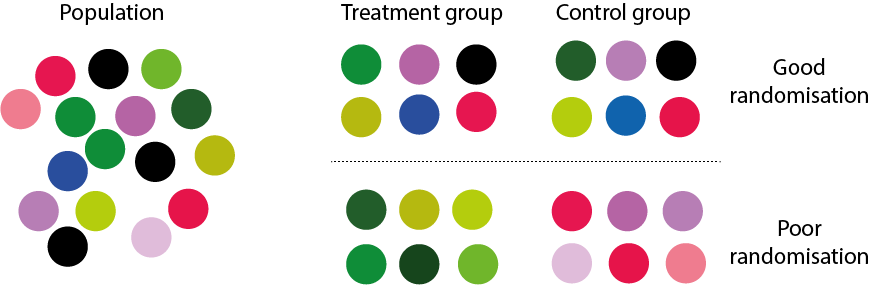
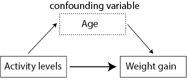
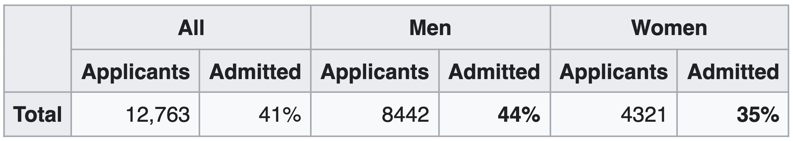

# Emner fra eksperimental design

```{r,message=FALSE,comment=FALSE,warning=FALSE,echo=FALSE}
library(tidyverse)
library(broom)
```

"Amatører sidder og venter på inspiration, resten af os står bare op og går på arbejde." - Stephen King

```{r, echo=FALSE,out.height="90%",out.width="90%",fig.cap="Image just for fun"}
# Bigger fig.width
library(png)
library(knitr)

```

## Inledning og læringsmålene


Formålet med dette kapitel er at spørge: Hvordan kan vi anvende de værktøjer, vi har lært i kurset, til at undersøge forskellige emner inden for eksperimentelt design? Dette er ikke en grundig introduktion til eksperimentelt design, men snarere en præsentation af nogle nyttige og interessante emner, der effektivt illustrerer, hvorfor det er vigtigt at lave passende visualiseringer af dine data. Forståelsen af, hvordan batch-effekter påvirker en analyse, er særlig vigtig inden for biologifaget, hvor mange store sekventeringsprojekter involverer data indsamlet eller sekventeret over forskellige batches, sekventeringsmaskiner eller forskellige forberedelsesmetoder.

:::goals
I skal være i stand til at

* Beskrive randomisering, replikation og blokering
* Beskrive Simpsons paradoks
* Beskrive Anscombes kvartet
* Undersøge for batch-effekter med PCA
:::


:::checklist
* Læs kursusnotaterne om randomisation, replikation, blocking + confounding
* Se videorne til "Simpson's Paradoks" og "Anscombe's quartet"
* Læs kursusnotaterne om batch effekt undersøgelse (11.5)
* Quiz - eksperimental (på Absalon)
* Lav problemstillingerne og sige til hvis du har bruge for hjælp :)
:::

### Video ressourcer

* Part 1: randomisation, replikation, blocking + confounding
    + Ingen video: læs gerne notaterne nedenfor 11.2 "Grundlæggende principper i eksperimentelt design"
    + Lav problemstilling __Problem 2__)
    
---

* Part 2: Simpson's Paradoks 
    + Se videoen nedenfor samt 11.3 "Case studies: Simpson's paradoks" i kursusnotaterne
    + Lav problemstilling __Problem 3__) 
    + Problemstilling __Problem 7__) giver endnu et eksempel på Simpon's paradoks

```{r,echo=FALSE}
library("vembedr")
#Link her hvis det ikke virker nedenunder: https://player.vimeo.com/video/556581563

embed_url("https://vimeo.com/556581563")
```

---

* Part 3: Anscombe's quartet 
    + Se videoen nedenfor samt 11.4 "Case studies: Anscombes kvartet" i kursusnotaterne
    + Lav __Problem 4__) i problemstillingerne

```{r,echo=FALSE}
#library("vembedr")
#Link her hvis det ikke virker nedenunder: https://player.vimeo.com/video/556581540

embed_url("https://vimeo.com/556581540")
```

--- 

* Part 4: Batch effects and principal component analysis. 
    + Læs 11.5: "Undersøgelse af batch effekts"
    + Lav __Problem 5__) og __Problem 6__) )

<!-- _OBS Man kan selvfølgelige også anvende `map_if()` til at log-transformere._ -->

<!-- Der er også nogle esktra notater om heatmaps (hvis interesseret, frivilligt) -->

```{r,echo=FALSE}
#library("vembedr")
#Link her hvis det ikke virker nedenunder: https://player.vimeo.com/video/556581521

#embed_url("https://vimeo.com/556581521")
```


## Grundlæggende principper i eksperimentelt design 

### Randomisering og replikation

Man laver et __eksperiment__ for at få svar på et bestemt spørgsmål eller en hypotese. Eksperimentet designes ud fra principper, der gør det muligt at fortolke resultaterne fra analysen af datasættet efterfølgende. For at et eksperiment skal være gyldigt, skal det kunne demonstrere hensigtsmæssig __replikation__ og __randomisering__.

__Randomisering__

Målet er at udelukke, at konklusionerne simpelthen kan skyldes varians som følge af en faktor, der ikke direkte er interessant i eksperimentet. Derfor bruger man randomisering til at fordele disse faktorer over de forskellige behandlingsgrupper. Et eksempel kan være 'double-blinding' i kliniske eksperimenter - både lægen og patienten har ikke kendskab til, hvem der hører til de forskellige grupper, således at forskelsbehandling indenfor grupperne, som kan påvirke de endelige resultater, undgås.

__Replikation__ 

Dette sker, når man gentager et eksperiment flere gange - for eksempel ved at have flere patienter i hver behandlingsgruppe. Dette tillader os at beregne variabiliteten i data, som er nødvendig for at kunne konkludere om, der er en forskel mellem grupperne. Man kan altså ikke generalisere resultater, som kun er målt på én person.


```{r, echo=FALSE,fig.width = 1,fig.height=1,comment=FALSE,warning=FALSE,out.width="100%",fig.cap="randomisation og replikation"}
# Bigger fig.width
library(png)
library(knitr)

```

I ovenstående figur er der 6 replikationer i hver gruppe, der enten er "behandling" eller "kontrol". I tilfældet "God randomisering" er objekter, som er taget tilfældigt fra populationen, godt matchet mellem de to grupper. I det andet tilfælde, "Dårlig randomisering", kan man se, at objekternes farver er godt matchet inden for de samme grupper. Dette gør det derfor umuligt at afgøre, om en eventuel forskel mellem "behandling" og "kontrol" i virkeligheden er resultatet af farven frem for de målinger, man gerne vil sammenligne.

__Forvekslingsvariabler__

Figuren nedenfor illustrerer alder som en forvekslingsvariabel i et eksperiment, hvor man prøver at forstå sammenhængen mellem aktivitetsniveau og vægtøgning. Det kan se ud som om, at et lavt aktivitetsniveau (afhængig variabel) forklarer vægtøgning (uafhængig variabel), men man er nødt til at tage andre variable i betragtning for at sikre, at sammenhængen ikke skyldes noget andet. For eksempel kunne gruppen med det høje aktivitetsniveau bestå af personer, der er yngre end personerne i gruppen med det lave aktivitetsniveau, og deres alder kan påvirke deres vægtøgning (måske på grund af forskelle i stressniveauer, kost osv.).

```{r, echo=FALSE,fig.width = 1,fig.height=1,comment=FALSE,warning=FALSE,out.width="60%"}
# Bigger fig.width
library(png)
library(knitr)

```


__Blokering__

Man kan forsøge at kontrollere for ekstra variable, som vi ikke er interesseret i, gennem "blokering". Blokering udføres ved først at identificere grupper af individer, der ligner hinanden så meget som muligt. Det kan for eksempel være, at tre forskellige forskere har medvirket til at udføre et stort eksperiment med mange patienter og forskellige behandlingsgrupper. Vi er interesseret i, om der er forskelle mellem behandlingsgrupperne, men ikke i, om der er en forskel i forskernes behandling af patienterne. Derfor vil vi gerne 'blokere' efter forsker - altså kontrollere for dem som en "batch" effekt. Man kan også blokere efter fx køn, for at sikre at forskellene i behandlingsgrupperne ikke skyldes forskelle mellem mænd og kvinder. Blokering udføres som en del af en lineær model, efter data er indsamlet, men det er nyttigt at tænke over det fra starten.

### Eksempel med datasættet `ToothGrowth`

Et godt eksempel på et veludført eksperimentelt design er datasættet `ToothGrowth`, som er baseret på marsvin - de fik forskellige kosttilskud og doser, og derefter blev længden af deres tænder målt.

```{r}
data(ToothGrowth)
ToothGrowth <- ToothGrowth %>% tibble() %>% mutate(dose = as.factor(dose))
summary(ToothGrowth)
```

Her kan man se, at for hver gruppe (efter `supp` og `dose`) er der 10 marsvin - vi har således replikationer over grupperne, og hver `supp` (supplement) har hver af de tre mulige værdier for "dose". Hvis vi for eksempel ikke var interesseret i `supp` men kun i dosis, kunne vi 'blokere' efter `supp` for at afbøde forskelle i effekten af de to supplementer i `supp`.

```{r,fig.width=4.5,fig.height=4}
ToothGrowth %>% dplyr::count(supp,dose) %>% 
  ggplot(aes(x=factor(dose),y=n,fill=factor(dose))) + 
    geom_bar(stat="identity") + 
    ylab("Antal marsvin") + 
    xlab("Dosering") +
    facet_grid(~supp) +
    theme_bw()
```

Man skal dog være opmærksom, fordi vi ved ikke, hvordan marsvinene blev tildelt til de forskellige grupper. For eksempel, hvis hanner og hunner ikke er tildelt tilfældigt, kan det forekomme, at supp "OJ" og dosis "0.5" kun har hanmarsvin, og supp "OJ" med dosis "1.0" kun har hunmarsvin. I sådanne tilfælde kunne vi ikke afgøre, om forskellen i dosis "0.5" versus "1.0" er resultatet af dosis eller køn.

## Case studies: Simpsons paradoks

(Se også videoressourcer Del 2).

Simpsons paradoks er et fascinerende statistisk fænomen, der er en vigtig påmindelse om, at korrelation ikke nødvendigvis indebærer kausalitet, og at det er afgørende at forstå de underliggende data og ikke kun de aggregerede statistikker. Simpsons paradoks opstår, når man drager to modsatte konklusioner fra det samme datasæt - på den ene side, når man kigger på dataene samlet, og på den anden side, når man tager visse grupper i betragtning. Vi kan visualisere Simpsons paradoks gennem eksemplet nedenfor - her har vi to variable `x` og `y`, som vi kan bruge til at lave et scatterplot, samt nogle forskellige grupper inden for variablen `group`.

```{r,comment=FALSE,message=FALSE,warning=FALSE}
#library(datasauRus)
simpsons_paradox <- read.table("https://www.dropbox.com/s/ysh3qpc7qv0ceut/simpsons_paradox_groups.txt?dl=1",header=T)
simpsons_paradox <- simpsons_paradox %>% tibble()
simpsons_paradox
```

Hvis vi ignorerer `group` og kigger på dataene samlet, kan vi se, at der er en stærk positiv sammenhæng mellem x og y. Men når vi opdeler efter de forskellige grupper ved at skrive `colour = group`, opnår vi faktisk en negativ sammenhæng indenfor hver af grupperne.

```{r,comment=FALSE,message=FALSE,warning=FALSE,fig.width=9,fig.height=4}
p1 <- simpsons_paradox %>% 
  ggplot(aes(x,y)) + 
  geom_point() +
  geom_smooth(method="lm",se=FALSE) +
  theme_classic()

p2 <- simpsons_paradox %>% 
  ggplot(aes(x,y,colour=group)) + 
  geom_point() +
  geom_smooth(method="lm",aes(group=group),colour="black",se=FALSE) +
  theme_classic()

library(gridExtra)
grid.arrange(p1,p2,ncol=2)
```

Simpsons paradoks forekommer oftere end man skulle tro, og derfor er det vigtigt at overveje, hvilke andre variable man også er nødt til at tage i betragtning.

### Optagelse på Berkeley

Det mest berømte eksempel på Simpsons paradoks drejer sig om optagelsen på Berkeley Universitetet i 1973. Følgende tabel fra Wikipedia (https://en.wikipedia.org/wiki/Simpson%27s_paradox) viser statistikker over antallet af ansøgere samt procentdelen, der blev optaget på universitetet generelt, opdelt efter køn.

```{r, echo=FALSE,comment=FALSE,warning=FALSE,out.width="85%",tidy=FALSE,fig.cap="source: wikipedia"}
# Bigger fig.width
library(png)
library(knitr)

```


Hvis vi laver et søjlediagram af tallene, kan man se, at der er en højere procentdel af mænd end kvinder, som blev optaget på universitetet (sagen medførte en retssag mod universitetet).

```{r,fig.height=2.5,fig.width=5}
admissions_all <- tibble("sex"=c("all","men","women"),admitted=c(41,44,35))

admissions_all %>% ggplot(aes(x=sex,y=admitted,fill=sex)) + 
  geom_bar(stat="identity") + 
  theme_minimal() + 
  ylab("Procent optaget") +
  scale_x_discrete(limits = c("women","men","all")) +
  coord_flip()
```

Da man dog kiggede lidt nærmere på de samme tal, men opdelte efter de forskellige fakulteter på universitetet, fik man et anderledes billede af situationen. I følgende tabel har vi optagelsestallene for mænd og kvinder på hver af de forskellige fakulteter (A til F).

<!-- optagelses statistik efter afdeling -->
```{r}
admissions_separate <- tribble(
  ~department,   ~all,   ~men,  ~women,
  #------------|-------|-------|--------#
  "A",            64,     62,      82,
  "B",            63,     63,      68,
  "C",            35,     37,      34,
  "D",            34,     33,      35,
  "E",            25,     28,      24,
  "F",             6,      6,       7
)
```

Man kan se, at for de fleste af fakulteterne er der ikke en markant forskel mellem mænd og kvinder, og i nogle tilfælde havde kvinder faktisk en større sandsynlighed for at blive optaget.

<!-- lave et plot af de data opdelte efter afdeling -->
```{r,fig.height=4,fig.width=4}
admissions_separate %>% 
  pivot_longer(-department,names_to="sex",values_to="admitted") %>%
  ggplot(aes(x=department,y=admitted,fill=sex)) + 
  ylab("Procent optaget") +
  geom_bar(stat="identity",position = "dodge",colour="black") + 
  theme_minimal()
```

Hvad skyldes denne sammenhæng? Det viste sig, at kvinder havde en tendens til at ansøge indenfor de fakulteter, som var sværest at komme ind på. For eksempel kan man se her, at fakultet E har en relativt lav optagelsesprocent. Det samme fakultet var dog et af dem, hvor betydeligt flere kvinder ansøgte end mænd.

<!-- lave et plot af ansøgelse statistik for afdeling E -->
```{r,fig.height=2.5,fig.width=5}
applications_E <- tibble("sex"=c("all","men","woman"),applications=c(584,191,393))


applications_E %>% ggplot(aes(x=sex,y=applications,fill=sex)) + 
  geom_bar(stat="identity") + 
  theme_minimal() + 
  ylab("Number of applications to dep. E") +
  scale_x_discrete(limits = c("woman","men","all")) +
  coord_flip()
```

Derfor, selvom kvinder ikke havde en lavere sandsynlighed for at blive optaget end mænd i deres fortrukne fag, var antallet af kvinder, der blev optaget i det hele taget på tværs af alle afdelinger, faktisk lavere end antallet af mænd. 

## Case studies: Anscombes kvartet

(Se også videoressourcer Del 3).

Anscombes kvartet (se også https://en.wikipedia.org/wiki/Anscombe%27s_quartet) er et meget nyttigt og berømt eksempel fra 1973, der fremhæver vigtigheden af at visualisere datasættet. Vi kan hente dataene fra linket nedenfor - der er x-værdier og y-værdier, som kan anvendes til at lave et scatterplot, og der er også `set`, der refererer til fire forskellige datasæt (derfor 'kvartet').

```{r}
anscombe <- read.table("https://www.dropbox.com/s/mlt7crdik3eih9a/anscombe_long_format.txt?dl=1",header=T)
anscombe <- anscombe %>% tibble()
anscombe
```

Formålet med datasættet er, at vi gerne vil fitte en lineær regressionsmodel for at finde den forventede y-værdi afhængig af x (husk `lm(y ~ x)`). Da vi har fire datasæt, kan vi opdele datasættet efter `set` og anvende funktionerne `nest` og `map` (se Kapitel 7) til at fitte de fire lineære regressionsmodeller. Vi anvender også `tidy` og `glance` for at få resuméstatistikker fra de fire modeller:


```{r}
my_func <- ~lm(y ~ x, data = .x)

tidy_anscombe_models <- anscombe %>% 
  group_nest(set) %>% 
  mutate(fit = map(data, my_func),
         tidy = map(fit, tidy),
         glance = map(fit, glance))
```

Vi kan anvende `unnest` på outputtet fra `tidy` og se på skæringspunktet og hældningen af de fire modeller. Man kan se, at de to parametre er næsten identiske for de fire modeller:

```{r}
tidy_anscombe_models %>% unnest("tidy") %>% 
  pivot_wider(id_cols = "set",names_from = "term",values_from="estimate") 
```

Hvad med de andre parametre fra modellen - lad os eksempelvis kigge på `r.squared` og `p.value` fra modellerne, som kan findes i outputtet fra `glance`. Her kan vi igen se, at de er næsten identiske.

```{r}
tidy_anscombe_models %>% 
  unnest(cols = c(glance)) %>% 
  select(set, r.squared,p.value)
```

Hvad med korrelation? Den er også næsten den samme:

```{r}
my_func <- ~cor(.x$x,.x$y)

anscombe %>% 
  group_nest(set) %>% 
  mutate(cor = map(data, my_func)) %>% 
  unnest(cor) %>% 
  select(-data)
```

Kan vi så konkludere, at de fire datasæt, som underbygger de forskellige modeller, er identiske? Lad os lave et scatter plot af de fire datasæt (som vi faktisk burde have gjort i starten af vores analyse).

```{r,fig.width=8,fig.height=8,message=FALSE,comment=FALSE}
anscombe %>% 
  ggplot(aes(x = x, y = y,colour=factor(set))) +
  geom_point() + 
  facet_wrap(~set) +
  geom_smooth(method = "lm", se = FALSE) + 
  theme_minimal()
```

De fire datasæt er meget forskellige. Vi ved, at de alle har samme bedste tilpasning med rette linjer, men de underliggende data er slet ikke de samme. Det første datasæt ser egnet ud til en lineær regressionsanalyse, men vi kan se i datasæt nummer to, at der ikke engang er en lineær sammenhæng. Og de andre to har outlier værdier, hvilket gør, at den bedst tilpassede rette linje ikke passer særlig godt til punkterne.

## Undersøgelse af "batch-effekter"

En "batch-effekt" er en systematisk teknisk bias, der opstår, når målinger (f.eks. genekspression) udføres i flere omgange eller "batches". Dette kan potentielt føre til betydelige forvrængninger og fejlagtige konklusioner i dataanalyse, hvis det ikke tages højde for.

Forestil dig, at du udfører et eksperiment, hvor du sammenligner genekspressionen i sundt væv med kræftvæv. Du udfører dine eksperimenter over flere dage, og det viser sig, at alle dine sunde prøver blev behandlet på mandag, og alle dine kræftprøver blev behandlet på tirsdag. Hvis der er en systematisk forskel i, hvordan dine eksperimenter blev udført på de to dage (måske et reagens var lidt anderledes, eller instrumentet blev brugt på en anden måde), vil du se en stor forskel i genekspression mellem dine sunde og kræftprøver. Men denne forskel skyldes faktisk batch-effekten, ikke forskellen mellem sundt og kræftvæv.

Man kan også anvende visualiseringer til at undersøge eventuelle batch-effekter eller forvirrende variabler i datasættet. Dette er især vigtigt i store eksperimenter, hvor forskellige prøver eller dele af datasættet bliver indsamlet på forskellige tidspunkter, steder, eller af forskellige personer. Det er ofte tilfældet i sekvenseringsbaserede datasæt, at man ser batch-effekter, og det kan skyldes mange ting, bl.a.:

* Sekvenseringsdybde
* Grupper af prøver lavet på forskellige tidspunkter af forskellige individer
* Sekvenseringsmaskiner - prøver sekvenseret på forskellige maskiner eller 'lanes'. 

Lad os tage udgangspunkt i nogle genekspressionssekvenseringsdata fra mus (vi så også dette datasæt, da vi lærte om `pivot_longer` kombineret med `left_join`).

```{r}
norm.cts <- read.table("https://www.dropbox.com/s/3vhwnsnhzsy35nd/bottomly_count_table_normalised.txt?dl=1")
coldata <- read.table("https://www.dropbox.com/s/el3sm9ncvzbq6xf/bottomly_phenodata.txt?dl=1")
coldata <- coldata %>% tibble()
norm.cts <- as_tibble(norm.cts,rownames="gene")
```

Jeg begynder med at vælge kun de rækker, der har mindst 50 counts, for at undgå gener med lave ekspressionsniveauer. Det næste jeg gør er at transformere dataene til logaritmisk form (funktion `map_if()`) for at opnå en bedre fordeling i datasættet. Derefter tager jeg kun de første 1000 rækker med, kun for at gøre det nemmere at køre mine koder på en laptop.

```{r}
#normalisere og filtrere dataene
norm.cts <- norm.cts %>% 
  filter(rowSums(norm.cts %>% select(-gene))>50) %>% 
  map_if(is.numeric,~log(.x+1)) %>% as_tibble()

norm.cts <- norm.cts[1:1000,] #take a subset to save loading times on laptop
```

Så der er 1000 gener i rækkerne, og der er 21 forskellige prøver, der spreder sig over kolonnerne. Vi har også nogle prøveoplysninger - der er to forskellige stammer af mus og også forskellige batches, som vi gerne vil undersøge nærmere.

```{r}
coldata
```

Vi kan se på, hvor mange prøver vi har for hver kombination af stamme og batch i datasættet:

```{r}
table(coldata$strain, coldata$batch)
```

Så man kan se, at både stammen er repræsenteret med tre eller fire prøver i hver af de tre batches. Der er derfor _replikation_, og da vi har fået repræsenteret hver kombination af stamme og batch, kan vi eventuelt __blokere__ efter batch for at fjerne dens effekt. Her har vi ikke tid til at se på metoder til at fjerne batch-effekter, men det er vigtigt, at vi er i stand til at opdage dem.

### Principal component analyse

Man kan undersøge mulige batch-effekter via principal component analyse. 

Først skal vi lave en "transpose" af datasættet således at variablerne (samples) bliver i rækkerne og observationerne (genes) er som kolonnerne. 

Det er ikke helt ligetil i tidyverse, men her er en måde at gøre det på:

```{r}
norm.cts.transpose <- as_tibble(t(norm.cts[,-1])) #lave transpose med t() funktion (drop genenavne)
colnames(norm.cts.transpose) <- norm.cts %>% pull(gene) #tilføje gene som kolonnenavne
norm.cts.transpose %>% mutate(sample = colnames(norm.cts)[-1],.before=1) #sample skal være den første kolonne
```

Heldigvis er der en pakke, som kan gøre processen meget hurtigere, som vi kan benytte os af her:

```{r}
library(sjmisc)
norm.cts.transpose <- norm.cts %>% 
                          rotate_df(cn=TRUE,rn="sample") %>% 
                          as_tibble()

norm.cts.transpose
```

Nu kan vi udføre en principal component analyse:

```{r}
pca_fit <- norm.cts.transpose %>%
  select(where(is.numeric)) %>% # behold kun numeriske kolonner
  prcomp(scale = TRUE) # udfør PCA på skalerede data
```

Så kan vi bruge vores standarde måde at visualisere principal components på:

```{r}
library(ggrepel)

pca_fit_augment <- pca_fit %>% 
  augment(norm.cts.transpose)

pca_fit_augment %>% 
  ggplot(aes(x=.fittedPC1,y=.fittedPC2)) + 
  geom_point() + 
  geom_text_repel(aes(label=sample)) +
  theme_bw()
```

Anvend left_join til at få oplysningen med:

```{r}
pca_fit_augment <- pca_fit_augment %>% 
  left_join(coldata %>% rename(sample = column),by="sample")
```

Når der er så mange kolonnerne i `pca_fit_augment` bruger jeg `tail`-funktionen ovenpå `colnames` så jeg kan se, hvad for nogle oplysningsvariabler vi har fået med: 

```{r}
tail(colnames(pca_fit_augment))
```


Vi er interesseret i at undersøge mulige batch-effektor, så lad os give en forskellige farve efter `batch` og en forskellige form efter `strain`:

```{r}
pca_fit_augment %>% 
  ggplot(aes(x=.fittedPC1,y=.fittedPC2,colour=as.factor(batch),shape=strain)) + 
  geom_point(size=3) + 
  geom_text_repel(aes(label=sample)) +
  theme_bw()
```


Man kan også se på dataene på en anden måde ved at lave boksdiagrammer for de to første principale komponenter, opdelt efter batch. Vi får bekræftet vores observation om, at der er en markant forskel mellem batch 4 og de andre to batches, og det er et problem, som bør korrigeres, før man foretager yderligere analyser af dataene.


<!-- lave boxplot af PC1 og PC2 opdelt efter batch-->
```{r,comment=FALSE,message=FALSE}
p1 <- pca_fit_augment %>%
  ggplot(aes(x=factor(batch),y=.fittedPC1,fill=factor(batch))) + geom_boxplot(show.legend = F) + geom_jitter(show.legend = F) + theme_minimal() + ggtitle("Batches PC1")

p2 <- pca_fit_augment %>%
  ggplot(aes(x=factor(batch),y=.fittedPC2,fill=factor(batch))) + geom_boxplot(show.legend = F) + geom_jitter(show.legend = F) + theme_minimal() + ggtitle("Batch PC2")

library(gridExtra)
grid.arrange(p1,p2,ncol=2)
```

### EKSTRA: Heatmap

Man kan også lav en heatmap for at undersøge batch effektor. Jeg begynder med at lave en korrelationsmatrix af mine data, som indeholder sammenhængene (pearson's korrelationskoefficient) mellem de forskellige variabler (husk at drop den første kolonne, da den ikke er numeriske):

```{r}
cor_mat <- cor(norm.cts[,-1])
```

Jeg laver en heatmap med `heatmap`-funktionen i ovenstående:

```{r}
row.names(cor_mat) <- coldata$batch
colnames(cor_mat) <- coldata$strain
heatmap(cor_mat)
```

Samples som har en stækere sammenhænge forekommer tættere på hinanden i rækkerne/kolonnerne. Her kan man se, at samples fra batch 7 er mere ofte sammen oppe på de ydereste rækkere i forhold til batch 4, hvor samples er mere ofte på de nederste rækker. 

### EKSTRA: Batch effect correction med ComBat()-funktionen

`sva`-pakken i R har en funktionen der hedder `ComBat`, der kan hjælpe med at korrigere for batch-effekter, så forskelle mellem prøver skyldes biologisk variation og ikke tekniske forskelle. 

Se her for ydereligere om ComBat: https://rdrr.io/bioc/sva/man/ComBat.html

```{r}

#if (!require("BiocManager", quietly = TRUE))
#    install.packages("BiocManager")

#BiocManager::install("sva")

library(sva)
corrected <- sva::ComBat(dat=norm.cts %>% select(-gene),batch=coldata %>% pull(batch))
corrected <- as_tibble(corrected) %>% mutate(gene = norm.cts %>% pull(gene),.before=1)
```


Så kan man lave præcis samme procedure som i ovenstående på den korrigede dataframe:

```{r}
corrected.transpose <- corrected %>% 
                          rotate_df(cn=TRUE,rn="sample")

pca_fit <- corrected.transpose %>%
  select(where(is.numeric)) %>% # behold kun numeriske kolonner
  prcomp(scale = TRUE) # udfør PCA på skalerede data

pca_fit_augment <- pca_fit %>% 
  augment(corrected.transpose)

pca_fit_augment <- pca_fit_augment %>% 
  left_join(coldata %>% rename(sample = column),by="sample")

pca_fit_augment <- pca_fit_augment %>% mutate(batch=as.factor(batch))
```


Og så lav en plot:

```{r}
PCA1 <- pca_fit_augment %>% 
  ggplot(aes(x=.fittedPC1,y=.fittedPC2,colour=batch,shape=strain)) + 
  geom_point(size=3) + 
  geom_text_repel(aes(label=sample)) +
  theme_bw()

PCA2 <- pca_fit_augment %>% 
  ggplot(aes(x=.fittedPC1,y=.fittedPC2,shape=batch,colour=strain)) + 
  geom_point(size=3) + 
  geom_text_repel(aes(label=sample)) +
  theme_bw()

grid.arrange(PCA1,PCA2,ncol=2)

```


<!-- Husk, at når man udfører en principal component analyse, får man rotationsmatricen, der anvendes til at se, hvor de forskellige prøver ligger i forhold til hinanden over de forskellige principal komponenter - dvs. at prøver, der ligner hinanden, vises på samme sted på plottet. Rotationsmatricen udtrækkes med funktionen `tidy()`: -->

<!-- ```{r} -->
<!-- rot_matrix <- pca_fit %>% -->
<!--   tidy(matrix = "rotation")  -->
<!-- ``` -->

<!-- Vi vil gerne lave et plot af rotationsmatricen, men først vil vi gerne tilføje prøveoplysningerne med `left_join`, så vi kan se de forskellige batches eller stammer. Begge dataframes har en kolonne, der hedder `column`, som refererer til prøvenavne, så jeg forbinder efter `column` her. -->

<!-- ```{r} -->
<!-- rot_matrix <- rot_matrix  %>%  -->
<!--   left_join(coldata,by="column") -->
<!-- ``` -->

<!-- Brug `pivot_wider()` til at få det i bred format, så vi kan plotte "PC1" og "PC2" i et scatter plot: -->

<!-- ```{r} -->
<!-- rot_matrix_wide <- rot_matrix %>%  -->
<!--   pivot_wider(names_from = "PC", names_prefix = "PC", values_from = "value") -->
<!-- rot_matrix_wide -->
<!-- ``` -->

<!-- Jeg tildeler farver og former efter de tre batches. Man kan se, at jeg har fået alle prøver fra batch nummer 2 på samme sted i plottet. -->


<!-- ```{r,fig.width=6,fig.height=4} -->
<!-- rot_matrix_wide %>% -->
<!--   ggplot(aes(PC1,PC2,shape=factor(batch),colour=factor(batch))) +  -->
<!--   geom_point(size=3) + -->
<!--   theme_minimal() -->
<!-- ``` -->

<!-- Jeg kan også tildele farver efter stamme, hvor man kan se, at der sandsynligvis er en forskel mellem de to stammer her. -->

<!-- ```{r,fig.width=6,fig.height=4} -->
<!-- rot_matrix_wide %>% -->
<!--   ggplot(aes(PC1,PC2,shape=factor(strain),colour=factor(strain))) +  -->
<!--   geom_point(size=3) + -->
<!--   theme_minimal() -->
<!-- ``` -->

<!-- Man kan også se på dataene på en anden måde ved at lave boksdiagrammer for de to første principale komponenter, opdelt efter batch. Vi får bekræftet vores observation om, at der er en markant forskel mellem batch 7 og de andre to batches langs den første principale komponent, og det er et problem, som muligvis skal korrigeres, før man foretager yderligere analyser af dataene. -->


<!-- <!-- lave boxplot af PC1 og PC2 opdelt efter batch--> -->
<!-- ```{r,comment=FALSE,message=FALSE} -->
<!-- p1 <- rot_matrix_wide %>%  -->
<!--   ggplot(aes(x=factor(batch),y=PC1,fill=factor(batch))) + geom_boxplot(show.legend = F) + geom_jitter(show.legend = F) + theme_minimal() -->

<!-- p2 <- rot_matrix_wide %>%  -->
<!--   ggplot(aes(x=factor(batch),y=PC2,fill=factor(batch))) + geom_boxplot(show.legend = F) + geom_jitter(show.legend = F) + theme_minimal() -->

<!-- library(gridExtra) -->
<!-- grid.arrange(p1,p2,ncol=2) -->
<!-- ``` -->


<!-- ### Ekstra: Pheatmap tilgang! -->

<!-- Det er også meget almindeligt at se "heatmaps" indenfor biologi fag. I en heatmap kan man visualisere korrelationerne i ekspressionen mellem de forskellige samples. Samples som har tætteste sammenhænge fremstå ved siden af hinanden på heatmappen ( ligesom i en dendrogram i hierarchical clustering, men med korrelation i stedet for afstand). -->

<!-- I følgende beregner jeg korrelationkoffeficient mellem de forskellige variabler: -->

<!-- ```{r} -->
<!-- norm.cts.cor <- norm.cts %>% select(-gene) %>% cor() -->
<!-- ``` -->

<!-- I følgende laver jeg en heatmap med funktionen `pheatmap` som findes i pakken `pheatmap`.  -->

<!-- ```{r,fig.width=6,fig.height=5} -->
<!-- library(pheatmap) #installer pakken hvis nødvendigt -->
<!-- pheatmap(norm.cts.cor) -->
<!-- ``` -->

<!-- Samme samples stå på både rækkerne og kolonnerne, og farverne representere hvor stærk korrelationen er mellem hver par samples. Hver sample har en korrelationskoefficient af 1 med sig selv, så man får en rød farve langt diagonelen, som betyder perfekt korrelation. Men det er svært at se, om der er en effekt pga. de forskellige batches. Hvordan kan vi gøre heatmappen mere informativ? -->

<!-- I følgende anvender jeg unite til at lave mere informativ navne i variablen "info_name": -->

<!-- ```{r} -->
<!-- info_new_names <- coldata %>%  -->
<!--   unite(strain,batch,lane.number,col = "info_name",remove = F) -->

<!-- info_new_names -->
<!-- ``` -->

<!-- Jeg ændrer navnerne på kolonnerne og rækkerne i min korrelation matrix og laver en ny heatmap: -->

<!-- ```{r,fig.width=6,fig.height=5} -->
<!-- colnames(norm.cts.cor) <- info_new_names %>% pull(info_name) -->
<!-- row.names(norm.cts.cor) <-  info_new_names %>% pull(info_name) -->

<!-- pheatmap(norm.cts.cor) -->
<!-- ``` -->

<!-- Det er bedre - jeg tilføjer også nogle flere annotations til at gøre det mere informativ: -->

<!-- ```{r,fig.width=6.75,fig.height=5} -->
<!-- annotations <- info_new_names %>%  -->
<!--   select(batch,lane.number,strain) %>%  -->
<!--   mutate(batch = as.factor(batch),lane.number=as.factor(lane.number)) %>% as.data.frame() -->

<!-- row.names(annotations) <- info_new_names$info_name -->


<!-- pheatmap(norm.cts.cor,annotation_col = annotations) -->
<!-- ``` -->


## Problemstillinger


__Problem 1__) Quiz på Absalon - experimental

---

__Problem 2__) Eksperimentelt design

Jeg udfører et eksperiment, hvor patienter modtager et af tre forskellige kosttilskud (Gruppe 1, 2 og 3). Der er 5 patienter i hver gruppe, og jeg ønsker at undersøge, om patienternes energiniveau i gennemsnit varierer mellem de tre grupper. Alderen på patienterne i hver af de tre grupper er:

Gruppe 1: 18, 23, 31, 25, 19

Gruppe 2: 24, 29, 35, 21, 30

Gruppe 3: 43, 52, 33, 39, 40

a) Hvad er problemet med det eksperimentelle design her? Lav boxplots for at illustrere fordelingen af alderne for hver af de tre grupper (du skal starte med at lave en __tibble__, der indeholder dataene - se tilbage til __Emne 5.5__ hvis du har glemt, hvordan man laver en __tibble__).

b) Hvis man finder en signifikant forskel mellem de tre kosttilskud, kan man så stole på resultaterne?

c) Hvilke andre variabler end alder kunne være årsag til en eventuel forskel mellem de tre kosttilskud, og som muligvis skulle tages i betragtning?

d) Hvad kan man gøre for at løse problemet med det ovenstående eksperimentelle design?

```{r,echo=FALSE,eval=FALSE}
mytib <- tibble("group_1"=c(18,23,31,25,19),"group_2"=c(24,29,35,21,30),"group_3"=c(43,52,33,39,40))
mytib %>% pivot_longer(cols=everything()) %>%
  ggplot(aes(x=name,y=value,fill=name)) + geom_boxplot() + theme_minimal() + coord_flip()
```

---

__Problem 3__) *Simpsons paradoks* __Genbesøg af Lung Cap-data__

Indlæs `LungCapData` og tilføj den kategoriske variabel `Age.Group`:

```{r}
LungCapData <- read.csv("https://www.dropbox.com/s/ke27fs5d37ks1hm/LungCapData.csv?dl=1")
LungCapData$Age.Group <- cut(LungCapData$Age,breaks=c(1,13,15,17,19),right=FALSE,include.lowest = TRUE)
levels(LungCapData$Age.Group) <- c("<13","13-14","15-16","17+")
```

__a__) Lav boxplots med `smoke` på x-aksen og `LungCap` på y-aksen.
    + Bemærk hvilken gruppe der har den højeste lungekapacitet.

```{r,echo=FALSE,eval=FALSE}
ggplot(LungCapData, aes(x = Smoke,y = LungCap, fill=Smoke)) + 
  geom_boxplot() + 
  theme_minimal() + 
  geom_jitter()
```

__b__) Lav samme plot, men adskilt efter `Age.Group`, og beskriv, hvordan det er et eksempel på Simpsons paradoks.

```{r,echo=FALSE,eval=FALSE}
ggplot(LungCapData, aes(x = Smoke,y = LungCap, fill=Smoke)) + 
  geom_boxplot() + 
  theme_minimal() + 
  geom_jitter() +
  facet_grid(~Age.Group)
```
 

__c)__ Lav et boxplot med `Age` på y-aksen og `Smoke` på x-aksen for at understøtte forklaringen på, hvorfor man ser Simpsons paradoks i dette datasæt.

```{r,fig.width=4,fig.height=2, echo=FALSE,eval=FALSE}
LungCapData %>% 
  ggplot(aes(y=Age,x=Smoke,fill=Smoke)) + 
  scale_fill_manual(values = c("purple","steelblue")) +
  geom_boxplot(show.legend = FALSE) + 
  coord_flip() +
  theme_minimal()
```

---

__Problem 4__) *Anscombes analyse* Gentag Anscombes analyse med dinosaurdatasættet:

```{r,warning=FALSE,message=FALSE,comment=FALSE}
library(datasauRus) #installer denne pakke
data_dozen <- datasauRus::datasaurus_dozen
data_dozen
```

__a__) Fit en lineær regressionsmodel for hvert af datasættene (brug `group_by`, `nest` og `map` i kombination med en custom funktion), hvor `y` er den afhængige variabel og `x` er den uafhængige variabel. Anvend også `tidy` og `glance` på alle modellerne.

```{r,echo=FALSE,eval=FALSE}

my_func <- ~lm(y ~ x,data=.x)

data_dozen_fit <- data_dozen %>% 
  group_by(dataset) %>% 
  nest() %>%
  mutate(fit = map(data,my_func),
         fit_tidy = map(fit,tidy),
         fit_glance = map(fit,glance))
```

__b__) Brug resultaterne fra `tidy` til at undersøge hældning og skæring med y-aksen for de forskellige modeller - ligner de hinanden?

```{r,echo=FALSE,eval=FALSE}
data_dozen_fit %>% 
  unnest(fit_tidy) %>% 
  pivot_wider(id_cols = dataset,names_from = term,values_from = estimate)
```

__c__) Brug også resultaterne fra `glance` til at undersøge `r.squared` og `p.value`.

```{r,eval=F,echo=F}
data_dozen_fit %>% unnest(fit_glance) %>% select(dataset, r.squared, p.value)
```


__d__)  Er de alle det samme datasæt? Lav et scatter plot opdelt efter de forskellige datasæt. Hvordan ser de bedste rette linjer ud på plottene?

```{r,echo=FALSE,eval=FALSE}
data_dozen %>% 
  ggplot(aes(x=x,y=y,colour=dataset)) + 
  geom_point() + 
  facet_wrap(~dataset,ncol=3) + 
  geom_smooth(method="lm") +
  theme_bw()
```

---

__Problem 5__) Vi vil gerne undersøge eventuelle batcheffekter i det følgende datasæt. Det er simulerede "single cell"-sekvenserings count data (dataframen `cse50`) samt dataframen `batches`, som angiver hvilken batch hver af de 500 celler tilhører.

```{r}
cse50 <- read.table("https://www.dropbox.com/s/o0wzojpcsekeg6z/cell_mix_50_counts.txt?dl=1")
batches <- read.table("https://www.dropbox.com/s/4t382bfgro46ka5/cell_mix_50_batches.txt?dl=1")
batches <- tibble("batch"=batches %>% pull(batch),cell=paste0("cell_",c(1:500)))
cse50 <- as_tibble(cse50,rownames="gene") %>% mutate(gene = paste0("gene_",gene))
```

__a__) Transformere værdierne i `cse50` til log-skala (tilføj 1 først og tag logaritmen bagefter).
  
```{r,echo=FALSE,eval=FALSE}
cse50 <- cse50 %>% map_if(is.numeric,~log(.x+1)) %>% as_tibble()
```
  
__b__) For at undersøge mulige batch-effektor bruger vi samme process som i kursusnotaterne ovenstående. Lav en transpose af `cse50` således at cellerne er i rækkerne og generne er i kolonnerne.


```{r,echo=FALSE,eval=FALSE}
cse50.transpose <- cse50 %>% rotate_df(cn=TRUE,rn="cell")
```

__c__) Udfør en prinicipal component analyse og tilføj din transposed-datasæt til dit resultat

```{r,echo=FALSE,eval=FALSE}
pca_fit <- cse50.transpose %>%
  select(where(is.numeric)) %>% # behold kun numeriske kolonner
  prcomp(scale = TRUE) # udfør PCA på skalerede data

pca_fit_augment <- pca_fit %>% 
  augment(cse50.transpose)
```

__d__) Tilføj batch oplysning til din nye dataframe fra __c__ (som har dine principal components).

```{r,echo=FALSE,eval=FALSE}
pca_fit_augment <- pca_fit_augment %>% 
  left_join(batches,by="cell")

pca_fit_augment <- pca_fit_augment %>% mutate(batch=as.factor(batch))
```


__e__) Lav et tilpassende plot af dine første to principal components, hvor du farver punkterne efter de forskellige batches.
      
```{r,echo=FALSE,eval=FALSE}
pca_fit_augment %>% 
  ggplot(aes(x=.fittedPC1,y=.fittedPC2,colour=batch)) + 
  geom_point(size=3) + 
  theme_bw()
```

__f__) Som alternativ visualisering lav også boxplots for de første to prinpical components fordelt efter `batch`. Kommenter kort på eventuelle batch effekts i datasættet ud fra __e__) og __f__).


```{r,echo=FALSE,eval=FALSE}
p1 <- pca_fit_augment %>% 
  ggplot(aes(x=factor(batch),y=.fittedPC1,fill=factor(batch))) + 
  geom_boxplot(show.legend = F) + 
  geom_jitter(show.legend = F) + 
  theme_minimal()

p2 <- pca_fit_augment %>% 
  ggplot(aes(x=factor(batch),y=.fittedPC2,fill=factor(batch))) + 
  geom_boxplot(show.legend = F) + 
  geom_jitter(show.legend = F) + 
  theme_minimal()

grid.arrange(p1,p2,ncol=2)
```


---


__Problem 6__) Som tilføjelse til __Problem 5__), prøve

__a__) Lav en heatmap af cellerne i datasættet med `heatmap`-funktionen()

```{r,echo=FALSE,eval=FALSE}
cor_mat <- cor(cse50[,-1])
row.names(cor_mat) <- batches$batch
colnames(cor_mat) <- batches$cell
heatmap(cor_mat)
```


__b__) Anvend ComBat-function på datasættet (husk at installere `sva`-pakken - når den ikke er på CRAN se kode for gøre det i notaterne ovenpå) og gentage samme undersøgelsen som du lavede i __Problem 6__ for at se, om batch-effekterne findes stadig i datasættet.

```{r,echo=FALSE,eval=FALSE}
library(sva)
corrected <- sva::ComBat(dat=cse50 %>% select(-gene),batch=batches %>% pull(batch))
corrected <- as_tibble(corrected) %>% mutate(gene = cse50 %>% pull(gene),.before=1)
```

```{r,echo=FALSE,eval=FALSE}
corrected.transpose <- corrected %>% 
                          rotate_df(cn=TRUE,rn="cell")

pca_fit <- corrected.transpose %>%
  select(where(is.numeric)) %>% # behold kun numeriske kolonner
  prcomp(scale = TRUE) # udfør PCA på skalerede data

pca_fit_augment <- pca_fit %>% 
  augment(corrected.transpose)

pca_fit_augment <- pca_fit_augment %>% 
  left_join(batches ,by="cell")

pca_fit_augment <- pca_fit_augment %>% mutate(batch=as.factor(batch))
```


```{r,echo=FALSE,eval=FALSE}
pca_fit_augment %>% 
  ggplot(aes(x=.fittedPC1,y=.fittedPC2,colour=batch)) + 
  geom_point(size=3) + 
  theme_bw()
```


---

__Problem 7__) _Yderligere Simpson's paradoks_

Kør følgende kode for at indlæse og bearbejde det følgende datasæt `airlines`.

```{r}
airlines <- read.table("http://www.utsc.utoronto.ca/~butler/d29/airlines.txt",header=T)

airlines <- airlines %>% 
  pivot_longer(-airport) %>% 
  separate(name,sep="_",into = c("airline","status")) %>%
  mutate(airline = recode(airline, aa = "Alaska", aw = "American")) %>% 
  pivot_wider(names_from=status,values_from=value) %>% 
  mutate("ontime" = ontime + delayed) %>% 
  rename(flights = ontime)
```

__a__) For hvert flyselskab opsummer antallet af `flights` og antallet af `delayed`.

```{r,eval=F,echo=F}
airlines_total <- airlines %>% 
  group_by(airline) %>% 
  summarise("total_flights" = sum(flights), "total_delay" = sum(delayed)) %>% 
  mutate("total_prop" = total_delay/total_flights)
```

__b__) Beregn også andelen (proportionen) af flyvninger, der er forsinkede, i hvert flyselskab. Lav et søjlediagram for at vise proportionerne.

```{r,eval=F,echo=F}
airlines_total %>% ggplot(aes(x=airline,y=total_prop,fill=airline)) + geom_bar(stat="identity") + theme_bw()
```

__c__) Denne gang, lave samme opsummerings beregninger som i __a__ og __b__ men til hver lufthavn (i stedet for hvert flyselskab). Lav et plot.

```{r,eval=F,echo=F}
airports_total <- airlines %>% 
  group_by(airport) %>% 
  summarise("total_flights" = sum(flights), "total_delay" = sum(delayed)) %>% 
  mutate("total_prop" = total_delay/total_flights)

airports_total %>% ggplot(aes(x=airport,y=total_prop,fill=airport)) + geom_bar(stat="identity") + theme_bw()
```

__d__) Denne gang, beregn andelen af flyvninger, der er forsinkede, for hver kombination af __både__ lufthavn og flyselskab. Omsæt igen dette til et plot.

```{r,eval=F,echo=F}
airlines_props <- airlines %>% 
  group_by(airport,airline) %>% 
  summarise("prop" = delayed/flights) %>% 
  ungroup(airport)

airlines_props %>% 
  ggplot(aes(x=airport,y=prop,fill=airline)) +
  geom_bar(stat="identity",position="dodge") + 
  theme_bw()
```

__e__) Kan du forklare dette? Hint: kig eksempelvis på rådataene og især lufthavnen "Phoenix".

## Yderligere læsning

Simpson's paradox og airlines: http://ritsokiguess.site/docs/2018/04/07/simpson-s-paradox-log-linear-modelling-and-the-tidyverse/

Batch effekt correction: https://en.wikipedia.org/wiki/Batch_effect#Correction


