# Presæntering af datasæt over for andre

```{r, echo=FALSE,fig.width = 1,fig.height=1,comment=FALSE,warning=FALSE,out.width="35%"}
# Bigger fig.width
library(png)
library(knitr)

```


```{r,comment=FALSE,message=FALSE,warning=FALSE,echo=FALSE}
library(tidyverse)
```

## Introduktion til chapter og læringsmålene

I dette kapitel beskæftiger vi os med at lave interaktive visualiseringer, som vi kan vise frem for andre, fx som en del af en præsentation. Til sidst vil der være generelle råd til at lave plots, fx i en PowerPoint-præsentation.

### Læringsmål

Du skal være i stand til at 

* lave interaktive plots med pakken `plot_ly`.
* anvende R-pakken `Shiny` til at lave en simpel app og gøre den interaktiv.
* udbygge appen i `Shiny` - tilføje forskellige inputs, plot-typer og paneler.
* kende generelle råd om præsentation af data gennem visualiseringer.

## Video ressourcer

* Video 1 - Introduktion til Shiny

Link her hvis det ikke virker nedenunder: https://player.vimeo.com/video/559363250
```{r,echo=FALSE}
library("vembedr")

embed_url("https://vimeo.com/559363250")
```


* Video 2 - Introduktion til Shiny - interaktiv plots

Link her hvis det ikke virker nedenunder: https://player.vimeo.com/video/559558820
```{r,echo=FALSE}
library("vembedr")

embed_url("https://vimeo.com/559558820")
```


* Video 3 - Introduktion til Shiny - ui layout


Link her hvis det ikke virker nedenunder: https://player.vimeo.com/video/559562153
```{r,echo=FALSE}
library("vembedr")

embed_url("https://vimeo.com/559562153")
```


## Interactiv plots

Der er en nyttig pakke, der hedder `plot_ly`, som man kan anvende til at lave interaktive plotter. Kig for eksempel på følgende plot og afprøve de forskellige interaktiv muligheder.


```{r,comment=FALSE,message=FALSE,warning=FALSE,fig.width=4,fig.height=4}
library(plotly)
data(diamonds)
plot_ly(diamonds, 
        x = ~cut)
```

Her er et scatter plot lavet med `plot_ly`:

```{r,comment=FALSE,message=FALSE,warning=FALSE,fig.width=5,fig.height=4}
diamonds %>% slice_sample(n = 1000) %>%
  plot_ly(x = ~ carat, 
          y = ~ price) %>%
  add_markers(color = ~ color)
```

Bemærk, at vi her har specificeret `slice_sample`, der vælger 1000 tilfældige rækker fra datasættet. Det skyldes, at `diamonds` er et meget stort datasæt, og hvis man forsøger at plotte alle observationer på en gang med `plot_ly`, kan det resultere i, at programmet crasher eller kører for langsomt.

Faktisk er der en nyttig funktion i `plot_ly`, der hedder `ggplotly`. Man kan tage et plot, som er lavet i `ggplot2`, og så anvende `ggplotly` til at gøre det interaktivt. Her er det samme plot:

```{r,fig.width=5,fig.height=4}
my_plot <- diamonds %>% slice_sample(n = 1000) %>%
  ggplot(aes(x=carat,y=price,colour=color)) + 
  geom_point() + 
  theme_minimal()

ggplotly(my_plot)
```

## Shiny

Shiny kan anvendes til at lave et interaktivt program. Det er nemt at få din første app op at køre. Her laver jeg en simpel app, der inkluderer et plot af nogle af de data, vi har arbejdet med på kurset.

### Eksempler der demonstrerer Shiny

Inden for pakken `shiny` findes der nogle eksempler, der viser forskellige Shiny-apps. Prøv at køre nogle af de følgende kodelinjer.


```{r,echo=TRUE,eval=FALSE,comment=F,message=F,warning=F}
library(shiny)
runExample("01_hello")      # a histogram
runExample("02_text")       # tables and data frames
runExample("03_reactivity") # a reactive expression
runExample("04_mpg")        # global variables
runExample("05_sliders")    # slider bars
runExample("06_tabsets")    # tabbed panels
runExample("07_widgets")    # help text and submit buttons
runExample("08_html")       # Shiny app built from HTML
runExample("09_upload")     # file upload wizard
runExample("10_download")   # file download wizard
runExample("11_timer")      # an automated timer
```

I eksempel 1 er der et histogram, der viser nogle ventetider, med en skyder, hvor man kan specificere antallet af bins i histogrammet. Man kan således ændre nogle parametre, og plottet ændres automatisk. Eksempel 2 har en tabel, hvor man kan specificere, hvor mange rækker man gerne vil have, og man kan også vælge mellem forskellige datasæt.

Disse eksempler har den fordel, at man blot kan kopiere koden, lave sin egen app og tilpasse den efter egne data.

### Create new app

```{r, echo=FALSE,fig.width = 1,fig.height=1,comment=FALSE,warning=FALSE,out.width="40%"}
# Bigger fig.width
library(png)
library(knitr)
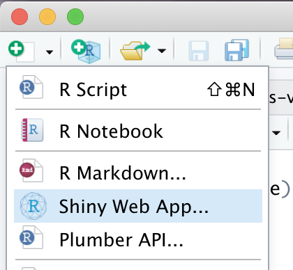
```

* Man vælger en mappe, og "Single File". Indenfor mappen skal ligge en skript der hedder "app.R" (det er vigtigt at man ikke ændre navnet af "app.R").

```{r, echo=FALSE,fig.width = 1,fig.height=1,comment=FALSE,warning=FALSE,out.width="65%"}
# Bigger fig.width
library(png)
library(knitr)
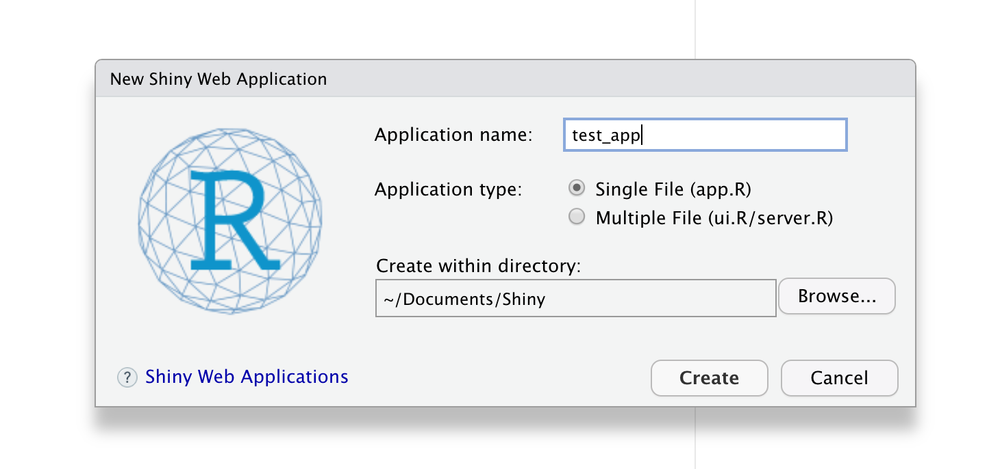
```

* Man kan trykke på "Run App" indenfor R Studio for at få den at køre

```{r, echo=FALSE,fig.width = 1,fig.height=1,comment=FALSE,warning=FALSE,out.width="65%"}
# Bigger fig.width
library(png)
library(knitr)
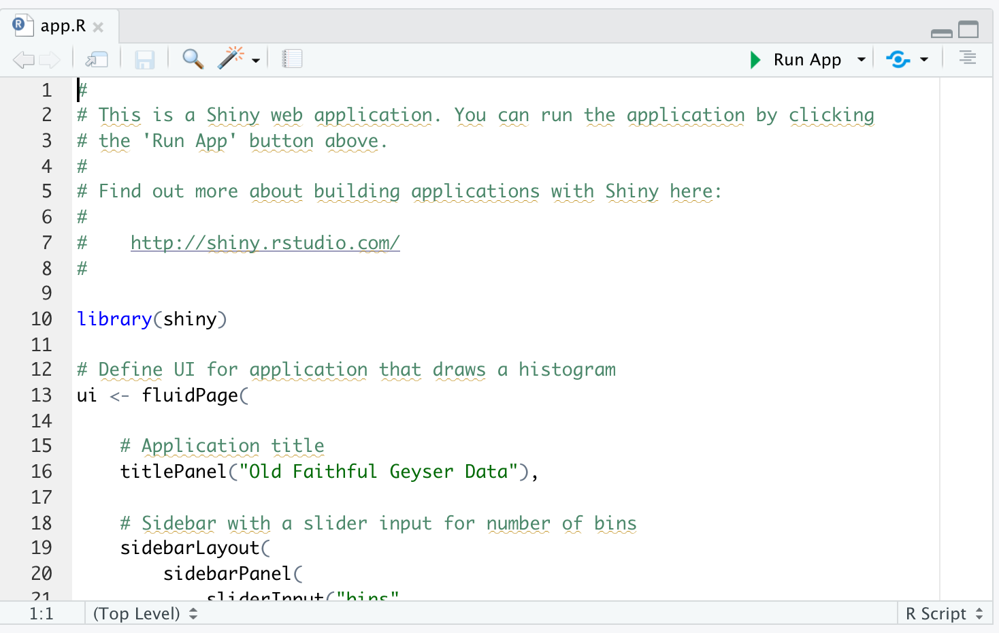
```


### Struktur af en Shiny App

Her er den grundlæggende struktur af en Shiny app:

```{r, echo=FALSE,fig.width = 1,fig.height=1,comment=FALSE,warning=FALSE,out.width="55%"}
# Bigger fig.width
library(png)
library(knitr)
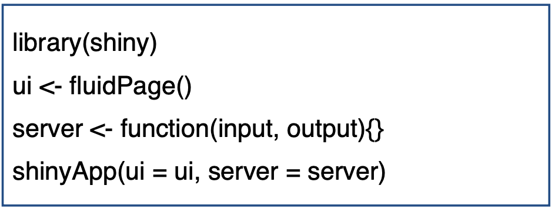
```

Inden for "app.R" er der tre komponenter, som man skal være opmærksom på. Vi ændrer kun to af de tre komponenter.

Dele | Beskrivelse
--- | ---
`ui <- fluidPage()` |  "User interface"-objekt: Det fortæller __Shiny__, hvordan appen skal se ud.
`server <- function(input,output){}` | Her skrives R-kode, fx til et plot, som skal være en del af det R-objekt, der hedder `output`. `input` er for eksempel antallet af bins, som man specificerer med en skyder som i histogram-eksemplet.
`shinyApp(ui = ui, server = server)` | Er altid den sidste linje - den ændrer vi ikke. Den får appen til at køre.


### Minimal example (men ikke interaktiv)

Jeg starter med at lave et meget simpelt "minimal" eksempel af hvordan man kan lave et program med __Shiny__:

* __ui komponent__: Vi vil gerne viser et plot som hedder "my_plot" - så skriver jeg `plotOutput("my_plot")`

```{r,eval=FALSE}
ui <- fluidPage(
    plotOutput("my_plot") #fortælle, at vi vil fremvise "my_plot".
)
```

  * __`server` komponent__: angiver vi koden til `my_plot`. 
      + Plottet skal være en del af vores `output`, så vi skriver `output$my_plot <- `.
      + `renderPlot({ #plot kode })` fortæl den at det vi lave er et plot og vi skriver koden indenfor. 

```{r,eval=FALSE}
server <- function(input, output) {
    #definere "my_plot"
    output$my_plot <- renderPlot({
        #Skriv plot kode her
  })
}
```

Her er appen med ovenstående kode sæt ind: man godt kan køre den men når vi ikke har nogle data eller plot kode er den meget kedelig.

```{r,eval=FALSE}
library(shiny)
library(tidyverse)

ui <- fluidPage(
    plotOutput("my_plot") #fortælle, at vi vil fremvise "my_plot".
)

server <- function(input, output) {
    #definere "my_plot"
    output$my_plot <- renderPlot({
        #Skriv plot kode her
  })
}
# Run the application 
shinyApp(ui = ui, server = server)
```


__Tilføje dataseættet `iris` og lave et plot__

Lad os tilføje nogle data til vores plot i formen af `iris`, og skriv nogle kode til et scatter plot:

```{r,eval=FALSE}
library(shiny)
library(tidyverse)
data(iris)

#ui: output plottet 'my_plot'
ui <- fluidPage(
    plotOutput("my_plot")
)

#server: lav plot og kalde den for output$my_plot
server <- function(input, output) {
    output$my_plot <- renderPlot({
        iris %>%
            ggplot(aes(x=Sepal.Width,y=Petal.Length)) + 
            geom_point() +
            theme_classic()
  })
}

# køre appen
shinyApp(ui = ui, server = server)
```

Hvis vi køre koden kan man se at vi har et plot frem. Appen er dog ikke interaktiv.

```{r, echo=FALSE,fig.width = 1,fig.height=1,comment=FALSE,warning=FALSE,out.width="75%"}
# Bigger fig.width
library(png)
library(knitr)
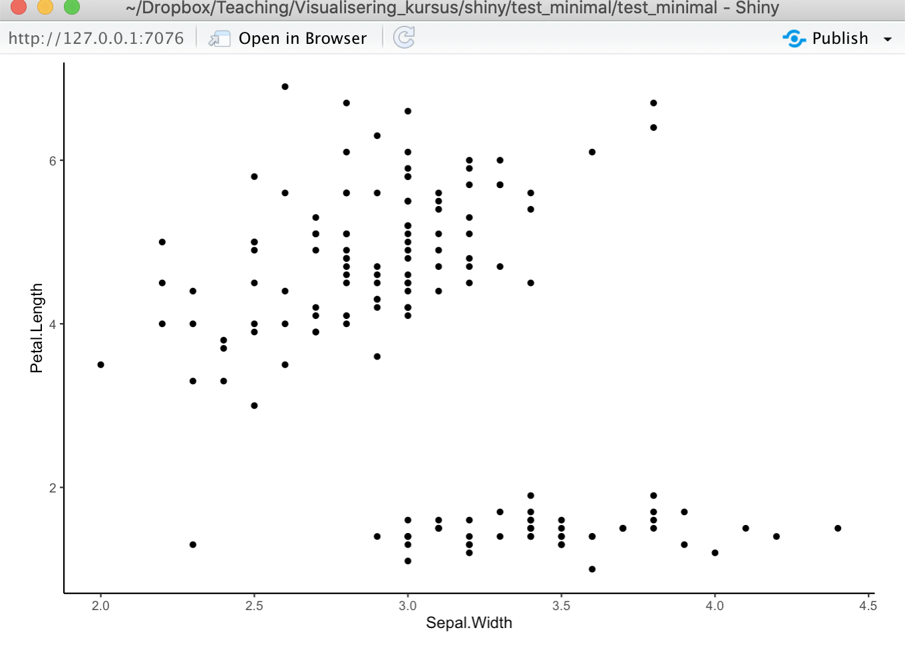
```


### Minimalt eksempel - interaktivt

Vi vil gerne gøre vores app mere fleksibel - lad os gøre den interaktiv ved at plotte et subset af Iris for en af de tre arter, der vælges fra en "drop-down" boks - vi kan anvende en funktion, der hedder `selectInput`:

```{r, echo=FALSE,fig.width = 1,fig.height=1,comment=FALSE,warning=FALSE,out.width="40%"}
# Større fig.width
library(png)
library(knitr)
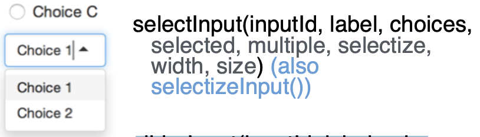
```

Her er koden for vores `selectInput`, som skal tilføjes inden for `fluidPage`.

```{r,eval=FALSE}
    selectInput(inputId = "Species", #giv en id
                choices = iris %>% distinct(Species) %>% pull(Species), #setosa, virginica eller versicolor
                selected = "setosa", #default art
                label = "Vælg art") #label på plottet
```

Vi skal også ændre koden til plottet, så det reagerer på vores `selectInput`:

* Vi laver et subset `iris_subset` af dataene efter den "Species", vi har valgt i vores "drop-down"-boks ved at angive `Species==input$Species` inden for funktionen `filter`.
* Vi laver et scatterplot med `iris_subset`:

```{r,eval=FALSE}
iris_subset <- iris %>% 
            filter(Species==input$Species)
        
        iris_subset %>%
            ggplot(aes(x=Sepal.Width,y=Petal.Length)) + 
            geom_point() +
            theme_classic()
```

Her tilføjer jeg de kode chunks fra ovenpå til vores program:

```{r,eval=FALSE}
library(shiny)
library(tidyverse)
data(iris)

ui <- fluidPage(
    selectInput(inputId = "Species",
                choices = iris %>% distinct(Species) %>% pull(Species),
                selected = "setosa",
                label = "Choose species"),
    
    plotOutput("my_plot")
)

server <- function(input, output) {
    output$my_plot <- renderPlot({
        
        iris_subset <- iris %>% 
            filter(Species==input$Species)
        
        iris_subset %>%
            ggplot(aes(x=Sepal.Width,y=Petal.Length)) + 
            geom_point() +
            theme_classic()
        
    })
}

# Run the application 
shinyApp(ui = ui, server = server)
```

Som man kan se i screenshot nedenunder, har vi en "drop-down box" hvor vi kan vælge imellem de tre `Species`.

```{r, echo=FALSE,fig.width = 1,fig.height=1,comment=FALSE,warning=FALSE,out.width="75%"}
# Bigger fig.width
library(png)
library(knitr)
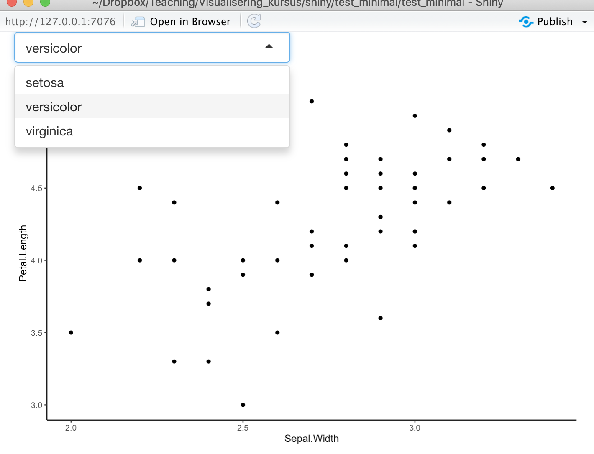
```


### Flere plots på samme Shiny app

<!-- * Anvend en `textInput` boks (se nedenfor for hvordan en textInput ser ud): -->

<!-- ```{r, echo=FALSE,fig.width = 1,fig.height=1,comment=FALSE,warning=FALSE,out.width="40%"} -->
<!-- # Bigger fig.width -->
<!-- library(png) -->
<!-- library(knitr) -->
<!-- 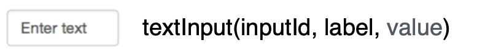 -->
<!-- ``` -->

<!-- * `textInput` boks for at styr en anden plot efter variablen `Species`: -->

<!-- ```{r,eval=FALSE} -->
<!--     textInput(inputId = "Species2",   #giv ID species2 -->
<!--               label = "Type species", #giv label på selve plottet -->
<!--               value = "setosa"),      #default tekst er setosa -->
<!-- ``` -->


* Vi laver to plotter, et scatter plot og et histogram, som reagere på `selectInput` som fortæller de subset af de data efter `Species` som skal plottes.
* Vi kalder dem for `p1` og `p2` og plotte dem ved siden af hinanden med `grid.arrange`:

```{r,eval=FALSE}
grid.arrange(p1,p2,ncol=2)
```

```{r,eval=FALSE}
library(shiny)
library(tidyverse)
library(gridExtra)
data(iris)

ui <- fluidPage(
    selectInput(inputId = "Species",
                choices = iris %>% distinct(Species) %>% pull(Species),
                selected = "setosa",
                label = "Choose species"),
    
    plotOutput("my_plot")
)

server <- function(input, output) {
  
    output$my_plot <- renderPlot({
        
        iris_subset <- iris %>% 
            filter(Species==input$Species)
        
     p1 <- iris_subset %>%
            ggplot(aes(x=Sepal.Width,y=Petal.Length)) + 
            geom_point(colour="steel blue") + 
            ggtitle(input$Species) +
            theme_classic()
        
        p2 <- iris_subset %>%
            ggplot(aes(x=Sepal.Width)) + 
            geom_density(colour="firebrick3") + 
            ggtitle(input$Species) +
            theme_classic()
        
        grid.arrange(p1,p2,ncol=2)
        
    })
}

# Run the application 
shinyApp(ui = ui, server = server)
```

```{r, echo=FALSE,fig.width = 1,fig.height=1,comment=FALSE,warning=FALSE,out.width="75%"}
# Bigger fig.width
library(png)
library(knitr)
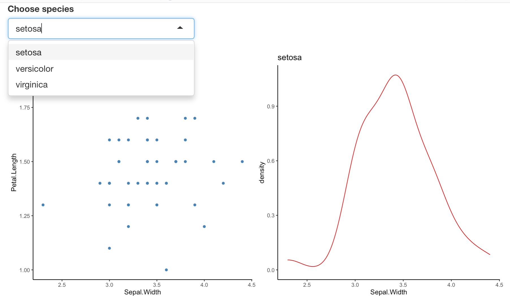
```

### Inkludering af en tabel

Vi vil gerne tilføje en tabel, så vi kan se vores data i appen. Jeg vil gerne specificere, hvor mange rækker jeg skal vise frem i appen - vi kan gøre dette interaktivt ved at tilføje en `numericInput` funktion:

```{r, echo=FALSE,fig.width = 1,fig.height=1,comment=FALSE,warning=FALSE,out.width="40%"}
# Større fig.width
library(png)
library(knitr)
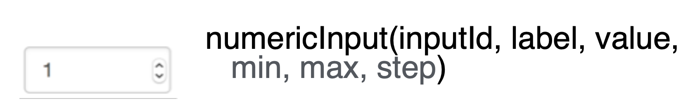
```

Her er koden for vores `numericInput`. Bemærk, at man skriver `tableOutput("my_table")` for at angive, at vi vil vise "my_table" i appen.

```{r,eval=FALSE}
numericInput(inputId = "num_rows",                           #giv id num_rows
                 label = "Antal observationer at se:",  #label på selve plottet
                 value = 5),                                 #default værdi

tableOutput("my_table")                                      #angiv, at vi vil outputte "my_table"
```

Her er koden for `my_table`. Bemærk, at vi anvender funktionen `renderTable` i stedet for `renderPlot`, og der er en indstilling inde i `head`, hvor vi kan specificere, hvor mange rækker vi skal have (med `n = input$num_rows` - altså det tal, som vi indtaster i appen).


```{r,eval=FALSE}
    output$my_table <- renderTable({
        iris_subset <- iris %>% 
            filter(Species==input$Species)
        head(iris_subset, n = input$num_rows)
    })
```

Jeg tilføjer de to kode chunks til vores app i følgende (som kan kopireres og blive kørte):

```{r,eval=FALSE}
library(shiny)
library(tidyverse)
library(gridExtra)
data(iris)

ui <- fluidPage(
  selectInput(inputId = "Species",
              choices = iris %>% distinct(Species) %>% pull(Species),
              selected = "setosa",
              label = "Choose species"),
  
  numericInput(inputId = "num_rows",
               label = "Number of observations to view:",
               value = 5),
  
  plotOutput("my_plot"),
  tableOutput("my_table")
  
)

server <- function(input, output) {
  
  output$my_plot <- renderPlot({
    
    iris_subset <- iris %>% 
      filter(Species==input$Species)
    
    p1 <- iris_subset %>%
      ggplot(aes(x=Sepal.Width,y=Petal.Length)) + 
      geom_point(colour="steel blue") + 
      ggtitle(input$Species) +
      theme_classic()
    
    p2 <- iris_subset %>%
      ggplot(aes(x=Sepal.Width)) + 
      geom_density(colour="firebrick3") + 
      ggtitle(input$Species) +
      theme_classic()
    
    grid.arrange(p1,p2,ncol=2)
    
  })
  
  output$my_table <- renderTable({
    iris_subset <- iris %>% 
      filter(Species==input$Species)
    head(iris_subset, n = input$num_rows)
  })
}

# Run the application 
shinyApp(ui = ui, server = server)
```

```{r, echo=FALSE,fig.width = 1,fig.height=1,comment=FALSE,warning=FALSE,out.width="75%"}
# Bigger fig.width
library(png)
library(knitr)
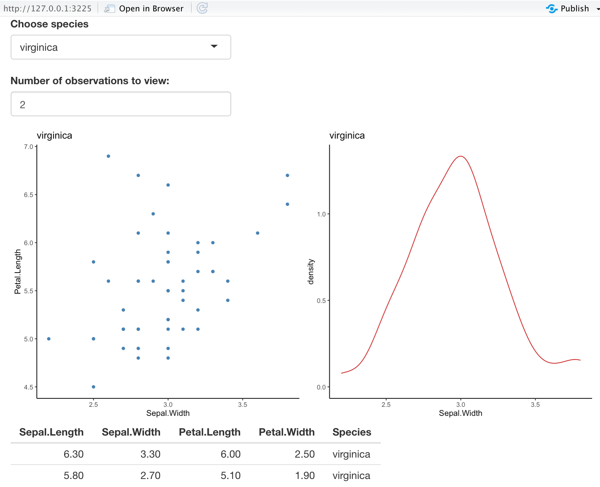
```


### Add a slider

* Lad os tilføj en `sliderInput` for at styr punkt eller linje størrelse i plottet. Den ser sådan ud:

```{r, echo=FALSE,fig.width = 1,fig.height=1,comment=FALSE,warning=FALSE,out.width="40%"}
# Bigger fig.width
library(png)
library(knitr)
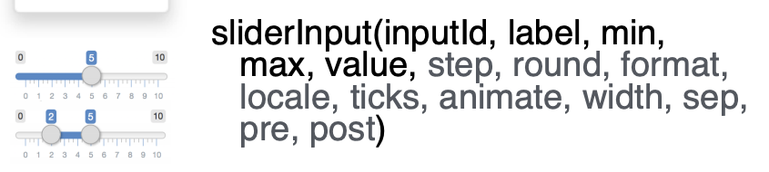
```

* Vores kode ser sådan ud. Vi lave en slider af integer fra 1 til 10.

```{r,eval=FALSE}
    sliderInput(inputId = "Point",    #giv den id Point
                label = "Point size", #label på selve plottet
                min = 1,              #min værdi
                max = 10,             #max værdi
                step = 1,             #step size
                value = 1),           #default værdi
```

* Vi referer vores point størrelse ind i plottet med `input$Point`:

```{r,eval=FALSE}
         ....+   geom_point(size = input$Point, colour="steel blue") + ....
         ....+   geom_density(colour="firebrick3",lwd=input$Point) + ......
```

* Vi tilføj ovenstående kode til vores plot:

```{r,eval=FALSE}
library(shiny)
library(tidyverse)
library(gridExtra)
data(iris)

ui <- fluidPage(
  selectInput(inputId = "Species",
              choices = iris %>% distinct(Species) %>% pull(Species),
              selected = "setosa",
              label = "Choose species"),
  
  numericInput(inputId = "num_rows",
               label = "Number of observations to view:",
               value = 5),
  
  sliderInput(inputId = "Point",
              label = "Point size",
              min = 1,
              max = 10,
              step = 1,
              value = 1),
  
  plotOutput("my_plot"),
  tableOutput("my_table")
  
)

server <- function(input, output) {
  
  output$my_plot <- renderPlot({
    
    iris_subset <- iris %>% 
      filter(Species==input$Species)
    
    p1 <- iris_subset %>%
      ggplot(aes(x=Sepal.Width,y=Petal.Length)) + 
      geom_point(size = input$Point, colour="steel blue") + 
      ggtitle(input$Species) +
      theme_classic()
    
    p2 <- iris_subset %>%
      ggplot(aes(x=Sepal.Width)) + 
      geom_density(size = input$Point,colour="firebrick3") + 
      ggtitle(input$Species) +
      theme_classic()
    
    grid.arrange(p1,p2,ncol=2)
    
  })
  
  output$my_table <- renderTable({
    iris_subset <- iris %>% 
      filter(Species==input$Species)
    head(iris_subset, n = input$num_rows)
  })
}

# Run the application 
shinyApp(ui = ui, server = server)
```


```{r, echo=FALSE,fig.width = 1,fig.height=1,comment=FALSE,warning=FALSE,out.width="75%"}
# Bigger fig.width
library(png)
library(knitr)
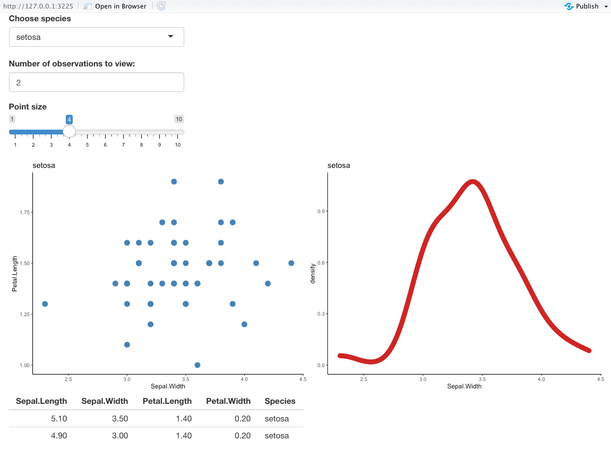
```


### Ekstras som man kan tilføje til `ui`

Her er nogle ekstra tekst som vi kan tilføj - for eksempel en title. Vi kan også lave nogle forskellige panels for at fremvise de forskellige dele af vores app - for eksempel en side panel og en main panel.

__Title__

```{r,eval=FALSE}
  titlePanel("Shiny Text")
```


<!-- ```{r, echo=FALSE,fig.width = 1,fig.height=1,comment=FALSE,warning=FALSE,out.width="75%"} -->
<!-- # Bigger fig.width -->
<!-- library(png) -->
<!-- library(knitr) -->
<!-- 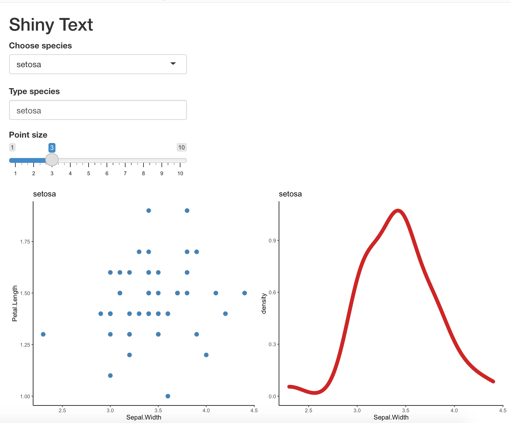 -->
<!-- ``` -->


__Specificier sidebarLayout__

```{r,eval=FALSE}
  sidebarLayout(
    sidebarPanel(),
    mainPanel()
  )
```

Her er hvordan appen ser ud med titlen samt en `sidebarPanel` og `mainPanel`

```{r, echo=FALSE,fig.width = 1,fig.height=1,comment=FALSE,warning=FALSE,out.width="75%"}
# Bigger fig.width
library(png)
library(knitr)
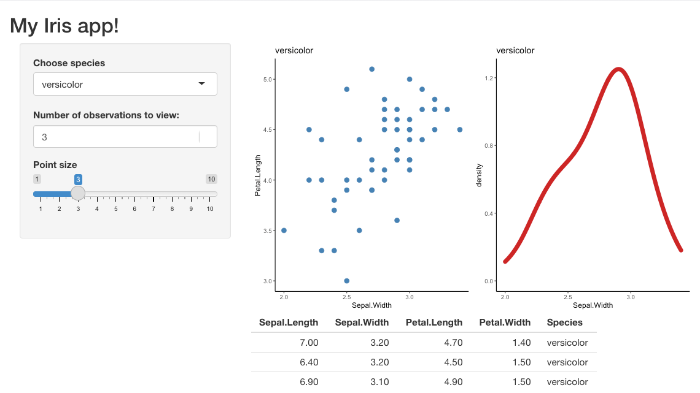
```

Her er fuld kode som man kan copy/paste ind i `app.R`:

```{r,eval=FALSE}
library(shiny)
library(tidyverse)
library(gridExtra)
data(iris)

ui <- fluidPage(

  titlePanel("My Iris app!"),
  
  sidebarPanel(
    selectInput(inputId = "Species",
                choices = iris %>% distinct(Species) %>% pull(Species),
                selected = "setosa",
                label = "Choose species"),
    
    numericInput(inputId = "num_rows",
                 label = "Number of observations to view:",
                 value = 5),
    
    sliderInput(inputId = "Point",
                label = "Point size",
                min = 1,
                max = 10,
                step = 1,
                value = 1)
  ),
  mainPanel(
    plotOutput("my_plot"),
    tableOutput("my_table")
  )
)

server <- function(input, output) {
  
  output$my_plot <- renderPlot({
    
    iris_subset <- iris %>% 
      filter(Species==input$Species)
    
    p1 <- iris_subset %>%
      ggplot(aes(x=Sepal.Width,y=Petal.Length)) + 
      geom_point(size = input$Point, colour="steel blue") + 
      ggtitle(input$Species) +
      theme_classic()
    
    p2 <- iris_subset %>%
      ggplot(aes(x=Sepal.Width)) + 
      geom_density(size = input$Point,colour="firebrick3") + 
      ggtitle(input$Species) +
      theme_classic()
    
    grid.arrange(p1,p2,ncol=2)
    
  })
  
  output$my_table <- renderTable({
    iris_subset <- iris %>% 
      filter(Species==input$Species)
    head(iris_subset, n = input$num_rows)
  })
}

# Run the application 
shinyApp(ui = ui, server = server)
```


## Yderligere generelle råd

* Tilføj passende titler/akse-labels osv. og gør dem til en størrelse, der er nem at læse (tænk i PowerPoint-termer - personer bagest i rummet skal kunne læse teksten).
* Fjern unødvendige forklaringer.
* Anvend farvepaletter, der er designet til at fungere godt for de fleste (for eksempel, undgå grøn og rød ved siden af hinanden).
* Vis kun det, der er nødvendigt for at fortælle den historie, du gerne vil formidle til andre. Undgå for eksempel ekstra tekst, der ikke tilføjer noget til budskabet.
* Fortæl en historie pr. slide, hvis du laver en PowerPoint-præsentation.
* Brug passende aksetransformationer, der giver mest mening i forhold til dine data.
* Undgå cirkeldiagrammer, 3D-plots osv., medmindre de absolut tilføjer noget ekstra til visualiseringen (meget sjældent).
* Hvis du tilføjer et plot til en PowerPoint-præsentation, anbefaler jeg at bruge PDF'er og ikke PNG/JPG, da PDF'er har højere kvalitet.
* Interaktive plots kan være sjove og interessante (men sørg igen for, at de tilføjer noget ekstra til din præsentation/rapport).

## Andre muligheder/advanceret topics

* Lave præsentations i PowerPoint direkte fra RStudio: https://support.rstudio.com/hc/en-us/articles/360004672913-Rendering-PowerPoint-Presentations-with-RStudio

* Shiny cheatsheet: https://github.com/rstudio/cheatsheets/raw/master/shiny.pdf

* Debugging with RStudio: https://support.rstudio.com/hc/en-us/articles/200713843-Debugging-with-RStudio

* Advanced R: https://adv-r.hadley.nz/index.html

## Problemstillinger

__Problem 1__) Lav interactiv plots

Anvend funktionen `ggplotly` fra pakken `plotly` til at lave følgende interkative plots:

* Et barplot som viser antallet af biler for de forskellige antal cylinders i variablen `cyl` i datasættet `mtcars`.
* Et scatter plot som viser `wt` på x-aksen og `qsec` på y-aksen og med farver efter variablen `gear`.
    + tilføj lineær trend linjer til plottet.
    
```{r,eval=FALSE,echo=FALSE}
library(plotly)
myplot <- mtcars %>% 
  ggplot(aes(x=factor(cyl))) + 
  geom_bar(stat="count",fill="steel blue") + 
  theme_classic()
ggplotly(myplot)
```

```{r,eval=FALSE,echo=FALSE}
myplot <- mtcars %>% ggplot(aes(x=wt,y=qsec,colour=factor(gear))) + geom_point() + geom_smooth(method="lm") + theme_classic()
ggplotly(myplot)
```

---

__Problem 2__) *Shiny*

* Indlæs pakken `Shiny` og se på de forskellige eksempler fk. `runExample("05_sliders")`.
* Lav et nyt app og kør den default app (dvs. uden at redigere på noget).

---

__Problem 3__) *Shiny*

* Slet default tekst og kopi koden fra ovenpå (med slider og to plotter) - kør appen.
* Tilpas koden, hvor du ændrer datasættet fra `Iris` til `Penguins`.

```{r,eval=FALSE,echo=FALSE}
library(shiny)
library(tidyverse)
library(gridExtra)
library(palmerpenguins)

ui <- fluidPage(

  titlePanel("My penguin app!"),
  
  sidebarPanel(
    selectInput(inputId = "species",
                choices = penguins %>% distinct(species) %>% pull(species),
                selected = "Adelie",
                label = "Choose species"),
    
    numericInput(inputId = "num_rows",
                 label = "Number of observations to view:",
                 value = 5),
    
    sliderInput(inputId = "Point",
                label = "Point size",
                min = 1,
                max = 10,
                step = 1,
                value = 1)
  ),
  mainPanel(
    plotOutput("my_plot"),
    tableOutput("my_table")
  )
)

server <- function(input, output) {
  
  output$my_plot <- renderPlot({
    
    penguins_subset <- penguins %>% 
      filter(species==input$species)
    
    p1 <- penguins_subset %>%
      ggplot(aes(x=bill_length_mm,y=bill_depth_mm)) + 
      geom_point(size = input$Point, colour="steel blue") + 
      ggtitle(input$species) +
      theme_classic()
    
    p2 <- penguins_subset %>%
      ggplot(aes(x=bill_length_mm)) + 
      geom_density(size = input$Point,colour="firebrick3") + 
      ggtitle(input$species) +
      theme_classic()
    
    grid.arrange(p1,p2,ncol=2)
    
  })
  
  output$my_table <- renderTable({
    penguins_subset <- penguins %>% 
      filter(species==input$species)
    head(penguins_subset, n = input$num_rows)
  })
}

# Run the application 
shinyApp(ui = ui, server = server)
```

---

__Problem 4__) *Shiny*

* Lav et app som viser de første n rækker i dataframen `mtcars` (`numericInput`)
* Tilføj også en "drop-down box" med funktionen `selectInput` for at vise en subset af dataframen, efter de forskellige mulige værdier i variablen `gear`.

```{r,eval=FALSE,echo=FALSE}
library(shiny)
library(tidyverse)
library(gridExtra)
data(mtcars)

ui <- fluidPage(

  titlePanel("My mtcars app!"),
  
  sidebarPanel(
    numericInput(inputId = "num_rows",
                 label = "Number of observations to view:",
                 value = 5),
    selectInput(inputId = "gears",
                choices = mtcars %>% select(gear) %>% unique,
                label = "Number of gears",
                selected = "4")
  ),
  mainPanel(
    tableOutput("my_table")
  )
)

server <- function(input, output) {
  output$my_table <- renderTable({
    head(mtcars %>% filter(gear==input$gear), n = input$num_rows)
  })
}

# Run the application 
shinyApp(ui = ui, server = server)
```

---

__Problem 5__) *Shiny*

* Lav et app med en `sliderInput`, hvor du styrer antallet af clusters med funktionen `kmeans` i datasættet `penguins`.
* Vis clusters som forskellige farver indenfor et scatter plot (det kan være fk. to variabler eller den første to principal components).
* Tilføj også en `selectInput` for at visualisere dine clusterings, i et subsæt af datasættet efter variablen `island` (det kan være, at du ikke kan se al dine clusters på plottet, fordi der er ingen observationer fra en bestemt island i en cluster).
* Anvend `sidebarPanel` og `mainPanel` til at separere dine inputs fra plotterne.
* Tilføj en app titel samt plot-title/akse labels osv. for at bedste viser din app over for andre.

```{r,eval=FALSE,echo=FALSE}
library(shiny)
library(tidyverse)
library(gridExtra)
library(broom)
library(palmerpenguins)

ui <- fluidPage(
    
    titlePanel("My penguin clustering app!"),
    
    sidebarPanel(
        
        sliderInput(inputId = "clust_num",
                    label = "Number of clusters",
                    min = 1,
                    max = 10,
                    step = 1,
                    value = 1),
        selectInput(inputId = "island",
                    choices = penguins %>% select(island) %>% unique,
                    label = "Choose island",
                    selected = "Torgersen")
    ),
    mainPanel(
        plotOutput("my_plot"),
    )
)

server <- function(input, output) {
    output$my_plot <- renderPlot({
        
        penguins_scaled <- penguins %>% drop_na %>%
            select(where(is.numeric)) %>% 
            scale
        
        kclust <- kmeans(penguins_scaled,centers = input$clust_num)
        
        kclust %>% augment(penguins %>% drop_na) %>% filter(island==input$island) %>%
            ggplot(aes(x=scale(bill_length_mm),y=scale(bill_depth_mm),colour=.cluster)) + 
            geom_point() + 
            ggtitle(input$clust_num) +
            theme_classic()
        
    })
}

# Run the application 
shinyApp(ui = ui, server = server)
```

---

__Problem 6__) *Shiny*

Lav egen app og inddrager forskellige datasæt og koncepter fra kurset!
